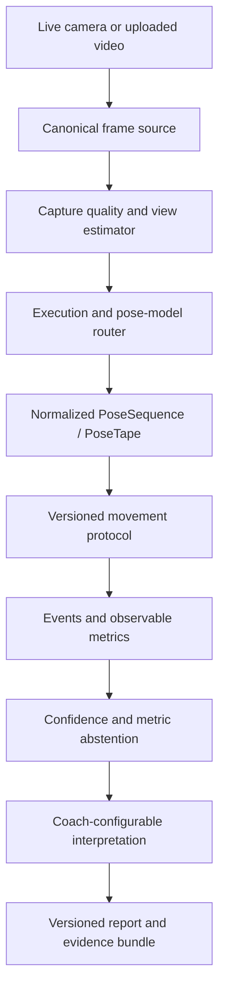
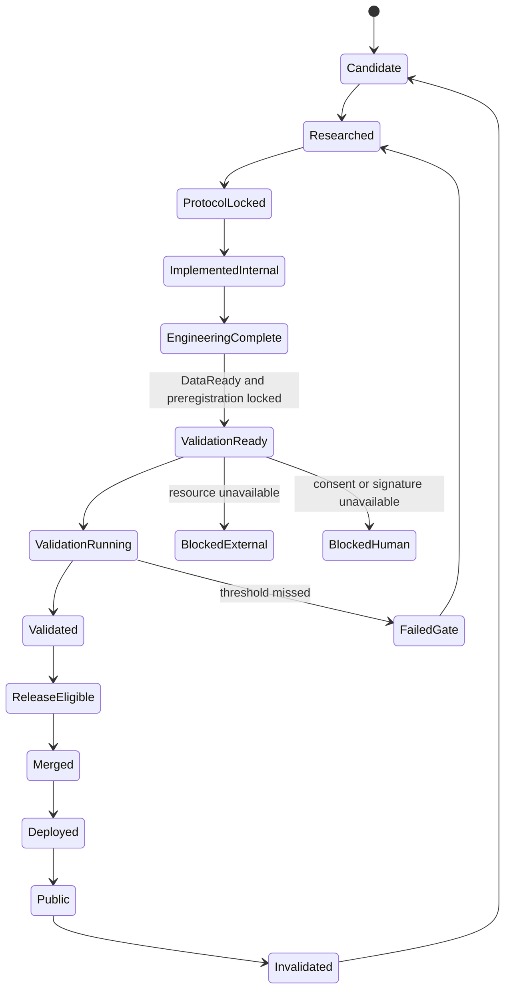
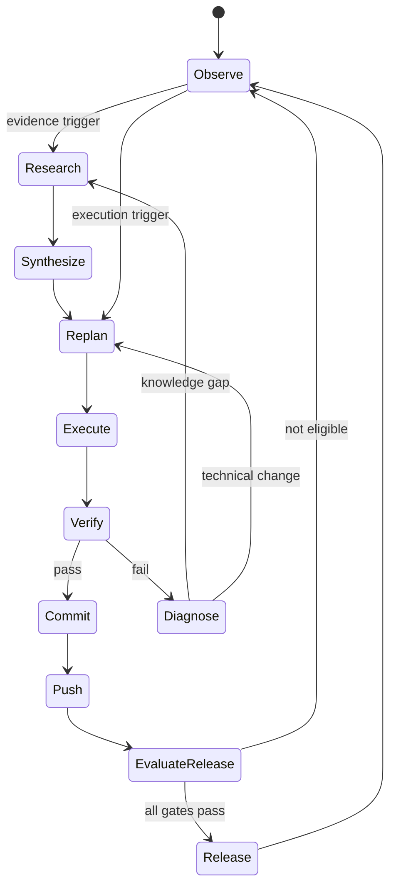

# KinematicIQ Autonomous Expanded-10 Master Program

**Status:** revision 4 — canonical candidate execution contract; clean-clone repository verification pending
**Prepared:** 2026-07-21
**Canonicalization revision:** 2026-07-21
**Repository reviewed:** `Born2tweak/KinematicIQ`, `master`, HEAD `44daa7b9998508c779ac0b50567ed66c2c1542fd`
**Program branch:** `agent/expanded-10-revision-4`
**Scope:** bodyweight squat, forward lunge, hip hinge, push, pull, rotation, gait, jump, landing, sprint

## 1. Executive decision

KinematicIQ will become one coach-configurable, protocol-driven movement-analysis platform with ten equally governed movement protocols. Internal development states may exist, but no protocol is released publicly through a weaker “experimental” route. Every public protocol must pass the same universal validation framework, with metric-specific reference standards and preregistered thresholds.

The program is designed to remove the recurring 10–15 milestone reset. It defines the full dependency graph now, continually updates unresolved work when evidence changes, and interrupts the owner only for genuine human or external gates. Routine research, architecture, implementation, testing, documentation, dataset appraisal, replanning, milestone commits, and pushes to the dedicated execution branch are autonomous.

The locked product contract is:

- healthy adults and athletes first;
- consumer phone and laptop cameras as baseline hardware;
- live camera and uploaded video through one canonical analysis contract;
- local-first processing, with an optional consented hybrid compute path when a validated model cannot run acceptably on-device;
- model-agnostic pose adapters selected by benchmark evidence;
- movement-specific capture flows on a shared platform;
- view-adaptive analysis from front, rear, side, and oblique positions where evidence supports it;
- metric-level abstention whenever view, tracking, model, or capture quality cannot support a metric;
- tiered reference standards selected per metric;
- public datasets plus consented original data when public evidence is insufficient;
- coach-configurable interpretation without allowing coaches to weaken scientific, observability, privacy, or safety gates;
- automatic scientific release eligibility only after every preregistered gate is evidenced and machine-verifiable;
- merge, deployment, and actual public exposure remain separate operational states governed by separately granted authority.

Revision 4 corrects the execution semantics found defective in the Revision 3 review. Its schema-v4 registry separates milestone execution status, scientific result code, and protocol lifecycle; uses outcome-aware dependency conditions; adds the full normative contract fields; binds acceptance to artifacts, current-commit evidence, commands, and predicates; and permits failed or blocked scientific work to reach an auditable disposition without satisfying release. The schedule is capacity-aware, resource acquisition has named accountability and escalation, and validation records are explicitly preregistration work queues rather than locked manifests. Repository commands, current-node satisfaction, and clean-clone behavior remain evidence to produce during KQ-001/KQ-015; this document does not claim they have already passed.

## 2. Repository frontier and problem diagnosis

The live repository is materially ahead of the older squat-only context:

- the platform already has a protocol registry, `ProtocolRuntime`, movement-neutral outcome contracts, deterministic PoseTape replay, capture-readiness logic, live/upload flows, metric and finding provenance, local history/export, validation statistics, accessibility automation, and 600+ tests recorded across the latest program history;
- squat is the only available protocol;
- forward lunge has an unavailable research runtime plus Phase 4 identity, schema, perturbation, labeling, validation, reliability, claims, and availability-decision artifacts;
- the latest binding decision keeps forward lunge unavailable because real participant, qualified-rater, synchronized-reference, repeat-session, and independent-signature evidence is absent;
- hip hinge, jump, and sprint are planned stubs; sit-to-stand exists but is not part of the locked Expanded-10 product scope unless retained as a non-public research fixture;
- `ProtocolId`, `ProtocolStatus`, and current validation metadata are closed around the older movement set and only express `available | planned`;
- the current architecture remains MediaPipe-first and browser-only, while the new product contract requires model routing and an optional hybrid execution path.

The bottleneck is not insufficient rigor. It is serial execution. Phase 4 applied an entire validation program to one movement before constructing the shared machinery and parallel workstreams needed for ten. This program keeps the fail-closed science and removes the serial planning model.

## 3. Authority and non-negotiable invariants

This program supersedes future-planning portions of older short-horizon roadmaps after it is accepted and merged. Historical evidence and completed progress records remain immutable.

The following invariants survive the expansion:

1. No diagnosis, injury prediction, pathology, return-to-play, internal tissue, muscle activation, force, torque, or kinetic claim from ordinary single-camera RGB evidence.
2. No composite “movement quality” score.
3. No metric without provenance, uncertainty, observability rules, validation state, failure behavior, and claim boundaries.
4. Raw observations remain recoverable; filters and recovery never silently become ground truth.
5. Invalid evidence abstains. Partial validated evidence may return only at the metric level.
6. Schema changes are additive or include an explicit migration and legacy reader.
7. Public protocol versions are immutable. New evidence creates a candidate version and never silently mutates a released one.
8. Research-only or ontology-only datasets cannot close scientific or commercial release gates.
9. Git contains no participant-identifying or restricted raw media.
10. A failed locked gate causes diagnosis and a new preregistered development cycle, never post-hoc threshold weakening.

## 4. Canonical architecture



### 4.1 One input contract

`LiveFrameSource` and `UploadFrameSource` emit the same timestamped, orientation-aware `FramePacket`. Live mode executes incrementally; upload mode may batch and seek. Both call the same versioned analysis core and both must produce deterministic PoseTape replay artifacts. Equivalent usable input must meet preregistered live/upload parity tolerances.

### 4.2 Model-agnostic pose layer

The existing MediaPipe engine becomes the first `PoseModelAdapter`. Candidate adapters for MoveNet, RTMPose/MMPose, YOLO Pose, and future models implement the same capability and inference contracts. The normalization layer records model ID/version, landmark ontology, coordinates, confidence, timestamps, dimensionality, execution location, transformations, missing landmarks, and uncertainty. It never invents joints absent from a source model.

Routing is session-level by default. Calibration selects a validated model/configuration from protocol, detected view, device capability, latency, landmark coverage, input mode, and benchmark evidence. A mid-session fallback begins a new provenance segment or invalidates dependent metrics; it does not silently splice incompatible model outputs.

### 4.3 Local-first hybrid execution

Browser execution remains the default and must work without application-cloud inference for the supported local baseline. Optional remote/GPU execution is introduced only after the local contracts, privacy lifecycle, replay format, deletion semantics, and parity tests are stable. It requires explicit data-processing consent, minimal upload scope, encryption, bounded retention, deletion verification, and a result that conforms to the identical PoseSequence contract.

Hybrid processing is an optimization and capability extension, not a way to bypass a failed scientific model gate.

Before any real video leaves a device, a minimum hybrid threat model and data-flow approval must pass: data inventory, transfer path, processor roles, authentication, encryption, retention, deletion, logging, incident response, consent withdrawal, and prohibited secondary use. KQ-171 remains the final cross-system closeout; it is not the first privacy review.

### 4.4 View adaptation and observability

The view estimator returns a distribution across front, rear, left/right side, and oblique views plus framing, occlusion, and changing-view evidence. Every metric has an observability matrix keyed by protocol version, view band, model, required landmarks, capture quality, and processing path.

“Any camera position” therefore means:

- detect and describe the position;
- select an eligible validated model/configuration;
- compute only observable metrics;
- request repositioning when a required metric is unavailable;
- abstain when evidence is insufficient.

It does not mean every metric can be recovered from every view.

### 4.5 Protocol package

Each public candidate is a versioned package containing:

- canonical task and population;
- inputs and capture flow;
- supported view bands and models;
- event ontology and temporal engine;
- landmark/feature dependencies;
- metric definitions and coordinate systems;
- uncertainty and abstention rules;
- coach-configurable interpretations and immutable safety bounds;
- evidence and dataset ledger;
- preregistered development and locked-validation plans;
- accuracy, reliability, robustness, UX, accessibility, and performance results;
- claim and limitation registry;
- release manifest and checksums.

Movement-specific code is limited to definitions and genuinely irreducible event/feature plugins. Filtering, confidence propagation, trial envelopes, abstention, reporting, replay, statistics, governance, and release evaluation remain shared.

## 5. Universal protocol lifecycle and two finish lines



Side states are `BlockedHuman`, `BlockedExternal`, `FailedGate`, `Invalidated`, and `Retired`. `DataReady` is an orthogonal readiness flag rather than an assumed stage after engineering completion. A protocol reaches `ValidationReady` only when engineering, data/resources, and preregistration are all ready. A blocked protocol does not stop ready shared work or other protocol trains.

Milestone status, result code, and protocol lifecycle are independent. For example, a correctly executed locked study that misses a preregistered threshold has milestone status `Passed`, result code `GATE_FAIL_RECORDED`, and protocol state `FailedGate`. This distinction is normative; scientific failure is not executor failure, and neither can qualify for release.

The two finish lines are intentionally different:

| Finish line | Required evidence | Meaning |
|---|---|---|
| `EngineeringComplete` | Locked protocol identity; implemented live/upload flow; deterministic replay; unit, integration, accessibility, performance, observability, and development-dataset checks pass | The software is ready for locked real-world evaluation. It is not a public scientific claim. |
| `ReleaseEligible` | All mandatory U1–U12 gates pass on untouched evidence; independent signatures and claim audit complete | The protocol is scientifically eligible to ship. It is not yet merged, deployed, or exposed publicly. |

The scheduler targets `EngineeringComplete` for all ten protocols as quickly as dependencies permit while data acquisition and validation proceed independently. It never relabels engineering progress as scientific validation.

## 6. Universal validation standard

Equal rigor does not mean one arbitrary numeric threshold for every metric. It means every protocol passes the same classes of evidence, using preregistered metric-appropriate thresholds and references.

Before development tuning, each protocol freezes a **minimum core claim set**: the smallest group of outputs that makes the movement useful as the named product protocol. A protocol cannot release unless every core claim passes. Optional metrics are evaluated independently and may remain withheld through metric-level abstention, but strong optional results cannot compensate for a failed core claim. Every visible metric must pass its own validity, reliability, observability, robustness, abstention, and claim gates.

### U1 — Identity and intended-use gate

Freeze the exact movement, allowed variants, population, context, camera assumptions, intended outputs, excluded claims, and product value. Two variants require owner input only when both are scientifically defensible and materially different in product value.

### U2 — Evidence and traceability gate

Every public metric, evidence-bounded interpretation, and claimed coaching effect must map:

`primary evidence → construct/claim → observable signal → algorithm → test fixture → validation endpoint → product copy → release state`.

GitHub code can inform implementation; it cannot establish biomechanical validity.

### U3 — Dataset and custody gate

Record license, allowed role, provenance, consent, population, demographics, movement match, camera views, devices, reference system, annotations, leakage risk, domain gap, checksums, exclusions, retention, and split assignment. Public data may support ontology, development, or locked evaluation only when its terms and task match permit that role.

### U4 — Algorithm and reproducibility gate

Require deterministic replay, schema validation, unit/property tests, golden fixtures, temporal perturbations, missing-data behavior, version provenance, and exact reproducibility of derived results.

### U5 — Accuracy and validity gate

Preregister endpoints and compare each output with the proper tiered reference:

- event/count labels: two qualified independent raters with agreement measured before adjudication;
- 2D or 3D kinematics: synchronized marker-based motion capture or a validated instrument appropriate to the metric;
- jump/landing temporal outcomes: force plate or validated contact/timing reference where needed;
- gait/sprint timing and distance: timing gates, instrumented walkway, synchronized high-speed video, or validated wearable reference as appropriate;
- view/capture states: independently labeled camera geometry and failure events.

Report error distributions and confidence intervals, not only correlations. Metrics without criterion validity remain withheld.

There is no universal “acceptable five-degree error.” Each metric preregisters a maximum acceptable error from the smallest difference that would change interpretation. Continuous metrics report bias, MAE/RMSE, uncertainty, and limits of agreement; event timing uses milliseconds rather than frame counts alone; repetition counts report insertions/deletions and exact-session accuracy; categorical interpretations report confusion matrices and class-sensitive agreement. A claim that a cue improves movement requires a separate preregistered intervention-effect gate and cannot block release of an otherwise valid measurement protocol. Sample size is justified from participant-level precision, not inflated frame counts.

### U6 — Reliability and measurement-error gate

As applicable, evaluate inter-rater, intra-rater, processing rerun, repeat-session, device, view, operator, live/upload, and local/remote reliability. Report ICC variant/assumptions, SEM, MDC, bias, limits of agreement, missingness, and failure rate. Longitudinal change language is allowed only when measurement error supports it.

### U7 — Observability and abstention gate

Measure coverage, false-confident-result rate, abstention precision/recall, missingness by subgroup/view/device, and recovery guidance effectiveness. A protocol cannot pass by returning more metrics if unsupported outputs leak through.

### U8 — Generalization gate

Pass the preregistered healthy-adult/athlete strata across supported body-size ranges, skin tones, clothing categories, lighting, backgrounds, camera heights/distances, consumer devices, and view bands. Unsupported strata are explicit limitations rather than inferred coverage.

### U9 — Input and processing parity gate

Equivalent source evidence must produce equivalent event/metric interpretation within preregistered tolerances across live vs upload and, when enabled, local vs remote execution.

### U10 — Performance and resilience gate

Enforce device-class budgets for inference rate, end-to-end latency, dropped frames, memory, startup, upload completion, thermal/load behavior, offline behavior, failure recovery, and corrupted/interrupted input.

### U11 — UX and accessibility gate

Users must be able to position the camera, complete the task, understand recording state, recover from problems, distinguish observations from interpretation, understand withheld metrics, and operate critical flows with keyboard/screen reader/reduced motion. Automated checks do not replace named physical-device and assistive-technology runs.

### U12 — Claims, privacy, and release-integrity gate

Every user-facing claim must match achieved evidence and supported populations. The release bundle pins protocol, model, configuration, code, datasets, analysis plan, results, checksums, reviewers, and known limitations. Missing or conflicting critical evidence fails closed.

### 6.1 Operational threshold lock

U1–U12 are executable only when each core claim has a frozen row in `validation_manifest.yaml`. A protocol may not enter `ValidationRunning` while any mandatory field is absent or marked `TBD`.

| Required field | Rule |
|---|---|
| `claim_id` | Stable ID mapped to product copy and metric output |
| `endpoint` | Exact statistic evaluated; frame counts alone are prohibited for timing |
| `reference_standard` | Instrument or qualified-label procedure appropriate to the endpoint |
| `analysis_unit` | Participant/session/trial/rep; frames may not inflate sample size |
| `minimum_evidence` | Precision- or power-justified participant/session/trial rule |
| `supported_cells` | Frozen view × device × model × input/path matrix |
| `pass_threshold` | Numeric or categorical boundary fixed before locked data are opened |
| `false_confidence_limit` | Maximum unsupported result leakage |
| `missingness_rule` | Allowed missingness and required stratified reporting |
| `reliability_rule` | Applicable repeat/rater/device/view/path endpoints and threshold |
| `failure_action` | Withhold metric, fail protocol, or start a new preregistered version |
| `signatures` | Required scientific, statistical, privacy, and owner-independent roles |

Thresholds are derived from decision consequence, measurement error, prior primary evidence, and an explicit smallest practically meaningful difference. They are not copied from unrelated studies or chosen after locked results are visible. If evidence cannot justify a threshold, that claim remains blocked rather than weakened.

### 6.2 Deterministic release rule

For protocol `p`, release eligibility is:

```text
eligible(p) = core_claims_present(p)
           AND every(core_claim_gate == PASS)
           AND every(U1..U12 == PASS)
           AND no(critical_conflict OR missing_signature OR locked_data_violation)
```

Optional claims do not affect protocol eligibility when they are completely withheld. An optional claim that appears in any user-facing result becomes mandatory for its own metric-level gate set.

## 7. Autonomous operating system

### 7.1 Durable artifacts

Repository integration creates or updates:

| Artifact | Purpose |
|---|---|
| `AURELIAN/00_CONTROL/PROJECT_STATE.md` | One-read current frontier |
| `AURELIAN/00_CONTROL/DECISION_LOG.md` | Durable material decisions |
| `docs/program/EXPANDED_10_MASTER_ROADMAP.md` | Human-readable program authority |
| `docs/program/milestone_registry.yaml` | Machine-readable dependency graph |
| `docs/program/execution_policy.yaml` | Autonomy, branch, retry, commit, push, and rollback rules |
| `docs/program/inflection_log.ndjson` | Append-only research/replan triggers |
| `docs/research/evidence_registry.yaml` | Appraised primary-source evidence and conflicts |
| `docs/research/research_questions.yaml` | Open, answered, superseded, deferred questions |
| `docs/research/source_watchlist.yaml` | Bounded literature, dataset, model, and implementation watches |
| `docs/datasets/dataset_registry.yaml` | Legal, scientific, and product suitability |
| `docs/models/model_registry.yaml` | Capability, license, benchmarks, eligible routes |
| `docs/claims/claim_registry.yaml` | Claim scope, evidence tier, limitations, status |
| `docs/traceability/metric_traceability.yaml` | Evidence-to-release traceability |
| `docs/validation/gate_registry.yaml` | Machine-evaluable universal and metric gates |
| `docs/protocols/<id>/protocol_spec.yaml` | Canonical protocol package definition |
| `docs/protocols/<id>/validation_manifest.yaml` | Frozen study and analysis plan |
| `docs/protocols/<id>/release_manifest.yaml` | Computed release eligibility |
| `docs/status/program_status.json` | Protocol states, blockers, next executable work |
| `docs/status/replan_diffs/<id>.md` | Why and how unresolved work changed |

All objects have stable IDs, status, provenance, affected objects, owner role, and `last_reviewed_at`.

### 7.1.1 Revision-4 execution-contract bundle

The following companion files are authoritative inputs for repository integration:

| Bundle file | Repository target | Function |
|---|---|---|
| `KINEMATICIQ_MILESTONE_REGISTRY.yaml` | `docs/program/milestone_registry.yaml` | 175 instantiated milestone contracts and dependency edges |
| `KINEMATICIQ_MILESTONE_SCHEMA.yaml` | `docs/program/milestone_schema.yaml` | authoritative schema-v4 contract and allowed milestone statuses |
| `KINEMATICIQ_RESOURCE_REGISTRY.yaml` | `docs/program/resource_registry.yaml` | owners, candidates, lead times, status, cost authority, affected claims, and fallbacks |
| `KINEMATICIQ_PROTOCOL_VALIDATION_REGISTRY.yaml` | `docs/validation/protocol_validation_registry.yaml` | ten protocol claim/reference contracts, metric-class gates, and registered unknowns |
| `KINEMATICIQ_EXECUTION_WAVES_AND_CRITICAL_PATH.md` | `docs/program/EXECUTION_WAVES_AND_CRITICAL_PATH.md` | capacity model, committed/probable/stretch forecast, and scientific track |
| `KINEMATICIQ_EXECUTION_SEMANTICS_AND_FIXTURES.md` | `docs/program/EXECUTION_SEMANTICS_AND_FIXTURES.md` | status/result/lifecycle reducer and clean-clone pass/fail/block fixtures |
| `KINEMATICIQ_RESEARCH_REPLAN_VERTICAL_SLICE.md` | `docs/research/RESEARCH_REPLAN_VERTICAL_SLICE.md` | deterministic end-to-end research, synthesis, patch, and localized-replan fixture |

The Markdown milestone tables below remain the concise human view. The YAML registry is the scheduler source of truth; generated views must fail CI when they diverge.

### 7.2 Continuous loop



### 7.3 Runnable research and synthesis service

Research is a bounded queue, not a standing invitation to collect documents. The default worker limit is four concurrent jobs, configurable downward for tool or budget constraints. One worker is always reserved for synthesis when more than one domain is active.

| Role | Input | Required output | Cannot do |
|---|---|---|---|
| Biomechanics | Exact protocol/claim question | Construct definition, task constraints, observable implications, primary sources | Select code from popularity alone |
| Measurement | Endpoint and consequence | Reference tier, statistics, error/threshold rationale | Choose a threshold after locked results |
| Dataset/licensing | Required population/task/view/labels | Suitability record, legal role, domain gaps, acquisition decision | Treat repository availability as permission |
| Model/engineering | Documented failure cluster or capability gap | Official/primary technical evidence, reproducible spike, benchmark plan | Enable a model because a demo looks good |
| UX/accessibility | Capture or comprehension failure | Tested interaction hypothesis and verification plan | Convert preference into scientific evidence |
| Synthesis | Completed worker packets | Conflict matrix, decision, confidence, affected-node patch | Silently average incompatible findings |

Every `research_job.yaml` must include:

```yaml
job_id: RQ-...
decision_question: "one decision, not a topic"
trigger_id: INF-...
affected_objects: []
source_priority: [primary_study, official_specification, dataset_card, implementation_reference]
inclusion_criteria: []
exclusion_criteria: []
exit_criteria: []
budgets: {max_sources: 25, max_worker_hours: 4, max_retries: 2}
dedupe_keys: [doi, pmid, dataset_id, repository_commit]
status: queued
```

The exact limits may be raised automatically only when the exit criteria remain unmet and the expected decision value exceeds the recorded cost. Jobs are retried twice after transient failure, then become `BLOCKED_EXTERNAL` with the partial packet preserved. Citation URLs, identifiers, quoted claims, and source-to-inference boundaries are verified before synthesis. Preprints, papers, documentation, datasets, and GitHub implementations are tagged separately.

Scheduled watching is deliberately modest: monthly for literature/datasets/model releases, immediately for dependency security notices, and at every failed gate or new protocol version. A watch result creates no code change until it passes the decision-impact test. Duplicate, derivative, low-quality, or scope-filling research is rejected with a recorded reason.

Synthesis produces a machine-readable patch listing `confirmed`, `changed`, `invalidated`, and `unresolved` objects. The replan compiler may alter only unresolved or explicitly invalidated milestones; it must preserve completed evidence and output a human-readable diff.

### 7.4 Automatic triggers

Open bounded research and recompile affected unresolved milestones when:

- a validity, reliability, robustness, observability, performance, fairness, or UX gate fails;
- evidence conflicts with a current claim, metric, threshold, or camera assumption;
- a dataset is inaccessible, legally unsuitable, underpowered, biased, or protocol-mismatched;
- a repeated abstention or failure cluster appears;
- a new protocol version, metric, population, view, reference, model, or dependency enters scope;
- a material model, dataset, standard, or primary study changes the decision landscape;
- a shared architecture milestone unlocks or invalidates multiple tracks;
- privacy, consent, security, or data-custody conditions change.

Completed valid milestones remain immutable. Only unresolved or explicitly invalidated nodes are regenerated.

### 7.5 Scheduling, recovery, and stop conditions

The scheduler computes ready work from dependencies, gate availability, critical-path leverage, and risk. It keeps one implementation milestone `in_progress` per worktree, while independent research, dataset appraisal, and validation-preparation jobs may run concurrently in isolated branches/worktrees.

Automatic recovery is limited to reversible actions: retry a transient command, restore the last passing branch state through a new revert commit, quarantine a failed candidate, or generate a replacement unresolved node. It never force-pushes, deletes evidence, weakens a gate, or changes public behavior to make a test pass.

Execution pauses only the affected node for:

- consent, participant action, qualified labels, or instrumented capture;
- unavailable credentials, legal terms, fees, or external system authority;
- incompatible high-quality evidence that changes a claim or protocol identity;
- repeated nondeterministic failure after the retry budget;
- locked-data contamination or a scientific-integrity event;
- an equally defensible product variant with materially different user value.

All other ready nodes continue. Human questions are deduplicated and bundled by decision owner.

### 7.6 Approval matrix

| Action | Automatic | User interruption |
|---|---:|---:|
| Primary-source research, synthesis, and registries | Yes | No |
| Roadmap expansion/reordering inside locked scope | Yes | No |
| Routine architecture and implementation | Yes | No |
| Legally permitted public dataset evaluation | Yes | No |
| Tests, benchmarks, documentation, reports | Yes | No |
| Dedicated-branch commits and pushes | Yes | No |
| Technical retry, diagnosis, and replanning | Yes | No |
| Mark `ReleaseEligible` after every preregistered gate passes | Yes | No |
| Consent, privacy, participant custody | Prepare only | Yes |
| Qualified labels or instrumented capture | Prepare/manage only | Human act required |
| Credentials, payment, legal attestation | No | Yes |
| Material tradeoff between equally defensible variants | No | Yes |
| Irreconcilable evidence affecting public claims | No | Yes |
| Threshold waiver after seeing locked results | Never | Yes; new preregistration required |
| Direct-to-master merge or production deployment | No | Separate authority required |

Human questions are bundled. A noncritical human gate does not halt unrelated autonomous work.

### 7.7 Git policy

- Execute on `agent/expanded-10-revision-4`.
- Reconcile `master` before each milestone wave.
- Use one coherent commit per milestone or inseparable milestone set.
- Push after the milestone verification floor passes.
- Never force-push or rewrite published history.
- Record commit SHA and verification evidence in the milestone registry.
- Preserve valuable failed experiments as explicitly negative evidence; do not enable them.
- Scientific eligibility changes come only from the deterministic release evaluator; merge, deployment, and public exposure use separate authorities.

## 8. Canonical movement candidates

The system autonomously selects the most scientifically observable and product-useful variant. These are candidates, not silently locked identities:

| Pattern | Initial candidate | Principal references |
|---|---|---|
| Squat | Bodyweight squat to self-selected depth and return | event count, depth/trunk/knee observables |
| Lunge | Forward lunge with stride and stable return | existing six-state research seam |
| Hinge | Unloaded hip hinge with stable start/return | trunk-pelvis-knee coordination |
| Push | Standard floor push-up | count, phase, trunk line, elbow observables |
| Pull | Strict pull-up or equipment-light inverted row | autonomous trade study; interrupt only if product value is materially different |
| Rotate | Controlled torso rotation task | autonomous protocol design needed to make target/amplitude observable |
| Gait | Straight-level walking | spatiotemporal outputs; kinematics only where view/reference evidence permits |
| Jump | Countermovement jump | events, flight/contact proxies; height only with validated timing/reference behavior |
| Landing | Standardized drop landing | contact, stabilization, observable alignment; kinetics excluded without force reference |
| Sprint | Short acceleration sprint | timing/events and selected view-observable kinematics |

### 8.1 Resource-acquisition program

Scientific release depends on resources that software cannot fabricate. Acquisition therefore runs as a first-class parallel program rather than appearing as a late blocker.

| Track | Autonomous work | Human/external gate | Completion artifact |
|---|---|---|---|
| Participants | Eligibility, sample plan, recruitment copy, scheduling, de-identification, gap dashboard | Consent and participation | Signed consent index plus de-identified capture manifest |
| Qualified raters | Qualification cases, handbook, blinding, assignment, adjudication tooling | Independent labeling and qualification | Frozen label set with agreement-before-adjudication report |
| Devices/views | Device matrix, capture script, metadata, logistics, coverage dashboard | Physical access where unavailable | Device/view coverage manifest |
| Instrumented reference | Per-metric reference selection, synchronization protocol, calibration and export adapters | Lab/partner/equipment access | Checksummed synchronized reference bundle |
| Repeat sessions | Scheduling windows, participant linkage controls, missingness tracking | Participant return | Repeat-session manifest |
| Privacy/custody | Data-flow map, access roles, retention/deletion automation, incident plan | Owner/legal approval where required | Approved data-governance packet and deletion test |
| Institutional partners | Partner criteria, technical one-pager, outreach drafts, data-sharing requirements | Relationship and agreement | Signed access/data-use record or documented alternative |

The scheduler opens these tracks immediately after each protocol's core-claim matrix identifies required evidence. Failure to acquire one resource blocks only claims that require it; it also triggers research into a scientifically equivalent reference or narrower support claim, never a weaker standard.

## 9. Executable dependency program

The numbered spine remains 175 nodes for migration compatibility with the first edition, but a node exists only when its full contract validates against `KINEMATICIQ_MILESTONE_SCHEMA.yaml`. The compiler rejects title-only entries. Every registry record contains objective, direct outcome, outcome-aware dependencies, in/out scope, evidence, affected artifacts, deterministic predicates, manual gate if any, rollback/abstention, exact command profiles, separate outcome transitions, commit class, and unlocked successors. The protocol-specific rows in §9.1 bind the repeated train nodes to concrete claims, references, views, artifacts, and release effects.

The registry schema is normative:

```yaml
id: KQ-...
milestone_status: Pending
objective: "one independently verifiable outcome"
user_visible_outcome: "none | exact behavior"
dependencies:
  - id: KQ-...
    accepted_milestone_statuses: [Passed, SkippedByDecision]
requirements: []
evidence_inputs: []
in_scope: []
out_of_scope: []
artifacts: []
acceptance:
  - id: KQ-...-A1
    predicate: "machine-evaluable predicate"
    evidence: "current-commit path or command output"
verification:
  profile: "named verification profile"
  automated:
    - id: "command id"
      command: "exact command"
  manual_gate: null
failure:
  classify_as: FailedTechnical
  abstain_or_rollback: "exact behavior"
  research_trigger: null
outcomes:
  pass: {milestone_status: Passed, result_code: ACCEPTED}
  technical_failure: {milestone_status: FailedTechnical, result_code: TECHNICAL_FAILURE_RECORDED}
  human_block: {milestone_status: BlockedHuman, result_code: BLOCKED_HUMAN_WITH_OWNER}
  external_block: {milestone_status: BlockedExternal, result_code: BLOCKED_EXTERNAL_WITH_OWNER}
state_updates: ["milestone status", "result code", "protocol lifecycle when applicable"]
commit_policy: {class: code_atomic, commit_on_pass: true, push_on_pass: true}
unlocks: []
```

A milestone is `Passed` only when every declared artifact exists, every acceptance predicate links to current-commit evidence, required manual evidence is signed, and all state updates compile. A broad phase gate cannot compensate for an incomplete child node. `dependencies` are authoritative; `unlocks` is a generated reverse index. Release eligibility requires an upstream `GATE_PASS` and can never be satisfied by a block, failure, skip, or missing record.

### Phase A — Program control and reconciliation (KQ-001–KQ-015)

| ID | Milestone | Required outcome |
|---|---|---|
| KQ-001 | Reconcile repository frontier | Code/docs/commits/current availability and blocked evidence agree |
| KQ-002 | Approve locked product charter | Expanded-10 scope and non-goals are machine-readable |
| KQ-003 | Install canonical program artifact structure | Required control/research/validation/status paths exist |
| KQ-004 | Create milestone registry schema | Dependencies, gates, retries, evidence, commits are validated |
| KQ-005 | Import completed milestone history | M00–P4-M14 retained as historical evidence, not re-executed |
| KQ-006 | Build decision/evidence ID migration | Existing ADRs and Phase 4 artifacts receive stable cross-links |
| KQ-007 | Encode execution policy | Dedicated branch, auto-push, rollback, interruptions, retry budgets |
| KQ-008 | Encode inflection/replan schema | Trigger events deterministically identify affected unresolved nodes |
| KQ-009 | Build status compiler | Registries generate one concise current frontier |
| KQ-010 | Build traceability link validator | Broken or orphan evidence/claim/metric/gate links fail CI |
| KQ-011 | Build stale-authority detector | Older roadmaps cannot masquerade as current status |
| KQ-012 | Create research-question workflow | Question, exit criteria, sources, synthesis, decision impact |
| KQ-013 | Create automatic checkpoint generator | Per-push, lifecycle, replan, release, blocker summaries |
| KQ-014 | Create critical-path scheduler | Select ready high-leverage work without blocking on unrelated humans |
| KQ-015 | Phase A integration gate | All control artifacts reproduce the same frontier from a clean clone |

### Phase B — Compatibility and canonical data contracts (KQ-016–KQ-035)

| ID | Milestone | Required outcome |
|---|---|---|
| KQ-016 | Freeze squat golden corpus | Live/upload/replay/results behavior has immutable fixtures |
| KQ-017 | Freeze forward-lunge research corpus | Phase 4 deterministic evidence remains reproducible |
| KQ-018 | Audit legacy PoseTape/session schemas | Every reader/writer and migration risk is mapped |
| KQ-019 | Define `FramePacket` v1 | Timestamp, rotation, source, frame identity, quality metadata |
| KQ-020 | Adapt live camera source | Existing live behavior emits canonical packets with parity |
| KQ-021 | Adapt upload source | Upload emits the same contract with seek/batch metadata |
| KQ-022 | Define normalized `PoseSequence` v3 | Model-neutral ontology, uncertainty, gaps, provenance |
| KQ-023 | Add PoseTape v3 writer | New data is complete and versioned |
| KQ-024 | Add PoseTape legacy reader | Existing fixtures remain readable and semantically stable |
| KQ-025 | Define execution-segment provenance | Model/path switches cannot be hidden |
| KQ-026 | Define protocol package schema | Identity through release state is validated |
| KQ-027 | Expand protocol identity registry | Ten canonical IDs plus explicit legacy aliases |
| KQ-028 | Expand lifecycle states | Candidate through Public plus blocked/failed/invalidated/retired |
| KQ-029 | Define metric observability contract | View/model/quality eligibility is first-class |
| KQ-030 | Define metric-level abstention contract | Withheld values include reason, evidence, recovery |
| KQ-031 | Define coach-configuration contract | Configurable meaning without weakening validity/safety |
| KQ-032 | Define versioned result vNext | Partial valid results and provenance are representable |
| KQ-033 | Add backward-compatible result adapters | Existing squat reports/history/export remain readable |
| KQ-034 | Build protocol completeness lint v3 | Missing package/runtime/evidence/gates fail closed |
| KQ-035 | Phase B parity gate | Squat and lunge golden evidence pass without threshold/model change |

### Phase C — Pose abstraction, observability, and evidence-triggered expansion (KQ-036–KQ-055)

| ID | Milestone | Required outcome |
|---|---|---|
| KQ-036 | Define `PoseModelAdapter` SDK | Models expose capabilities and normalized inference |
| KQ-037 | Wrap MediaPipe adapter | Byte/semantic parity with current engine |
| KQ-038 | Create model capability manifest | Landmarks, dimensions, platforms, licenses, performance |
| KQ-039 | Create adapter conformance suite | Missing joints, confidence, timestamps, failures are tested |
| KQ-040 | Define model-expansion trigger | A challenger can be built only for a registered MediaPipe failure cluster or required missing capability |
| KQ-041 | Select one evidence-backed challenger | Trade study chooses at most one of MoveNet, RTMPose/MMPose, YOLO Pose, or none |
| KQ-042 | Implement selected research adapter | Isolated candidate passes license and conformance checks; no public route is enabled |
| KQ-043 | Create pose benchmark corpus manifest | Disjoint protocols/views/devices/failure cases |
| KQ-044 | Benchmark keypoint accuracy and coverage | Model results are stratified, reproducible, comparable |
| KQ-045 | Benchmark temporal stability and events | Jitter, gaps, recovery, event/count effects measured |
| KQ-046 | Benchmark consumer-device performance | Latency, FPS, memory, load, startup by device class |
| KQ-047 | Build session-level route evaluator | MediaPipe remains baseline; a router is enabled only if at least two routes pass distinct supported cells |
| KQ-048 | Build safe fallback segmentation | Route changes create explicit provenance boundaries |
| KQ-049 | Define view taxonomy and label handbook | Front/rear/side/oblique/changing view is reproducible |
| KQ-050 | Build view-estimation research baseline | Probabilistic view plus uncertainty, no claim promotion |
| KQ-051 | Validate capture/view quality detector | Independent labels and false-confidence gates |
| KQ-052 | Build metric observability evaluator | Eligibility/abstention can be benchmarked per matrix cell |
| KQ-053 | Define hybrid expansion trigger and contract | Remote work opens only when a core claim cannot meet local accuracy/performance and consented processing has product value |
| KQ-054 | Decide or implement hybrid candidate | Preserve a negative decision when trigger is absent; otherwise prototype consent, encryption, retention, deletion, and parity |
| KQ-055 | Phase C routing gate | No unbenchmarked route can execute a public metric |

### Phase D — Universal validation and data platform (KQ-056–KQ-075)

| ID | Milestone | Required outcome |
|---|---|---|
| KQ-056 | Formalize universal validation standard | U1–U12 become canonical and testable |
| KQ-057 | Define metric reference-tier registry | Each metric declares the correct criterion source |
| KQ-058 | Build dataset legal/suitability schema | License, task, population, views, labels, custody, gaps |
| KQ-059 | Re-audit existing public datasets | UI-PRMD, OCHuman, LLM-FMS and others get bounded roles |
| KQ-060 | Create continual dataset discovery workflow | New candidates are appraised, not blindly downloaded |
| KQ-061 | Define original-data governance | Consent, IDs, custody, retention, deletion, access |
| KQ-062 | Define common capture metadata v2 | Device/view/environment/operator/task fields |
| KQ-063 | Generalize blind labeling tool | Protocol-owned events, qualification, adjudication |
| KQ-064 | Build rater qualification evaluator v2 | Frozen, real-case, two-rater qualification |
| KQ-065 | Build split/leakage validator | Participant/source isolation across dev/locked data |
| KQ-066 | Build preregistration compiler | Specs generate immutable hypotheses/endpoints/exclusions |
| KQ-067 | Extend statistical library | Bootstrap CIs, missingness, stratification, calibration |
| KQ-068 | Build accuracy report generator | MAE/RMSE/bias/LoA/event/count classification as applicable |
| KQ-069 | Build reliability report generator | ICC/SEM/MDC/repeat/device/view/path outcomes |
| KQ-070 | Build observability/abstention report | Coverage vs false confidence and recovery effectiveness |
| KQ-071 | Build generalization report | Supported strata and exclusions are explicit |
| KQ-072 | Build live/upload and local/remote parity reports | Equivalent-evidence tolerances evaluated |
| KQ-073 | Build claims-strength evaluator | Copy cannot exceed achieved evidence |
| KQ-074 | Build deterministic eligibility evaluator | Complete signed manifests alone can transition `Validated` to `ReleaseEligible` |
| KQ-075 | Phase D synthetic integration gate | Malformed, missing, leaking, and partial evidence fail correctly |

### Phase E — Shared product experience (KQ-076–KQ-085)

| ID | Milestone | Required outcome |
|---|---|---|
| KQ-076 | Expanded-10 journey and IA audit | Movement selection through report is compact and coherent |
| KQ-077 | Build protocol discovery model | State, evidence, requirements, and availability are honest |
| KQ-078 | Build movement-specific setup shell | Protocol packages drive instructions and camera guidance |
| KQ-079 | Build adaptive capture guidance | View/quality/repositioning appears one action at a time |
| KQ-080 | Build live/upload shared progress UI | Equivalent state semantics across inputs |
| KQ-081 | Build metric-abstention results UI | Valid partial results and withheld reasons are clear |
| KQ-082 | Build coach-configuration UI boundaries | Only evidence-supported configuration is selectable |
| KQ-083 | Build protocol/version evidence panel | Models, views, validation, limitations are inspectable |
| KQ-084 | Build accessibility/device verification matrix | Automated plus named physical human runs |
| KQ-085 | Phase E comprehension gate | Users distinguish capture problems, measurements, interpretations, omissions |

### 9.1 Protocol core-claim and reference contracts

These rows are the minimum useful public product, not a promise that the listed claim will pass. Milestone B may narrow a claim only before preregistration and only when the resulting set still satisfies the product-value test. Any material identity change creates a decision record.

| Protocol | Standardized task to lock | Mandatory core claims | Minimum reference tier | Initial required cells | Core failure effect |
|---|---|---|---|---|---|
| Squat | Bodyweight squat, self-selected safe depth, stable stand return | valid-rep segmentation/count; bottom/standing events; projected sagittal knee flexion; trunk inclination; one evidence-bounded interpretation | two raters for events; synchronized marker-based/instrumented kinematics for angles | left/right side; live/upload; baseline consumer devices | withhold protocol |
| Forward lunge | Forward step, controlled descent/ascent, stable return to start | valid-rep segmentation/count; step/bottom/return events; lead-knee flexion; trunk inclination; one evidence-bounded interpretation | two raters; synchronized kinematic reference | left/right side; both lead legs; live/upload | withhold protocol |
| Hip hinge | Unloaded bilateral hinge with stable start/return and frozen tempo rule | valid-rep segmentation/count; bottom/return events; trunk inclination; knee-flexion excursion distinguishing the locked task; one evidence-bounded interpretation | two raters; synchronized kinematic reference | left/right side; live/upload | withhold protocol |
| Push-up | Standard floor push-up with locked hand/foot/knee variant policy | valid-rep segmentation/count; top/bottom events; elbow flexion; trunk-line deviation; one evidence-bounded interpretation | two raters; synchronized 2D/3D kinematic reference | left/right side; live/upload | withhold protocol |
| Pull | Variant selected by KQ-118; initial trade study compares strict pull-up with inverted row | valid-rep segmentation/count; top/bottom events; elbow excursion; trunk/swing control; one evidence-bounded interpretation | two raters; synchronized kinematic reference; object reference if bar relation is claimed | variant-dependent side/oblique/front cells | withhold protocol and reopen identity if task is not observable |
| Rotation | Paced, standardized torso-rotation task with explicit target/tempo and stable pelvis rule | valid-cycle segmentation/count; peak observable shoulder-to-pelvis rotation proxy; return control; one evidence-bounded interpretation | two raters; synchronized 3D kinematic reference | front/rear plus evidence-supported oblique; live/upload | withhold protocol; no axial-angle claim from unsupported view |
| Gait | Straight, level walking over a measured lane with stable start/finish | step events/count; cadence; step/stride time; speed and step length only when scale calibration passes | instrumented walkway/timing system plus synchronized video; raters for failures | side and evidence-supported oblique; live/upload | withhold failed core metric; if speed/length fail, core-set usefulness must be re-audited |
| Jump | Countermovement jump with stable takeoff and landing | attempt segmentation; takeoff/landing events; flight time; jump height only if event/frame-rate error passes; one evidence-bounded interpretation | force plate or validated contact system plus synchronized high-speed/reference video | side/front cells justified by event study; live/upload | withhold height if optional; withhold protocol if event/flight-time core fails |
| Landing | Drop landing from a preregistered height and standardized start | contact event; landing phase; peak projected knee flexion; trunk inclination; stabilization proxy only if validated; one evidence-bounded interpretation | force plate/contact reference plus synchronized kinematics | front and side captured as separate supported procedures unless evidence supports one view | withhold protocol; no force/kinetic claim |
| Sprint | Preregistered short acceleration distance with calibrated lane and start rule | start and foot-contact events; split time; step count/cadence; trunk inclination in supported phase; one evidence-bounded interpretation | timing gates and synchronized high-speed video; kinematic reference for angles | fixed side/oblique lane cells; upload first unless live performance passes | withhold protocol or narrow supported capture procedure before locked study |

For every row, subgroup, device, view, input/path, false-confidence, missingness, reliability, and sample-size fields remain blocking until milestone B/C freezes them. An interpretation must remain within the validated observable and cannot become diagnosis or a generic movement-quality score. A prescriptive coaching cue is optional unless its intervention effect is separately established.

### Phase F — Ten protocol trains (KQ-086–KQ-165)

Each train has eight explicit contracts: `A` identity/evidence lock, `B` claim/observability/threshold lock, `C` data/resource readiness, `D` internal implementation, `E` product integration, `F` development selection/freeze, `G` locked validation, and `H` release-eligibility decision. Work may interleave across trains.

| ID | Executable outcome | Deterministic exit and failure path |
|---|---|---|
| KQ-086 | Squat identity/evidence reconciliation | Existing claims, score, metrics, Phase history, and primary evidence map to one version; conflicts create research jobs |
| KQ-087 | Squat core-claim/observability manifest | §9.1 claims have numeric threshold rationale, reference, supported cells, abstention and sample rule; any `TBD` blocks C |
| KQ-088 | Squat data/resource readiness | Disjoint dev/locked sets, raters, kinematic reference, repeat sessions, devices and custody are checksummed; missing resource becomes localized blocker |
| KQ-089 | Squat vNext internal package | Golden replay, events, core metrics, evidence-bounded interpretation, uncertainty and negative tests pass; status becomes `ImplementedInternal` only |
| KQ-090 | Squat product integration | Live/upload setup, guidance, partial-result UI, export and accessibility contracts pass |
| KQ-091 | Squat development freeze | Candidate model/filter/threshold selected on development evidence; version/checksum/preregistration frozen |
| KQ-092 | Squat locked study | U5–U11 reports run once on untouched evidence; failure creates new candidate version without retuning locked results |
| KQ-093 | Squat claim/release decision | U1–U12 plus core claims and signatures deterministically set `ReleaseEligible` or `FailedGate` |
| KQ-094 | Lunge Phase-4 reconciliation | Prior negative/blocked evidence is preserved; protocol identity and unresolved resource gaps are explicit |
| KQ-095 | Lunge core-claim/observability manifest | Step/bottom/return/count, knee, trunk and interpretation rows are threshold-locked across lead leg/view cells; coaching efficacy remains separate |
| KQ-096 | Lunge data/resource readiness | Real participant, two-rater, synchronized-reference, repeat/device/view and custody manifests pass |
| KQ-097 | Lunge vNext internal package | Six-state engine, rejection logic, metrics, abstention and PoseTape fixtures pass without altering historical locked results |
| KQ-098 | Lunge product integration | Movement-specific live/upload capture and results meet parity, guidance and accessibility acceptance |
| KQ-099 | Lunge development freeze | Dev-only comparisons select one candidate and freeze code/model/config/analysis |
| KQ-100 | Lunge locked study | Validity, reliability, generalization, false-confidence, device/view/path and UX reports complete on untouched evidence |
| KQ-101 | Lunge claim/release decision | Complete signed manifest sets eligibility; any missing real evidence remains hard fail |
| KQ-102 | Hinge identity/evidence lock | Unloaded bilateral task, tempo, start/return and distinction from squat/good-morning-like execution are fixed |
| KQ-103 | Hinge core-claim/observability manifest | Count/events, trunk, knee excursion and interpretation receive references, numeric thresholds and side-view cells; coaching efficacy remains separate |
| KQ-104 | Hinge data/resource readiness | Dataset roles, original capture, raters, kinematic reference, repeats, devices and splits pass |
| KQ-105 | Hinge internal package | FSM, valid-trial envelope, metrics, abstention and confusion fixtures pass; unavailable externally |
| KQ-106 | Hinge product integration | Side-specific setup, live/upload parity, report/export and accessible recovery pass |
| KQ-107 | Hinge development freeze | Threshold/model/filter choice is selected only on dev participants and preregistered |
| KQ-108 | Hinge locked study | Core accuracy/reliability plus squat-confusion, view/device and false-confidence gates execute |
| KQ-109 | Hinge claim/release decision | Deterministic manifest returns eligibility or a diagnosed next-version node |
| KQ-110 | Push-up identity/evidence lock | Standard floor task and supported knee/foot variant policy are fixed without silently mixing variants |
| KQ-111 | Push-up core-claim/observability manifest | Count/events, elbow, trunk-line and interpretation rows receive references, numeric gates and side cells; coaching efficacy remains separate |
| KQ-112 | Push-up data/resource readiness | Participant, rater, synchronized kinematic, repeat/device/view and custody resources pass |
| KQ-113 | Push-up internal package | FSM, rejection, occlusion handling, metrics, abstention and replay tests pass |
| KQ-114 | Push-up product integration | Floor framing, camera-height recovery, live/upload parity, results and accessibility pass |
| KQ-115 | Push-up development freeze | One candidate is selected with no locked-set inspection and immutable checksums |
| KQ-116 | Push-up locked study | Accuracy, reliability, body/ground occlusion, devices/views, false-confidence and UX gates complete |
| KQ-117 | Push-up claim/release decision | Signed U1–U12/core evaluation determines eligibility |
| KQ-118 | Pull variant trade study and lock | Pull-up vs inverted row is scored for observability, equipment, access, evidence, data and product value; owner asked only if tradeoff is material |
| KQ-119 | Pull core-claim/observability manifest | Locked variant's count/events, elbow, swing/trunk and interpretation rows receive object-reference rule and numeric gates; coaching efficacy remains separate |
| KQ-120 | Pull data/resource readiness | Equipment/object geometry, participants, raters, kinematics, repeat/device/view and custody pass |
| KQ-121 | Pull internal package | Pose plus required object relation, FSM, rejection, metrics and abstention pass in replay |
| KQ-122 | Pull product integration | Equipment setup, framing, safety copy, live/upload report and accessibility pass |
| KQ-123 | Pull development freeze | Dev study selects one observable candidate; object-detection failures cannot be tuned on locked data |
| KQ-124 | Pull locked study | Core validity/reliability, equipment variation, devices/views and false-confidence gates complete |
| KQ-125 | Pull claim/release decision | Eligibility fails closed if top/bottom identity or object relation is not valid |
| KQ-126 | Rotation task/evidence lock | Target, tempo, stance, arm position, pelvis rule and repetition definition make the task reproducible |
| KQ-127 | Rotation core-claim/observability manifest | Cycle/events, shoulder-pelvis proxy, return control and interpretation receive 3D reference and view-specific numeric gates; coaching efficacy remains separate |
| KQ-128 | Rotation data/resource readiness | Synchronized 3D reference, view labels, raters, repeats, devices and custody pass |
| KQ-129 | Rotation internal package | Cycle engine, angle/proxy provenance, abstention and changing-view rejection pass |
| KQ-130 | Rotation product integration | Paced instruction, target/tempo UX, front/rear/eligible-oblique guidance and reporting pass |
| KQ-131 | Rotation development freeze | Candidate proxy and view bands freeze from development evidence only |
| KQ-132 | Rotation locked study | Criterion validity, reliability, view dependence, false-confidence and UX gates complete |
| KQ-133 | Rotation claim/release decision | No axial-angle wording survives unless its own 3D criterion gate passes |
| KQ-134 | Gait identity/evidence lock | Lane length, pace instruction, start/finish handling, usable passes and scale procedure are fixed |
| KQ-135 | Gait core-claim/observability manifest | Step events/count, cadence, temporal measures and conditional speed/length receive numeric reference gates |
| KQ-136 | Gait data/resource readiness | Instrumented walkway/timing, synchronization, repeats, devices/views, raters and custody pass |
| KQ-137 | Gait internal package | Moving-subject tracking, event engine, scale calibration, metrics and abstention replay pass |
| KQ-138 | Gait product integration | Lane setup, moving framing, live/upload behavior, compact report and accessibility pass |
| KQ-139 | Gait development freeze | Temporal/calibration candidate freezes with no participant leakage |
| KQ-140 | Gait locked study | Agreement, reliability, scale failure, view/device/path, subgroup and false-confidence gates complete |
| KQ-141 | Gait claim/release decision | Each spatiotemporal output is independently gated; core usefulness is re-audited if speed/length are withheld |
| KQ-142 | Jump identity/evidence lock | Countermovement, arm policy, start, takeoff, landing and valid-attempt rules are fixed |
| KQ-143 | Jump core-claim/observability manifest | Attempt/events, flight time, conditional height and interpretation receive force/contact reference and frame-rate error gates; coaching efficacy remains separate |
| KQ-144 | Jump data/resource readiness | Force/contact system, synchronized high-speed reference, repeats, devices/views and custody pass |
| KQ-145 | Jump internal package | Event engine, timestamp uncertainty, ballistic derivation provenance, invalid-attempt rules and replay pass |
| KQ-146 | Jump product integration | Whole-body framing, floor visibility, live/upload result/abstention and accessibility pass |
| KQ-147 | Jump development freeze | Event detector and minimum eligible frame-rate/device cells freeze on dev evidence |
| KQ-148 | Jump locked study | Event/flight-time/conditional-height accuracy, reliability, devices/views and false-confidence gates complete |
| KQ-149 | Jump claim/release decision | Height is withheld independently if it fails; protocol fails if its frozen minimum core set fails |
| KQ-150 | Landing identity/evidence lock | Drop height, platform, step-off, landing, arm/foot stance and valid-trial rules are fixed |
| KQ-151 | Landing core-claim/observability manifest | Contact/phase, projected knee, trunk, conditional stabilization and interpretation receive force/kinematic gates; coaching efficacy remains separate |
| KQ-152 | Landing data/resource readiness | Calibrated platform, force/contact and kinematic reference, raters, repeats, views/devices and custody pass |
| KQ-153 | Landing internal package | Contact/phase engine, two-view procedure, metrics, abstention and kinetic-claim exclusions pass |
| KQ-154 | Landing product integration | Height/setup safety, separate front/side guidance, live/upload results and accessibility pass |
| KQ-155 | Landing development freeze | Event/metric candidate and required capture procedure freeze on dev evidence |
| KQ-156 | Landing locked study | Criterion/reliability, view/device, false-confidence, UX and safety gates complete |
| KQ-157 | Landing claim/release decision | Any force, load or injury-risk implication fails claims audit automatically |
| KQ-158 | Sprint identity/evidence lock | Distance, start, lane calibration, acceleration interval, attempts and safety boundary are fixed |
| KQ-159 | Sprint core-claim/observability manifest | Start/contacts, split, steps/cadence, conditional trunk angle and interpretation receive timing/high-speed numeric gates; coaching efficacy remains separate |
| KQ-160 | Sprint data/resource readiness | Timing gates, calibrated lane, synchronized high-speed video, repeats, devices/views and custody pass |
| KQ-161 | Sprint internal package | Moving tracking, calibration, event/timing engine, metrics, uncertainty and replay pass |
| KQ-162 | Sprint product integration | Lane/framing/safety guidance, upload-first fallback, report and accessibility pass |
| KQ-163 | Sprint development freeze | Eligible distance/view/device/input cells and candidate algorithm freeze on dev evidence |
| KQ-164 | Sprint locked study | Timing/event/conditional-angle accuracy, reliability, devices/views, performance and false-confidence gates complete |
| KQ-165 | Sprint claim/release decision | Unsupported live or camera cells remain withheld; complete core failure blocks protocol |

### Phase G — Cross-protocol integration and release operations (KQ-166–KQ-175)

| ID | Milestone | Required outcome |
|---|---|---|
| KQ-166 | Cross-protocol confusion benchmark | Similar movements do not silently enter wrong runtimes |
| KQ-167 | Automatic protocol suggestion research | Suggestion abstains unless validated; manual selection remains safe |
| KQ-168 | Multi-protocol session architecture | Only if evidence/product need justifies it; otherwise negative decision retained |
| KQ-169 | Shared coach profile integration | Config persists locally with version and safe bounds |
| KQ-170 | Cross-protocol report/trend audit | No invalid comparison across incompatible metrics/versions |
| KQ-171 | Security/privacy threat-model closeout | Hybrid, local history, exports, deletion, dependencies verified |
| KQ-172 | Full consumer-device and accessibility matrix | Named devices/browsers/AT plus performance budgets pass |
| KQ-173 | Full reproducibility and clean-clone audit | All nonrestricted evidence regenerates; absences are explicit |
| KQ-174 | Expanded-10 release-candidate audit | Every protocol independently release-eligible, public under separate authority, blocked, or failed with evidence |
| KQ-175 | Program closeout and continuous-operations handoff | Watchlists, invalidation, maintenance, and next queue run without roadmap reset |

## 10. Execution ordering and speed strategy

The scheduler prioritizes shared leverage and ready work, not document order alone.

1. Complete the minimum control kernel and only the Phase B contracts required to preserve existing squat/lunge behavior; run Phase A conveniences in parallel.
2. Establish the MediaPipe adapter, conformance harness, view/observability contracts, and validation-manifest compiler. Do not wait for another model or remote compute.
3. Start all ten A/B protocol nodes and open all C resource tracks concurrently within worker limits. C nodes may remain `BlockedExternal` without blocking D engineering work.
4. Start squat and forward-lunge D/E nodes first as parity and governance fixtures, immediately followed by ready hinge, push-up, jump, and gait nodes.
5. Pair hinge/jump/landing resource acquisition where kinematic and force/contact references overlap; pair push/pull framing work; pair gait/sprint timing and calibrated-lane work.
6. Run rotation identity research separately because task standardization and 3D reference requirements are distinct.
7. Build one challenger pose adapter only after a registered MediaPipe failure cluster satisfies KQ-040/KQ-041. Preserve a negative `no challenger needed` decision when it does not.
8. Open hybrid processing only after KQ-053 proves that a core validated route cannot meet local requirements and the consented capability has sufficient product value.
9. Continue every unblocked engineering/research train while participant, rater, device, partner, or instrument gates are pending elsewhere.
10. Mark protocols `ReleaseEligible` independently under the same validation classes; merge/deploy/publication follow their separately authorized states.

The seven-day forecast in `KINEMATICIQ_EXECUTION_WAVES_AND_CRITICAL_PATH.md` no longer promises six internal packages. The former target required at least 339 modeled worker-hours before ordinary overhead. Revision 4 commits capacity first to repository reconciliation, execution semantics, clean state fixtures, parity preservation, and executable squat/lunge vertical slices. Additional protocol A/B work and internal packages are probable or stretch outputs selected from the ready queue. The scientific track proceeds until each protocol is `ReleaseEligible`, `FailedGate`, or legitimately blocked with exact missing evidence.

This is fast because shared infrastructure is built once, protocol definition and resource acquisition begin early, research is triggered by decisions, and human blockage is localized. It is not fast by fabricating real evidence.

## 11. Milestone verification floor

Every code milestone runs the relevant targeted tests plus the repository floor from `web/`:

```text
npm run build
npm test -- --run --reporter=dot
npm run test:coverage
npm run test:e2e:a11y
npm run test:e2e:support
npm run eval:tapes
npm run eval:datasets
npm run eval:llm-fms
npm audit --json
git diff --check
git status --short --ignored
```

Additional adapter, view, hybrid, protocol, validation, performance, privacy, and release-evaluator commands become mandatory when introduced. A command is never reported as passing without current-run output.

## 12. Checkpoint and interruption policy

Do not ask for approval after ordinary milestones.

- After each milestone: update registries and state silently.
- After each push batch: record commits, tests, and next ready nodes.
- Notify at protocol lifecycle transitions, roadmap recompilations, release-eligibility changes, deployments/publication when separately authorized, invalidations, or genuine blockers.
- Bundle all current human questions into one request.
- Distinguish a blocked human act from blocked autonomous system work.
- Continue unrelated ready work while noncritical human evidence is pending.

Each checkpoint states completed IDs, objective evidence, verification, commits, protocol-state changes, accepted/conflicting research, roadmap changes, active work, blockers, and next executable range.

## 13. Scope controls

The following remain outside this program unless separately authorized: clinical populations, youth, older adults, adaptive populations, diagnosis, injury prediction, return-to-play, load prescription, medical decision support, silent cloud retention, synchronized multicamera as a user requirement, wearable-required operation, normative population ranking, and unrestricted auto-deployment to production.

New work must map to at least one locked protocol, shared platform capability, public claim, release gate, or known risk. Shared abstraction requires demonstrated reuse. New research must pass the decision-impact test.

## 14. Source basis and research posture

The program is grounded in the live repository plus current primary/official references. These sources justify evaluation directions; they do not pre-validate KinematicIQ:

- [Google AI Edge Pose Landmarker](https://ai.google.dev/edge/mediapipe/solutions/vision/pose_landmarker) documents MediaPipe’s image/video/live-stream pose outputs.
- [TensorFlow MoveNet](https://www.tensorflow.org/hub/tutorials/movenet) documents Lightning/Thunder tradeoffs and on-device-oriented use.
- [Ultralytics pose documentation](https://docs.ultralytics.com/tasks/pose) defines its pose output and deployment surface; licensing and protocol-specific benchmarks remain required.
- [OpenCap validation paper](https://journals.plos.org/ploscompbiol/article?id=10.1371/journal.pcbi.1011462) demonstrates a validated multi-smartphone biomechanics architecture and is an implementation/reference comparator, not validity transfer to a monocular system.
- [Markerless motion capture review](https://pubmed.ncbi.nlm.nih.gov/35237469/) supports explicit treatment of current applications and limitations.
- [Camera-viewing-angle validation study](https://pmc.ncbi.nlm.nih.gov/articles/PMC11819822/) reinforces that view materially affects validity and supports view-specific observability gates.
- [UI-PRMD dataset paper](https://pmc.ncbi.nlm.nih.gov/articles/PMC5773117/) supports bounded rehabilitation-movement ontology/development uses; its small healthy-subject sample and capture setup prevent blanket product validation.
- [COSMIN measurement-property resources](https://www.cosmin.nl/) provide useful validity/reliability/measurement-error discipline, adapted cautiously because KinematicIQ is not a patient-reported outcome measure.
- [GRRAS reliability and agreement guidance](https://pubmed.ncbi.nlm.nih.gov/21130355/) informs transparent reporting of observer and instrument reliability studies.

Additional seed studies demonstrate why protocol-specific validation must remain direct rather than transferred: a 2024 AI vertical-jump study evaluated jump-height estimates against reference measurement, a 2024 smartphone gait study evaluated smartphone-derived gait measures in a controlled design, and markerless-versus-marker-based comparisons show that error depends on task, joint, plane, and system. They are candidate inputs to bounded jobs, not blanket proof for KinematicIQ:

- [Measuring Vertical Jump Height With Artificial Intelligence](https://pubmed.ncbi.nlm.nih.gov/38953840/)
- [Validation of gait analysis using smartphones](https://pmc.ncbi.nlm.nih.gov/articles/PMC11138199/)
- [Comparison of markerless and marker-based motion capture](https://pmc.ncbi.nlm.nih.gov/articles/PMC10739832/)

Before any protocol completes its A milestone, it must own a dedicated evidence pack with, at minimum: task-definition evidence; construct/metric evidence; exact reference-method evidence; camera/view/model evidence; reliability/measurement-error evidence; population applicability; conflicting findings; implementation implications; and a signed source audit. Search snippets and secondary summaries cannot close the pack. The pack may conclude that a proposed metric is not supportable.

Every later source must be appraised for recency, design, population, exact task, camera geometry, reference system, outcomes, limitations, conflicts, and direct impact on a registered decision.

## 15. Definition of program success

The program succeeds when:

1. all ten canonical movement protocols exist as versioned packages;
2. every protocol is independently either Public, Failed Gate, or legitimately Blocked with exact missing evidence;
3. every Public protocol passes U1–U12 with a reproducible release manifest;
4. live/upload and applicable local/hybrid paths satisfy parity;
5. model routing uses only validated protocol/view/device combinations;
6. unsupported metrics abstain reliably and explain recovery;
7. coach configuration cannot exceed evidence or disable trust controls;
8. research, datasets, decisions, claims, code, tests, validation, and release remain traceable;
9. continuous source/model/dataset monitoring can create candidate updates without mutating public behavior;
10. future execution continues from the adaptive queue without another wholesale roadmap rewrite.

## 16. Revision-4 execution-semantics and integration checklist

The Revision 4 bundle supplies the schema-v4 registry, outcome-aware dependency semantics, separate lifecycle reducer contract, named resource accountability, preregistration work queue, capacity-aware forecast, and research/replan fixture. Repository integration must still prove:

- all 175 contracts validate against the authoritative schema after placement at their repository targets;
- milestone status, scientific result code, and protocol lifecycle remain separate in compiled status;
- happy, scientific-fail, human-block, external-block, technical-fail, negative-model, license-rejection, contamination, public-invalidation, and cross-protocol-isolation fixtures pass;
- every protocol A–H node binds to its §9.1 core-claim row;
- `EngineeringComplete`, `ReleaseEligible`, `Merged`, `Deployed`, and `Public` are distinct states in code and status output;
- all mandatory validation fields reject `TBD` before locked evidence can be opened;
- research jobs enforce decision questions, budgets, deduplication, source classes, synthesis, retries, and replan diffs;
- KQ-040/KQ-041 prevent speculative multi-model implementation;
- KQ-053 prevents speculative hybrid infrastructure;
- participant, rater, device, instrument, repeat-session, privacy, and partner blockers appear as resource-track objects;
- an incomplete optional metric is absent from product output, while any visible metric must pass its own gates;
- a simulated passed scientific manifest reaches only `ReleaseEligible` unless merge/deploy/public authority is separately present;
- a resource-constrained forecast fits declared capacity and regenerates from observed velocity;
- clean-clone verification reproduces the same frontier, ready queue, blockers, dispositions, and next node.

Until the live-repository and clean-clone checks pass, Revision 4 is the canonical candidate execution contract—not a claim that its scheduler, automation, scientific validation, or release gates have executed.
