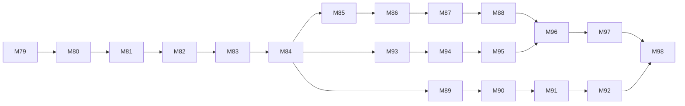

# KinematicIQ Phase 2 Execution Roadmap — M79-M98

**Issued:** 2026-07-12
**Authority:** Phase 2 Universal Movement Intelligence brief; ADR-001 through
ADR-010; M61-M78 evidence package
**Status:** Canonical next-phase roadmap
**Activation rule:** squat remains the only available protocol until a later
protocol closes its independent evidence, human-label, device, claims, and
explicit availability gates.

## 1. Audit decision

The repository already contains a protocol registry, a five-stage
`ProtocolRuntime`, protocol-owned live cyclic behavior, guarded planned stubs,
neutral benchmark sequences, replay parity, and evidence-tiered findings. Phase
2 therefore extends those seams instead of starting a second engine.

Observed contradictions are resolved as follows:

- The brief says “no persistence,” while canonical architecture already permits
  explicit opt-in local IndexedDB history. Phase 2 adds no persistence and does
  not remove the existing user-controlled local feature without a separate
  product decision.
- `docs/00_context_pack.md` and `docs/07_architecture.md` are stale through M33.
  Code plus M61-M78 progress/traceability records govern until M80 refreshes
  them.
- Research examples contain numeric confidence gates, but current product tiers
  are not calibration evidence. Phase 2 records thresholds and provenance; it
  does not adopt research example numbers without benchmarks.
- “Universal” means a shared contract that can abstain and represent cyclic,
  transition, ballistic, and gait outcomes. It does not mean protocol
  availability or universal scientific validity.

## 2. Milestone map

| Phase | Milestones | Outcome |
|---|---|---|
| Foundation | M79-M84 | Canonical roadmap, current docs, versioned universal contracts, squat parity, contract lint |
| Tracking robustness | M85-M88 | Saved baseline, landmark-state taxonomy, bounded recovery experiment, actionable diagnostics |
| Product experience | M89-M92 | Evidence-led UI system and compact end-to-end journeys without activating protocols |
| Research-to-code governance | M93-M95 | Machine-checkable sources, thresholds, metrics, coaching inputs, and claims |
| Validation readiness | M96-M98 | Statistical utilities, human/device study package, integration audit and activation decision |



## 3. Execution milestones

Every implementation milestone must add a progress note recording objective,
baseline, changed files, tests, evidence, risks, rollback, deferrals, and gates.
Commands are run from `web/` unless stated otherwise.

### M79 — Phase 2 audit, roadmap, and handoff

**Class:** autonomous documentation. **Depends on:** M78.
Inventory actual architecture, contradictions, dirty-worktree baseline, risks,
and external gates. Create this roadmap and the living handoff before production
code changes.
**Acceptance:** 20 non-invented milestones; dependency graph; classifications;
measurable gates; rollback and commands; squat-only availability stated.
**Verify:** `git diff --check`; link/path audit with `rg`.
**Rollback:** remove the Phase 2 roadmap/handoff/progress note only.

### M80 — Canonical context and architecture refresh

**Class:** autonomous documentation. **Depends on:** M79.
Refresh `00_context_pack.md` and `07_architecture.md` through M79, removing stale
counts and documenting the M39-M78 runtime, datasets, browser matrix, and gates.
**Acceptance:** file/module statements match code; no M33-era status remains;
local-only history contradiction is explicit.
**Verify:** `npm run build`; `npm test -- --run`; `git diff --check`.
**Rollback:** revert only the two canonical documentation files.

### M81 — Protocol evidence and lifecycle contract v2

**Class:** autonomous architecture/implementation. **Depends on:** M80.
Add versioned protocol metadata for research/evidence/availability state,
dataset provenance, camera assumptions, validation gates, and acceptance
threshold provenance without making any planned protocol available.
**Acceptance:** squat metadata complete; every stub remains planned and throws;
invalid state combinations are rejected; backward compatibility documented.
**Verify:** targeted `core/protocol` and registry tests, then build/full unit.
**Rollback:** remove additive fields/parser and restore prior definitions.

### M82 — Universal trial/outcome contract

**Class:** autonomous architecture. **Depends on:** M81.
Version a movement-neutral outcome model for repetition, transition, ballistic
event, and stride, with explicit missingness/rejection and no mandatory
`RepMetrics[]`.
**Acceptance:** deterministic synthetic fixtures for all four kinds; ordering and
missing-event validation; no session schema migration yet.
**Verify:** targeted contract tests; build; full unit.
**Rollback:** remove the additive outcome module; existing session shapes remain.

### M83 — Squat runtime adapter and golden parity

**Class:** autonomous refactor. **Depends on:** M82.
Make squat emit/adapt the neutral outcome contract while preserving its existing
result and replay artifacts.
**Acceptance:** exact existing rep/tape outputs and 9/9 labeled counts; no
threshold change; old consumers remain readable.
**Verify:** squat golden tests, `npm run eval:tapes`, camera E2E, full unit/coverage.
**Rollback:** revert the adapter and keep the neutral contract unused.

### M84 — Protocol completeness and activation lint

**Class:** autonomous governance tooling. **Depends on:** M83.
Reject available protocols missing runtime, capture, evidence, metric, finding,
confidence, provenance, or acceptance declarations.
**Acceptance:** deliberate malformed fixtures fail; current squat passes; all
planned protocols remain non-runnable.
**Verify:** registry/runtime lint tests; claims tests; build.
**Rollback:** remove lint entry point/tests; no runtime data migration.

### M85 — Tracking robustness baseline v1

**Class:** autonomous measurement. **Depends on:** M84.
Save versioned raw-versus-filtered jitter, jump, missingness, recovery, frame
interval, critical-landmark coverage, and rep/event parity for current tapes.
**Acceptance:** immutable input/version metadata; per-tape and aggregate output;
no filter/threshold change; missing corpus reported, never hidden.
**Verify:** targeted benchmark tests; `eval:tapes`; dataset evaluations.
**Rollback:** remove the new evaluator and generated baseline.

### M86 — Landmark-state and failure taxonomy

**Class:** autonomous implementation. **Depends on:** M85.
Represent observed, low-confidence, short-gap, recovered, missing, out-of-frame,
ambiguous-side, and rejected states without inventing coordinates.
**Acceptance:** deterministic transitions; raw state retained; metric eligibility
can distinguish recovered from observed; no user claim changes.
**Verify:** targeted CV tests, coverage, tape baseline comparison.
**Rollback:** remove additive state model/adapters.

### M87 — Bounded recovery experiment

**Class:** evidence-gated experiment. **Depends on:** M86.
Compare current behavior with one named short-gap/confidence-aware candidate.
**Acceptance:** predeclared improvement and non-regression gates; accept only if
saved baselines improve without rep/event/camera regression; otherwise record a
rejected experiment and retain current behavior.
**Verify:** robustness evaluator, tape/dataset suites, camera E2E, coverage.
**Rollback:** candidate behind an isolated adapter; delete/revert on gate failure.

### M88 — Tracking diagnostics and recovery guidance

**Class:** autonomous UX logic. **Depends on:** M86; consumes M87 decision.
Map quality states to one prioritized, protocol-owned repositioning instruction
and analyst evidence without claiming anatomical error.
**Acceptance:** deterministic priority, abstention preserved, no contradictory
front/side copy, accessible text alternatives.
**Verify:** targeted guidance tests, claims audit, cross-browser camera E2E.
**Rollback:** revert mapping/UI copy; retain underlying state model.

### M89 — Phase 2 journey audit and UI system v2

**Class:** autonomous research/documentation. **Depends on:** M84.
Audit Landing through Results/Replay/History against hierarchy, scroll depth,
mobile, accessibility, confidence, error, and protocol-state requirements.
**Acceptance:** measured findings, prioritized wire contracts, updated tokens and
component/state rules; no visual change yet.
**Verify:** current screenshots/DOM measurements, axe/support suite, diff hygiene.
**Rollback:** revert UI documentation only.

### M90 — Movement selection and setup information architecture

**Class:** autonomous UI implementation. **Depends on:** M89, M84.
Present available versus research/planned movements clearly; derive setup copy
from protocol metadata; planned choices cannot enter analysis.
**Acceptance:** squat path unchanged; disabled states explain evidence status;
mobile/keyboard/screen-reader automation passes.
**Verify:** component/model tests, claims tests, support E2E, visual inspection.
**Rollback:** restore existing picker/setup composition.

### M91 — Calibration and active-analysis hierarchy

**Class:** autonomous UI implementation. **Depends on:** M90, M88.
Reduce active-session cognitive load to status, one correction, reps/trials, and
primary action; retain analyst detail behind disclosure.
**Acceptance:** no action overlap at 320/390/tablet; status is text/live-region;
fixture flows and reduced motion pass.
**Verify:** camera unit/E2E, axe, cross-browser responsive and visual checks.
**Rollback:** revert presentation components/CSS, not analysis logic.

### M92 — Compact results and evidence-linked replay

**Class:** autonomous UI implementation. **Depends on:** M91, M83.
Remove repeated evidence, prioritize verdict + up to three cues, and keep every
judgment linked to metric/provenance/replay evidence.
**Acceptance:** invalid sets fully abstain; no orphan claims; reduced measured
scroll depth; exports preserve information.
**Verify:** result-model/export tests, claims/axe/support E2E, visual desktop/mobile.
**Rollback:** restore prior report composition; session artifacts unchanged.

### M93 — Executable research-to-product traceability schema

**Class:** autonomous governance implementation. **Depends on:** M84.
Model source → concept → signal → metric → threshold/interpretation → coaching →
copy → validation requirement as versioned metadata.
**Acceptance:** squat active concepts represented; citations and evidence status
required; rejected concepts explicit; deterministic serialization.
**Verify:** schema/parser tests, docs cross-check, build/full unit.
**Rollback:** remove additive registry/report; product runtime unchanged.

### M94 — Threshold provenance and metric-orphan lint

**Class:** autonomous governance tooling. **Depends on:** M93.
Classify every active threshold as literature-, dataset-, expert-, heuristic-, or
user-calibrated and detect orphaned active metrics.
**Acceptance:** no unclassified active threshold; heuristics labeled; every
active metric has purpose, landmarks, failure modes, tier, and validation gate.
**Verify:** traceability lint, metric tests, claims tests.
**Rollback:** revert lint/metadata additions; never weaken tests to pass.

### M95 — Coaching input and claim-strength lint

**Class:** autonomous governance tooling. **Depends on:** M94.
Detect coaching rules without measurable inputs/evidence status and copy stronger
than its validation tier; preserve the maximum-three-primary-cues rule.
**Acceptance:** malformed fixtures fail; all active squat rules trace; forbidden
claims remain rejected.
**Verify:** finding/coaching/claims tests, full unit/coverage.
**Rollback:** remove lint adapter only; keep traceability data.

### M96 — Validation statistics library v1

**Class:** autonomous synthetic infrastructure. **Depends on:** M85, M95.
Implement deterministic MAE, RMSE, bias, Bland-Altman limits, correlation,
precision/recall/F1, confusion matrices, event/count accuracy, and documented
ICC variants where assumptions are met.
**Acceptance:** textbook/synthetic fixtures; missing/degenerate inputs abstain or
error explicitly; outputs state assumptions; no real-study result generated.
**Verify:** targeted numerical tests and coverage; independent hand calculations.
**Rollback:** remove isolated statistics module.

### M97 — Human/device validation execution package

**Class:** autonomous preparation; human/device/expert execution gated. **Depends on:** M96.
Unify study protocol, rater manual, schemas, split rules, analysis plan, device,
accessibility, failure report, reproducibility record, and release-claim matrix.
**Acceptance:** exact operator steps and blank evidence forms; named owners/gates;
no fabricated rows.
**Verify:** schema fixtures, command dry runs, link/diff hygiene.
**Rollback:** revert documentation/templates only.

### M98 — Phase 2 integration and activation audit

**Class:** autonomous audit; activation evidence-gated. **Depends on:** M92, M97.
Run the complete matrix, update risks/traceability/handoff, and decide which work
is complete, rejected, or externally blocked.
**Acceptance:** build, 533+ unit tests, coverage, support/axe, tapes, UI-PRMD,
LLM-FMS, audits, data hygiene; squat parity; no unearned protocol availability.
**Verify:** all commands in §4.
**Rollback:** revert only the failing milestone slice; activation is a separate
explicit change after evidence review.

## 4. Major-boundary verification matrix

```powershell
npm run build
npm test -- --run --reporter=dot
npm run test:coverage
npm run test:e2e:a11y
npm run test:e2e:support
npm run eval:tapes
npm run eval:datasets
npm run eval:llm-fms
npm audit --json
git diff --check
git status --short --ignored
```

Raw/restricted data must remain under gitignored local caches. Physical iPhone,
NVDA/VoiceOver, independent raters, expert review, unavailable original data,
and any protocol activation remain external gates rather than inferred passes.
