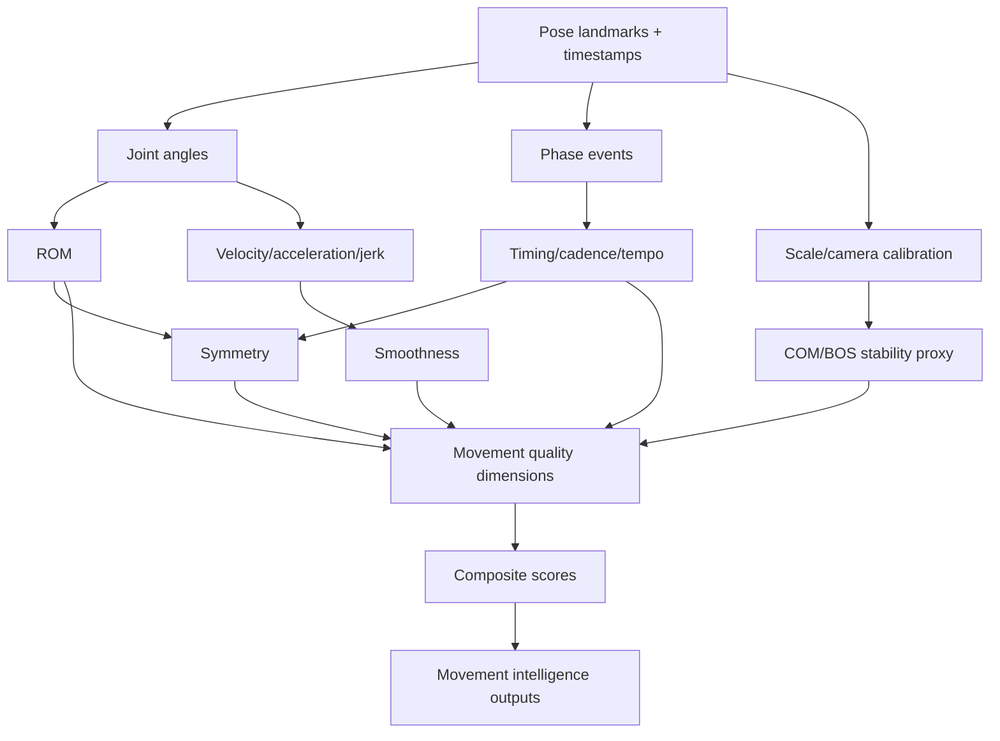

# KinematicIQ Metric Engine Specification

Generated: 2026-07-06

Purpose: define the practical, extensible metric library for a browser-based markerless biomechanics platform. This is an engineering specification, not a product review. It distinguishes metrics that are directly measurable from video, derived metrics, composite scores, research-only constructs, and outputs that are not defensible from a single RGB camera alone.

## 0. Evidence And Feasibility Principles

KinematicIQ should treat markerless video as a measurement system with uncertainty, not as a force plate or marker-based lab replacement. The strongest near-term evidence supports 2D/3D kinematics, spatiotemporal gait parameters, phase timing, range of motion, and gross posture measures. Evidence is weaker for ankle/foot kinematics, transverse-plane rotations, center of pressure, joint kinetics, ground reaction force, muscle force, tendon load, and tissue stress without additional sensors or assumptions.

Evidence anchors:

- Markerless camera-based gait analysis shows good-to-excellent performance for many spatiotemporal variables; hip/knee kinematics are generally more defensible than ankle kinematics. Source: [Sensors 2024 systematic review/meta-analysis](https://pmc.ncbi.nlm.nih.gov/articles/PMC11175331/).
- Commercial vision and AI pose estimation systems are promising for sports and exercise, but validation remains task-, camera-, population-, and model-specific. Source: [PMC mini-review](https://pmc.ncbi.nlm.nih.gov/articles/PMC12378739/).
- Single-camera and 2D methods can be reliable for selected posture and frontal-plane screening variables, but they should not be treated as full 3D biomechanics. Sources: [forward head posture review](https://pmc.ncbi.nlm.nih.gov/articles/PMC9354067/), [2D knee valgus validity](https://pmc.ncbi.nlm.nih.gov/articles/PMC8805110/), [photogrammetry spinal posture review](https://pmc.ncbi.nlm.nih.gov/articles/PMC4757659/).
- Joint coordinate systems should follow standardized biomechanical conventions where possible. Sources: [ISB lower limb/spine recommendation](https://pubmed.ncbi.nlm.nih.gov/11934426/), [ISB upper limb recommendation](https://pubmed.ncbi.nlm.nih.gov/15844264/).
- Movement quality has measurable components, but generic "quality" scores should be decomposed into validated dimensions such as smoothness, symmetry, consistency, coordination, stability, timing, and task success. Sources: [smoothness/jerk study](https://www.frontiersin.org/articles/10.3389/fbioe.2021.782740/full), [smoothness metrics comparison](https://www.mdpi.com/1424-8220/23/3/1158).

Feasibility tiers:

- Tier A: browser + single RGB, high feasibility: 2D landmarks, joint angles in visible plane, timing, cadence, repetition counts, path length in image-normalized units, symmetry from bilateral visible landmarks, phase duration, gross posture.
- Tier B: browser + single RGB, conditional feasibility: 3D pose estimates, segment velocities, angular velocities, COM proxy, trunk lean, dynamic knee valgus, smoothness, variability, ROM, coordination. Requires calibration, model confidence, stable camera, and task-specific validation.
- Tier C: multi-view/RGB-D/IMU recommended: transverse-plane rotation, scapular motion, foot pronation/supination, pelvis rotation, ankle kinematics, true COM trajectory, joint moments, power, GRF estimates.
- Tier D: not currently feasible with single RGB alone: center of pressure, tissue strain, ligament load, tendon force, muscle activation, metabolic cost, true fatigue physiology, bone stress, contact forces, pain diagnosis.

## 1. Universal Metric Ontology

Hierarchy:

```text
Movement domain
  Movement task
    Trial
      Movement phase
        Body region
          Segment
            Landmark / joint / coordinate frame
              Primary metric
                Derived metric
                  Composite score
                    Movement intelligence output
```

Why this is extensible:

- Every human movement can be decomposed into a task, repetitions/trials, phases, body regions, and measurable state variables.
- A "squat depth" and a "pitching elbow slot" differ in domain and task, but both reduce to pose states, phase timing, joint/segment metrics, and task-specific interpretations.
- The ontology separates measurement from interpretation. A knee angle is a metric; "valgus risk" is an interpretation; "Movement IQ" is a composite.
- New tasks can be added by defining phase detectors and expected metric families without rewriting the metric engine.

Canonical metric object:

```json
{
  "metric_id": "knee_flexion_angle_peak",
  "type": "primary | derived | composite | research_only | infeasible_single_rgb",
  "task": "squat",
  "phase": "descent | bottom | ascent | whole_trial",
  "body_region": "lower_limb",
  "definition": "Peak sagittal-plane knee flexion angle during selected phase.",
  "formula": "theta = angle(hip, knee, ankle)",
  "inputs": ["2D_or_3D_landmarks", "timestamps", "camera_calibration_optional"],
  "outputs": ["value", "time_of_peak", "side", "confidence", "quality_flags"],
  "units": "deg",
  "normalization": "side, limb length, task phase, age/sex/sport norms where validated",
  "confidence_model": "landmark_confidence * visibility * calibration_quality * temporal_stability * validation_prior",
  "feasibility": "A/B/C/D",
  "complexity": "O(T * J)",
  "evidence_grade": "high | moderate | emerging | research",
  "limitations": ["occlusion", "out_of_plane_motion"],
  "implementation_notes": ["filter before differentiating", "report uncertainty"]
}
```

## 2. Measurement Pipeline

Recommended implementation:

1. Capture video with timestamp integrity, camera orientation, frame rate, device metadata, resolution, and user calibration prompts.
2. Estimate 2D landmarks and, where supported, monocular 3D landmarks. Store model confidence per landmark per frame.
3. Smooth landmarks with a task-aware low-pass filter. Do not over-filter impact or rapid ballistic events.
4. Build segment coordinate frames using ISB-like conventions where 3D landmarks are available.
5. Detect task, repetitions, and phases using state machines plus learned classifiers.
6. Compute primary metrics first, derived metrics second, composites last.
7. Propagate uncertainty and suppress outputs below minimum confidence.
8. Validate per task against a reference standard before making clinical or high-stakes claims.

Generic confidence:

```text
C_metric = C_pose * C_visibility * C_calibration * C_task * C_model * C_signal

C_pose = weighted mean of involved landmark confidences
C_visibility = penalty for occlusion, truncation, self-contact, off-screen joints
C_calibration = camera scale/orientation certainty
C_task = phase detector confidence
C_model = validation prior for metric/task/camera/population
C_signal = temporal consistency and plausible anatomical range
```

Differentiation rule:

```text
position -> filtered position
velocity = d(position_filtered) / dt
acceleration = d(velocity_filtered) / dt
jerk = d(acceleration_filtered) / dt
```

Never compute velocity, acceleration, or jerk directly from unsmoothed landmarks.

## 3. Primary Metrics

All primary metrics include these standard outputs unless noted: value, side, phase, timestamp, trial summary, confidence, quality flags, units, normative comparator if validated, and raw trace for review.

| Metric | Type | Definition and formulation | Rationale/significance | Inputs | Outputs/units | Normalization and confidence | Feasibility | Complexity | Validation, limitations, mistakes, implementation |
|---|---|---|---|---|---|---|---|---|---|
| Joint angle | Direct/derived | Angle between adjacent segments; 2D: angle(a,b,c); 3D: joint coordinate system Euler/Cardan angles. | Core clinical and sports kinematic variable; informs ROM, compensation, technique, and asymmetry. | Landmarks, segment frames, timestamps. | deg, peak, min, mean, trace. | Normalize by task phase, side, sport, age; confidence is product of involved landmarks and plane validity. | A for 2D visible-plane, B/C for 3D. | O(TJ). | Use ISB conventions; avoid mixing 2D and 3D definitions; flag out-of-plane motion. |
| Joint position | Direct | Landmark or joint center position in image, camera, or body-normalized coordinates. | Enables tracking, phase detection, path metrics, displacement, symmetry. | Landmarks, optional calibration. | px, normalized units, m if calibrated. | Normalize to body height/segment length; confidence from landmark score. | A/B. | O(TJ). | Absolute meters from single RGB require scale assumptions; report coordinate frame. |
| Joint orientation | Derived | Orientation of a joint/segment frame relative to global or parent frame. | Needed for 3D kinematics, posture, rotation, and coordination. | 3D landmarks or multi-sensor data. | deg, quaternion, rotation matrix. | Normalize by anatomical neutral pose; confidence depends on 3D depth quality. | B/C. | O(TJ). | Transverse-plane estimates are fragile from monocular video; avoid clinical claims without validation. |
| Range of motion | Derived | ROM = max(theta) - min(theta) over trial/phase. | Mobility proxy; useful for rehab and performance constraints. | Joint angle trace. | deg. | Phase-specific norms; confidence combines angle confidence across extrema. | A/B. | O(TJ). | Extremes are noise-sensitive; require minimum dwell or robust percentiles. |
| Segment length | Direct/derived | Distance between adjacent landmarks. | Calibration, anthropometrics, scaling, plausibility checks. | Landmarks, scale reference optional. | px, normalized, m. | Normalize to height; confidence penalizes foreshortening. | A/B. | O(TJ). | Single-view apparent lengths vary with depth and perspective; use as scale proxy, not diagnosis. |
| Segment velocity | Derived | v = dx/dt for segment endpoint or center. | Speed, explosiveness, path control, timing. | Position trace, timestamps. | m/s, normalized length/s, px/s. | Normalize to height or limb length; confidence penalizes frame drops. | B. | O(TJ). | Filter first; require accurate timestamps. |
| Segment acceleration | Derived | a = dv/dt. | Ballistic control, impact proxy, rapid deceleration. | Velocity trace. | m/s^2 or normalized units/s^2. | Normalize to body scale and task speed. | B. | O(TJ). | Differentiation amplifies noise; use only when signal quality is high. |
| Angular velocity | Derived | omega = d(theta)/dt. | Movement speed, sequencing, skill timing. | Angle trace. | deg/s or rad/s. | Normalize by phase duration/task speed. | B. | O(TJ). | Do not compare across different filtering/frame rates without standardization. |
| Angular acceleration | Derived | alpha = d(omega)/dt. | Explosiveness and control; input to jerk/smoothness. | Angular velocity trace. | deg/s^2 or rad/s^2. | Normalize to task speed; confidence lower than angle/velocity. | B/C. | O(TJ). | High noise; report mainly as trace or research feature. |
| Center of mass proxy | Derived | Weighted sum of segment centers using anthropometric tables, or pelvis/trunk proxy. | Balance, stability, displacement, task control. | 2D/3D segment positions, segment weights. | normalized position, m if calibrated. | Normalize to base of support and height; confidence from trunk/pelvis visibility. | B/C. | O(TJ). | True COM requires 3D segment estimates; pelvis midpoint alone is only a proxy. |
| Center of pressure proxy | Research/infeasible | Approximate pressure location from foot contact geometry and COM dynamics. | COP is central to balance assessment, but normally requires force plate/pressure mat. | Foot contacts, COM, assumptions. | normalized foot coordinate. | Confidence should be low without force data. | D for true COP, C for proxy. | O(TJ). | Do not label video-only outputs as true COP. Use "support/contact proxy." |
| Timing | Direct | Event timestamps: start, end, contact, takeoff, peak, transition. | Required for phase duration, cadence, tempo, coordination. | Landmarks, frame times, event detectors. | s, frame index. | Confidence from detector margin and temporal consistency. | A. | O(T). | Frame rate and dropped frames matter; keep original timestamps. |
| Tempo | Derived | Ratio or pattern of phase durations, e.g., eccentric:isometric:concentric. | Training prescription and motor control. | Phase timestamps. | ratio, bpm, s. | Normalize by movement task. | A. | O(T). | Avoid inferring intent; report observed tempo. |
| Cadence | Derived | Steps/reps per minute. | Gait/running load, training rhythm, fatigue indication. | Event detector, timestamps. | steps/min, reps/min. | Normalize by speed/task; confidence from event detection. | A. | O(T). | Cadence changes often covary with speed; avoid causal claims without context. |
| Phase duration | Derived | Duration of named phase = t_end - t_start. | Reveals asymmetry, hesitation, control, fatigue. | Phase events. | s, % cycle. | Normalize to cycle duration. | A. | O(T). | Phase definitions must be task-specific and stable. |
| Path length | Derived | Sum of point-to-point displacement over phase. | Economy, sway, control, tremor proxy. | Position trace. | normalized units, m. | Normalize by body size and task amplitude. | A/B. | O(T). | Noise inflates path length; filter and set minimum displacement thresholds. |
| Curvature | Derived | Deviation of trajectory from straight line; kappa or path length/displacement ratio. | Motor planning, efficiency, compensation. | Position trace. | unitless or 1/m. | Normalize by task amplitude. | B. | O(T). | Sensitive to camera plane and smoothing. |
| Smoothness | Derived | Jerk-based, velocity peak count, log dimensionless jerk, spectral arc length. | Quantifies fluidity and neuromotor control; used in rehabilitation and motor assessment. | Position/angle traces, timestamps. | unitless, jerk units. | Normalize by movement duration and amplitude; confidence requires high frame rate/stability. | B/C. | O(T log T) for spectral. | Use dimensionless metrics for comparisons; avoid raw jerk across tasks. |
| Jerk | Derived | Third derivative of position or angle. | Lower jerk often indicates smoother motion, but interpretation is task-dependent. | Acceleration trace. | m/s^3, deg/s^3, normalized. | Normalize by amplitude and duration. | C. | O(T). | Very noise-sensitive; use only with validated filtering. |
| Balance | Composite/derived | Ability to maintain COM relative to base of support; proxy via sway, foot events, trunk/pelvis motion. | Fall risk, rehab, sport control. | COM proxy, foot landmarks, support polygon. | sway, MoS proxy, errors. | Normalize by stance width, height, task. | B/C. | O(TJ). | True balance needs perturbation/control context; video proxy is not vestibular diagnosis. |
| Stability | Derived/composite | Resistance to loss of control; dynamic proxy via extrapolated COM and base of support margin. | Important for gait, landing, cutting, aging, rehabilitation. | COM, COM velocity, BOS. | margin, time-to-boundary proxy. | Normalize by leg length and velocity. | C. | O(TJ). | Hof margin of stability requires defensible COM/BOS; single RGB is conditional. |
| Symmetry | Derived | Difference or ratio between left and right metric values. | Rehab, gait, bilateral sport tasks, fatigue, compensation. | Bilateral metrics. | %, ratio, absolute difference. | Use symmetry angle or normalized difference; confidence combines both sides. | A/B. | O(TJ). | Symmetry is not always ideal in asymmetric sports. |
| Variability | Derived | Trial-to-trial or cycle-to-cycle dispersion: SD, CV, entropy, stride variability. | Motor control adaptability; can relate to fall/injury risk depending on context. | Repeated cycles/trials. | SD, CV, entropy. | Normalize by mean and task speed. | A/B. | O(NT). | Too little and too much variability can both be undesirable; avoid one-direction scoring. |
| Repeatability | Derived | Within-session consistency using ICC-like or distance metrics across repetitions. | Technique consistency and learning. | Repeated trials. | ICC, CV, DTW distance. | Normalize by phase and amplitude. | B. | O(NT). | Requires enough repetitions; do not overinterpret n<3. |
| Coordination | Derived/research | Relative timing/phase between joints or segments; CRP, vector coding, cross-correlation. | Captures sequencing and intersegmental control. | Angle traces, phase-normalized cycles. | relative phase deg, coupling angle, variability. | Normalize to cycle percent. | B/C. | O(NT). | Requires good phase alignment; definitions vary. |

Primary metric pseudocode:

```python
def compute_metric_trace(landmarks, timestamps, metric_spec):
    clean = interpolate_short_gaps(landmarks, max_gap_frames=3)
    filtered = lowpass_filter(clean, cutoff=metric_spec.cutoff_hz)
    phases = detect_phases(filtered, timestamps, metric_spec.task)
    values = metric_spec.formula(filtered, timestamps, phases)
    confidence = propagate_confidence(filtered, phases, metric_spec.validation_prior)
    return summarize(values, phases, confidence)
```

## 4. Posture Metrics

Posture metrics are defensible as screening and trend metrics when camera placement is standardized. They are weaker as diagnosis because posture varies with breathing, fatigue, stance, habit, pain, anthropometry, and instruction. Radiography remains the reference for bony spinal curvature; photogrammetry is more appropriate for surface alignment and repeated non-invasive monitoring.

| Metric | Type | Definition/formula | Significance | Inputs | Units | Normalization/confidence | Feasibility | Validation and implementation notes |
|---|---|---|---|---|---|---|---|---|
| Forward head | Direct/derived | Craniovertebral angle or head anterior translation relative to trunk. | Neck loading, ergonomic screening, posture trend. | Ear/tragus proxy, C7/neck proxy, shoulder/trunk landmarks. | deg, normalized distance. | Lateral camera; confidence depends on head/neck visibility. | A/B. | CVA photogrammetry has reliability evidence, but landmark proxies differ from palpated points. |
| Thoracic kyphosis | Derived/research | Sagittal curvature proxy from upper spine/shoulder/trunk landmarks. | Spinal posture, aging, mobility. | 3D trunk or side-view landmarks. | deg/proxy score. | Camera standardized; confidence low without spine landmarks. | B/C. | Photogrammetry evidence is mixed; report as surface posture estimate. |
| Lumbar lordosis | Derived/research | Sagittal lumbar curve or pelvis-trunk angle proxy. | Low-back posture and movement strategy. | Pelvis, trunk, hip landmarks. | deg/proxy. | Requires side view and calibrated posture. | C. | Surface landmarks poorly capture lumbar curve through clothing; avoid diagnosis. |
| Pelvic tilt | Derived | Angle of pelvis segment relative to horizontal/vertical in sagittal plane. | Squat, gait, lumbar mechanics, hip strategy. | ASIS/PSIS if available, hip/pelvis proxy otherwise. | deg. | Normalize to neutral calibration. | B/C. | Monocular hip keypoints are only a proxy for anatomical pelvis. |
| Pelvic rotation | Derived/research | Transverse-plane rotation of pelvis relative to camera/body. | Gait, throwing, cutting, compensation. | 3D pelvis landmarks. | deg. | Needs 3D and camera calibration. | C. | Not robust from single frontal or sagittal RGB alone. |
| Shoulder elevation | Direct/derived | Vertical asymmetry or scapular/shoulder height angle. | Neck/shoulder screening, asymmetry, load carriage. | Shoulder, neck landmarks. | deg, normalized distance. | Normalize by shoulder width. | A. | Sensitive to camera roll; auto-level or calibrate. |
| Shoulder protraction | Derived/research | Forward displacement of shoulder relative to trunk/head in sagittal plane. | Posture and upper limb mechanics. | Lateral shoulder/trunk landmarks. | deg/distance. | Normalize by trunk length. | B. | Clavicle/scapula cannot be directly measured from standard pose points. |
| Scapular symmetry | Research-only | Difference in scapular position/orientation. | Shoulder rehab and overhead sport. | Scapular landmarks or specialized model. | deg/mm/proxy. | Confidence low unless scapula visible/tracked. | C/D. | Standard RGB pose models do not see scapular landmarks through clothing. |
| Rib flare | Research-only | Inferior rib cage protrusion relative to pelvis/trunk. | Breathing/bracing posture, trunk control. | Rib landmarks not common in pose models. | proxy score. | Requires visible rib cage or custom model. | D. | Do not infer reliably through clothing from generic landmarks. |
| Hip shift | Derived | Lateral pelvis displacement relative to foot midpoint or support base. | Squat/deadlift compensation, asymmetry. | Hip/pelvis, feet. | normalized distance, %. | Normalize by stance width. | A/B. | Frontal view best; distinguish intentional asymmetrical stance. |
| Knee valgus | Derived | Frontal-plane projection angle: hip-knee-ankle alignment; positive medial knee displacement. | ACL/patellofemoral screening, landing/cutting control. | Frontal hip/knee/ankle landmarks. | deg or normalized medial displacement. | Normalize by limb length/stance; confidence from lower-limb visibility. | A/B. | 2D FPPA can be useful, but not equal to 3D knee abduction moment. |
| Knee varus | Derived | Lateral knee displacement relative to hip-ankle line. | Load distribution and technique screening. | Frontal landmarks. | deg/proxy. | Same as valgus. | A/B. | Interpret with anatomy, stance width, and sport task. |
| Foot progression angle | Derived | Foot long-axis angle relative to walking/progression direction. | Gait, running, lower-limb alignment. | Toe/heel landmarks, trajectory. | deg. | Normalize by direction of travel. | B/C. | Foot landmarks are often weak in RGB; shoes/occlusion matter. |
| Toe-out angle | Derived | Static/dynamic external rotation of foot relative to body or travel line. | Squat stance, gait, hip/ankle strategy. | Foot landmarks. | deg. | Task-specific norms. | B/C. | True tibial/hip rotation cannot be inferred from toe-out alone. |
| Spinal neutrality | Composite/research | Combined trunk flexion, lateral flexion, rotation, and curvature proxy relative to calibrated neutral. | Lifting/squat/deadlift coaching, ergonomic risk. | Trunk, pelvis, shoulder, head landmarks. | score, deg components. | Normalize to user neutral; confidence penalizes side/rotation ambiguity. | B/C. | Use as coaching cue, not diagnosis of spinal pathology. |

## 5. Movement Quality Dimensions

Movement quality is measurable when decomposed into observable dimensions:

| Dimension | Quantification | Examples | Feasibility |
|---|---|---|---|
| Control | Low unintended displacement, stable endpoint, low overshoot, consistent phase transitions. | Knee path control in squat, trunk sway in balance. | A/B |
| Coordination | Intersegment timing, continuous relative phase, vector coding, cross-correlation. | Hip-knee-ankle sequencing. | B/C |
| Mobility | ROM achieved with task-relevant control and without compensatory excursions. | Squat depth plus trunk/pelvis constraints. | A/B |
| Stability | COM/BOS relationship, sway, landing stabilization time, foot errors. | Single-leg stance, landing. | B/C |
| Efficiency | Path economy, unnecessary motion, tempo consistency; true metabolic efficiency requires physiology. | Bar/hand path, running vertical oscillation proxy. | B/C |
| Rhythm | Cycle timing regularity, cadence stability, phase ratios. | Gait, running, reps. | A |
| Fluidity | Smoothness metrics such as LDLJ, SPARC, velocity peaks. | Shoulder reach, squat ascent. | B/C |
| Consistency | Trial-to-trial variability, DTW distance, ICC-like repeatability. | Repeated jump mechanics. | B |
| Adaptability | Ability to maintain outputs across constraints/speeds/fatigue states. | Technique under load or dual task. | C/research |
| Precision | Endpoint error, target path deviation, phase event accuracy. | Rehab reaching, sport skill. | A/B |
| Sequencing | Ordered peaks/events across segments. | Proximal-to-distal throw, jump extension. | B/C |

## 6. Composite Metrics

Composite scores must be explainable, confidence-weighted, and decomposable. Default method:

```text
metric_score_i = clamp(50 + 10 * z_i_directional, 0, 100)
weighted_score = sum(w_i * C_i * metric_score_i) / sum(w_i * C_i)
score_confidence = mean(C_i) * coverage_factor * validation_prior
```

Where possible, weights should be learned from validation outcomes or set by Delphi/expert consensus and versioned. Avoid hidden arbitrary weights.

| Composite | Required inputs | Formula | Interpretability | Validation strategy | Feasibility |
|---|---|---|---|---|---|
| Movement IQ | Mobility, stability, control, symmetry, consistency, task success, confidence. | Hierarchical weighted score; domain-specific subscales first, global score second. | Overall movement profile, never a diagnosis. | Predict known coach/clinician ratings and longitudinal improvements. | B |
| Mobility Index | ROM metrics plus compensation penalties. | Mean confidence-weighted ROM percentiles minus compensation cost. | "Can access task-relevant positions." | Compare to goniometry/3D motion capture and task outcomes. | A/B |
| Stability Index | Sway, COM/BOS proxy, landing stabilization time, foot errors. | Weighted stability submetrics normalized by task. | "Can control body over support." | Compare to force plate/BESS/gait fall-risk metrics. | B/C |
| Control Index | Path deviation, overshoot, valgus/varus excursion, trunk drift. | Penalty model from ideal task corridors plus smoothness. | "Can keep motion within desired corridors." | Compare to expert ratings and measured errors. | A/B |
| Efficiency Index | Path economy, unnecessary displacement, tempo economy, vertical oscillation proxy. | 100 - weighted inefficiency penalties. | "Uses less wasted motion." | Compare to performance/energy metrics where available. | B/C |
| Symmetry Score | Bilateral ROM, timing, peak angles, path, loading proxies. | 100 - normalized side-to-side differences. | "How similar sides are for this task." | Compare to instrumented gait/jump asymmetry. | A/B |
| Readiness Index | Baseline deviation, movement speed, ROM, stability, fatigue proxy, soreness if user-entered. | Bayesian/longitudinal model vs personal baseline. | "Today's movement state vs your normal." | Prospective association with performance and wellness. | B |
| Fatigue Index | Velocity loss, tempo drift, ROM decay, variability increase, landing control decay. | Slope and deviation model over sets/trials. | "Observable mechanical fatigue." | Compare to workload/RPE/force outputs. | B |
| Compensation Score | Extra trunk/hip/foot motion associated with target limitation. | Penalty graph: primary limitation plus correlated compensations. | "Likely movement workaround." | Validate per task against expert labels. | B |
| Recovery Score | Return-to-baseline across ROM, symmetry, control, pain-free completion if entered. | Weighted distance from personal baseline and contralateral side. | "Progress toward prior pattern." | Rehab cohort longitudinal validation. | B/C |
| Athleticism Index | Jump/landing timing, speed, ROM, stiffness proxy, coordination, repeatability. | Sport-specific percentile composite. | Performance phenotype, not health score. | Compare to performance testing. | B/C |
| Technical Consistency Index | DTW similarity, phase timing CV, endpoint/path repeatability. | 100 - normalized variability penalties. | "Repeats the same technique." | Reliability across sessions and coach labels. | A/B |

Composite pseudocode:

```python
def composite_score(inputs, weights, norms):
    usable = [m for m in inputs if m.confidence >= m.min_confidence]
    z = [directional_z(m.value, norms[m.id]) for m in usable]
    sub_scores = [max(0, min(100, 50 + 10 * zi)) for zi in z]
    numerator = sum(weights[m.id] * m.confidence * s for m, s in zip(usable, sub_scores))
    denominator = sum(weights[m.id] * m.confidence for m in usable)
    coverage = len(usable) / len(inputs)
    return numerator / denominator, mean(m.confidence for m in usable) * coverage
```

## 7. Metric Relationships

Evidence-supported or plausible relationships should be represented as typed edges:

```text
edge = {
  source_metric,
  target_metric,
  relation: "causal | correlational | biomechanically_constrained | hypothesis",
  direction,
  confidence,
  evidence_url,
  task_context
}
```

Examples:

- Ankle dorsiflexion and squat mechanics: limited dorsiflexion is associated with increased trunk lean and altered hip/knee/pelvis strategies. Treat as biomechanically constrained and task-dependent, not a universal diagnosis. Sources: [squat review](https://pmc.ncbi.nlm.nih.gov/articles/PMC10987311/), [ankle mobility/trunk lean study](https://journals.lww.com/nsca-jscr/fulltext/2017/11000/effect_of_ankle_mobility_and_segment_ratios_on.11.aspx).
- Hip strength and knee valgus: evidence supports an association in some populations, but causal strength is limited and inconsistent. Source: [systematic review](https://pmc.ncbi.nlm.nih.gov/articles/PMC8304771/).
- Cadence and running load: increasing step rate commonly alters loading, stride length, stance time, and joint mechanics; causality is protocol-specific. Sources: [step-rate systematic review](https://link.springer.com/article/10.1186/s40798-022-00504-0), [stride frequency mechanics](https://pmc.ncbi.nlm.nih.gov/articles/PMC4000471/).
- Variability and injury/fall risk: gait variability can be associated with fall risk and prior injury, but interpretation is nonlinear and context-specific. Sources: [gait variability/fall risk study](https://pmc.ncbi.nlm.nih.gov/articles/PMC12471427/), [falls biomechanics review](https://www.mdpi.com/2673-7078/4/1/11).
- Smoothness and motor quality: jerk and spectral smoothness metrics can quantify movement fluency, especially in upper-limb and rehab contexts. Sources: [Frontiers smoothness study](https://www.frontiersin.org/articles/10.3389/fbioe.2021.782740/full), [Sensors smoothness comparison](https://www.mdpi.com/1424-8220/23/3/1158).

Dependency graph:



## 8. Movement Fingerprinting

Athlete representation:

```text
fingerprint = [
  task_id,
  phase-normalized kinematic traces,
  summary metrics,
  asymmetry vector,
  variability vector,
  smoothness vector,
  posture baseline,
  confidence vector,
  metadata: age band, sport, sex if user-provided, camera setup, date
]
```

Recommended architecture:

- Store raw pose traces, filtered traces, phase labels, metric summaries, confidence, and model version.
- Build per-task embeddings using phase-normalized metric traces plus summary metrics.
- Maintain personal baselines with exponentially weighted moving averages and robust variance.
- Use nearest-neighbor search for "similar movement profiles" only within comparable task/camera/population contexts.
- Use clustering for archetypes after removing confounders such as body size, camera angle, speed, and skill level.
- Use anomaly detection against personal baseline before population comparison; personal change is often more actionable than generic rank.

Outputs:

- Athlete similarity: nearest neighbors in validated embedding space.
- Archetype: cluster label with explanatory top features.
- Longitudinal fingerprint: trend deltas, confidence, and baseline drift.
- Anomaly: metric vector distance above personal threshold, with source features listed.

## 9. Scoring Philosophy

Comparison methods:

| Method | Strength | Weakness | Recommended use |
|---|---|---|---|
| Percentiles | Easy to understand. | Requires strong normative dataset; hides absolute change near tails. | Population dashboards. |
| Z-scores | Statistically convenient. | Assumes distribution quality; can feel abstract. | Internal scoring and longitudinal changes. |
| Min-max | Simple. | Very sensitive to chosen bounds. | UI ranges only when bounds are validated. |
| Population norms | Competitive and clinical context. | Can be biased by sample. | Mature metrics with large datasets. |
| Sport-specific norms | More relevant. | Smaller samples, positional confounds. | Athletic reporting. |
| Age-adjusted norms | Necessary for development/aging. | Requires careful strata. | Youth, masters, clinical. |
| Confidence-weighted scores | Prevents false precision. | May frustrate users when outputs are withheld. | Default for KinematicIQ. |

Recommendation:

- Default report: raw value + confidence + personal trend + explanation.
- Score only when a metric has task validity, stable measurement reliability, and an interpretable direction.
- Use "insufficient confidence" rather than displaying a precise but unreliable score.
- Separate "performance" scores from "risk" language unless prospectively validated.

## 10. Reporting And Visualization

Audience-specific outputs:

- Coaches: compact scorecards, trend lines, phase overlays, top three constraints, drill-relevant metrics, confidence badges.
- Athletes: plain-language trends, personal bests, comparison to own baseline, simple "what changed" explanations.
- Clinicians: raw values, confidence intervals, side-to-side comparisons, phase traces, exportable tables, method/version metadata.
- Researchers: CSV/JSON export, raw/filtered traces, event labels, model versions, sampling rate, calibration metadata, uncertainty fields.

Visualization rules:

- Tables for exact values and exports.
- Trend lines for longitudinal change.
- Radar charts only for high-level subscales; avoid overcrowding.
- Heat maps for body-region or phase-level issue localization.
- Timelines for phase events and fatigue drift.
- Movement fingerprints for embedding/archetype views with confidence overlays.
- Confidence indicators should be visible but not alarming: high, medium, low, unavailable.

Cognitive load:

- Show one primary interpretation, the source metrics behind it, and confidence.
- Avoid presenting 50 raw metrics by default.
- Let experts drill down into trace-level evidence.

## 11. KinematicIQ Recommendations

Minimum viable metric set:

- Pose quality and confidence.
- Repetition count and phase timing.
- Joint angles: trunk, hip, knee, ankle proxy, shoulder, elbow where visible.
- ROM and peak/min angles.
- Tempo, cadence, phase duration.
- Frontal knee alignment, hip shift, trunk lean.
- Symmetry for bilateral tasks.
- Path length and simple consistency.
- Basic posture: forward head, shoulder elevation, trunk lean, pelvic/hip shift, knee valgus/varus proxy, foot progression proxy.
- Reports: raw values, confidence, trend, video overlay.

Ideal research-grade metric set:

- Multi-view or RGB-D support.
- ISB-style segment frames.
- 3D joint angles/orientations.
- COM estimate and BOS/MoS proxy.
- Smoothness: LDLJ, SPARC, velocity peaks.
- Coordination: CRP, vector coding, sequencing.
- Variability/repeatability across cycles.
- Task-specific composites with validation cohorts.
- Export and audit trail for model/filter versions.

Long-term movement intelligence library:

- Personal movement fingerprint.
- Sport- and task-specific archetypes.
- Fatigue and readiness models.
- Compensation graph.
- Recovery trajectory model.
- Similar-athlete search.
- Prospective risk models only after longitudinal validation.
- Multi-sensor fusion: video + IMU + force/pressure where available.

Prioritized roadmap:

| Priority | Capability | User value | Scientific validity | Browser feasibility | Cost | Differentiation |
|---|---|---:|---:|---:|---:|---:|
| 1 | Pose confidence, phase detection, ROM, timing, cadence | High | High | High | Low | Medium |
| 2 | Squat/lunge/landing posture metrics and symmetry | High | Moderate | High | Low | High |
| 3 | Trend reporting and personal baseline scoring | High | High | High | Medium | High |
| 4 | Smoothness and consistency metrics | Medium | Moderate | Medium | Medium | High |
| 5 | Composite Mobility/Stability/Control indices | High | Emerging | Medium | Medium | High |
| 6 | Movement fingerprint embeddings | Medium | Emerging | Medium | Medium | Very high |
| 7 | COM/BOS stability proxy | Medium | Moderate | Medium/low | Medium | High |
| 8 | Multi-view 3D kinematics | High | High | Medium | High | Very high |
| 9 | Joint kinetics/GRF estimates | High | Research | Low without sensors | High | Very high |
| 10 | Prospective injury/readiness prediction | Very high | Requires longitudinal proof | Medium | High | Very high |

## 12. Metrics Not Defensible From Single RGB Alone

These can appear in the long-term research library but should be explicitly labeled as unavailable, proxy-only, or requiring external sensors:

- True center of pressure.
- Ground reaction forces.
- Joint moments and powers.
- Ligament strain or ACL loading.
- Muscle activation and fatigue physiology.
- Tendon force and tissue stress.
- Plantar pressure distribution.
- True scapular kinematics through clothing.
- True spinal segmental curvature.
- Bone stress or injury diagnosis.
- Metabolic cost.

## 13. Common Implementation Mistakes

- Treating 2D angles as anatomical 3D joint angles.
- Reporting ankle/foot rotation from weak foot landmarks without confidence warnings.
- Differentiating noisy landmarks and calling the result acceleration or jerk.
- Combining metrics into a composite score without confidence propagation.
- Comparing users to norms collected with a different camera angle, task definition, or model version.
- Calling correlations "causes."
- Using a universal "good symmetry" assumption for asymmetric sports.
- Reporting exact values when occlusion or out-of-plane motion makes the metric unstable.
- Using proprietary black-box scores without showing the source metrics.
- Changing pose models or filters without versioning historical comparability.

## 14. Validation Plan

For each metric/task pair:

1. Define the gold/reference standard: marker-based motion capture, force plate, IMU, goniometer, expert label, or clinical test.
2. Define acceptable error: MAE, RMSE, ICC, limits of agreement, minimal detectable change.
3. Validate across camera angles, lighting, clothing, body sizes, skill levels, age bands, and movement speeds.
4. Report reliability: within-session, between-session, inter-device, inter-model.
5. Validate phase detection separately from metric calculation.
6. Lock model and filter versions for published benchmarks.
7. Publish confidence thresholds where metrics are withheld.

Minimum statistical outputs:

- MAE/RMSE for continuous values.
- ICC and SEM/MDC for reliability.
- Bland-Altman limits for agreement.
- Sensitivity/specificity only for validated binary classifications.
- Calibration curves for confidence estimates.

## 15. Reference Sources Used

- [Accuracy, Validity, and Reliability of Markerless Camera-Based 3D Motion Capture Systems versus Marker-Based 3D Motion Capture Systems in Gait Analysis](https://pmc.ncbi.nlm.nih.gov/articles/PMC11175331/)
- [Commercial vision sensors and AI-based pose estimation frameworks for markerless motion analysis in sports and exercises](https://pmc.ncbi.nlm.nih.gov/articles/PMC12378739/)
- [Applications of Pose Estimation in Human Health and Performance across the Lifespan](https://pmc.ncbi.nlm.nih.gov/articles/PMC8588262/)
- [ISB recommendation on definitions of joint coordinate system, part I](https://pubmed.ncbi.nlm.nih.gov/11934426/)
- [ISB recommendation on definitions of joint coordinate systems, upper limb](https://pubmed.ncbi.nlm.nih.gov/15844264/)
- [Reliability and Validity of Non-radiographic Methods of Forward Head Posture Measurement](https://pmc.ncbi.nlm.nih.gov/articles/PMC9354067/)
- [Photogrammetry as a tool for the postural evaluation of the spine](https://pmc.ncbi.nlm.nih.gov/articles/PMC4757659/)
- [Concurrent Validity and Reliability of Two-dimensional Frontal Plane Knee Valgus Measurements](https://pmc.ncbi.nlm.nih.gov/articles/PMC8805110/)
- [A Biomechanical Review of the Squat Exercise](https://pmc.ncbi.nlm.nih.gov/articles/PMC10987311/)
- [Effect of Ankle Mobility and Segment Ratios on Trunk Lean in the Barbell Back Squat](https://journals.lww.com/nsca-jscr/fulltext/2017/11000/effect_of_ankle_mobility_and_segment_ratios_on.11.aspx)
- [Is Hip Muscle Strength Associated with Dynamic Knee Valgus?](https://pmc.ncbi.nlm.nih.gov/articles/PMC8304771/)
- [What is the Effect of Changing Running Step Rate on Injury, Performance and Biomechanics?](https://link.springer.com/article/10.1186/s40798-022-00504-0)
- [Influence of Stride Frequency and Length on Running Mechanics](https://pmc.ncbi.nlm.nih.gov/articles/PMC4000471/)
- [Association Between Physical Performance, Gait Variability, and Fall Risk](https://pmc.ncbi.nlm.nih.gov/articles/PMC12471427/)
- [Gait Biomechanical Parameters Related to Falls in the Elderly](https://www.mdpi.com/2673-7078/4/1/11)
- [Assessing Smoothness of Arm Movements With Jerk](https://www.frontiersin.org/articles/10.3389/fbioe.2021.782740/full)
- [Comparison of Various Smoothness Metrics for Upper Limb Movements](https://www.mdpi.com/1424-8220/23/3/1158)
- [Reliability, Validity, and Injury Predictive Value of the Functional Movement Screen](https://pubmed.ncbi.nlm.nih.gov/27159297/)
- [Evaluation of the Functional Movement Screen as an Injury Prediction Tool](https://pubmed.ncbi.nlm.nih.gov/26502447/)
- [How should the margin of stability during walking be expressed to make it independent of the walking speed?](https://pmc.ncbi.nlm.nih.gov/articles/PMC10842449/)
- [Variability in kinematic coupling assessed by vector coding and continuous relative phase](https://pubmed.ncbi.nlm.nih.gov/20541759/)
