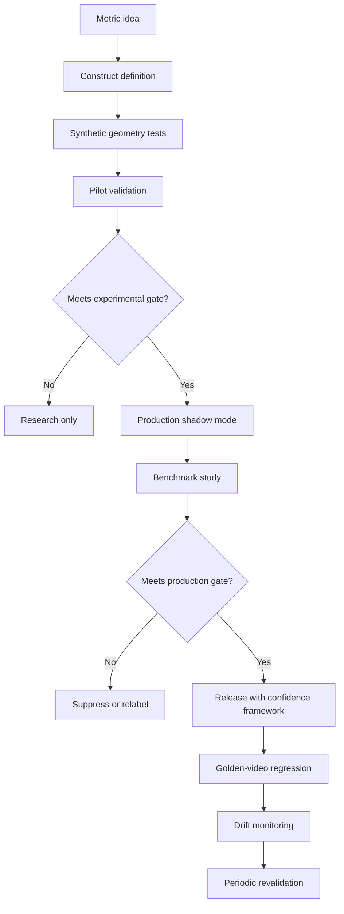

# KinematicIQ Validation, Reliability, and Scientific Benchmarking Handbook

Version: 0.1  
Prepared: 2026-07-05  
Scope: Markerless movement intelligence for coaching, sport science, rehabilitation research, and clinically adjacent decision support.

## Executive Standard

KinematicIQ should not treat a movement metric as trusted merely because it is visually plausible or internally repeatable. A metric is production-ready only when it has evidence for:

1. Analytical validity: the software computes the intended quantity correctly from the available signal.
2. Measurement validity: the metric agrees with an appropriate reference standard within pre-specified limits.
3. Reliability: repeated measurements under defined conditions produce stable results.
4. Responsiveness: the metric can detect changes larger than its measurement error.
5. Generalizability: performance remains acceptable across bodies, tasks, cameras, clothing, lighting, and movement speeds.
6. Communication safety: output language matches the validation tier and does not imply diagnosis, treatment, or injury prediction unless clinically validated and legally cleared.

KinematicIQ validation should use three evidence tiers:

| Tier | Label | Evidence required | Permitted product language |
|---|---|---|---|
| 0 | Experimental | Internal tests, synthetic data, limited pilots | "Experimental estimate", hidden from high-stakes recommendations |
| 1 | Production wellness/coaching | Test-retest reliability, benchmark against accepted reference, subgroup stress tests | "Movement estimate", "coaching cue", "screening insight" |
| 2 | Research grade | Independent protocol, synchronized gold standard, preregistered analysis, uncertainty reporting | "Validated for [task/population/device setup]" |
| 3 | Clinical decision support | Valid clinical association, analytical validation, clinical validation, QMS, regulatory review as applicable | "Clinical decision support" only within cleared intended use |

References that inform this standard include Bland and Altman's agreement framework, Koo and Li's ICC reporting guidance, COSMIN measurement-property taxonomy, IMDRF SaMD clinical evaluation guidance, FDA CDS guidance, OpenCap validation research, and systematic reviews of markerless motion capture.

## Part 1: Measurement Science

### Core Concepts

| Concept | Definition | Scientific purpose | KinematicIQ interpretation | Common misuse |
|---|---|---|---|---|
| Accuracy | Closeness of a measurement to the reference value | Determines truthfulness of estimates | Mean angular error versus Vicon/Qualisys/manual goniometry/force plate | Calling a metric accurate because it looks smooth |
| Precision | Closeness among repeated measurements | Quantifies random variation | Trial-to-trial spread under identical setup | Confusing precision with accuracy |
| Reliability | Ability to distinguish subjects despite measurement error | Supports longitudinal tracking and ranking | ICC, SEM, MDC across sessions/raters/devices | Reporting only correlation |
| Repeatability | Agreement under same operator, setup, device, time window | Isolates intrinsic noise | Same camera, same subject, repeated trials | Generalizing to new cameras or environments |
| Reproducibility | Agreement under changed conditions | Tests deployment robustness | Different device, day, camera placement, operator | Claiming from single-lab repeatability |
| Validity | Degree to which metric measures intended construct | Establishes scientific meaning | Does "knee valgus" match accepted 2D/3D definition? | Validating proxy against another unvalidated proxy |
| Robustness | Stability under nuisance variation | Protects production reliability | Clothing, occlusion, lighting, camera height, body type | Reporting aggregate performance only |
| Sensitivity | Ability to identify true positives or meaningful changes | Supports screening/change detection | Percent of true movement faults detected | Optimizing sensitivity without false-positive control |
| Specificity | Ability to identify true negatives | Prevents over-alerting | Percent of normal trials correctly not flagged | Using binary labels without expert consensus |
| Calibration | Mapping raw data to a coordinate system or subject model | Reduces systematic error | Camera intrinsics, floor plane, body scale, segment lengths | Treating browser pixel coordinates as biomechanical coordinates |
| Measurement uncertainty | Interval around the estimate likely to contain the true value | Enables safe interpretation | "Knee flexion 64 deg, 95% uncertainty +/- 5 deg" | Showing exact numbers without uncertainty |

### Mathematical Formulation

Let `y_i` be the KinematicIQ estimate, `x_i` the reference measurement, and `e_i = y_i - x_i`.

Accuracy:

```text
bias = mean(e_i)
MAE = mean(|e_i|)
RMSE = sqrt(mean(e_i^2))
```

Precision:

```text
SD_repeat = sqrt(sum((y_i - mean(y))^2) / (n - 1))
CV = SD_repeat / mean(y)
```

Reliability:

```text
ICC = between_subject_variance / (between_subject_variance + error_variance)
SEM = SD_pooled * sqrt(1 - ICC)
MDC_95 = 1.96 * sqrt(2) * SEM
```

Uncertainty propagation for a metric `m = f(p_1, ..., p_k)` derived from pose landmarks `p`:

```text
Var(m) ~= J * Sigma_p * J^T
```

where `J` is the Jacobian of the metric with respect to landmark coordinates and `Sigma_p` is the landmark covariance matrix. In production, use analytic propagation for simple angles and bootstrap or Monte Carlo propagation for nonlinear composite scores.

### Research Standard

Every metric needs a measurement-property dossier:

- Construct definition: the biomechanical quantity and coordinate convention.
- Reference standard: e.g., optical motion capture for 3D kinematics, force plates for kinetics, IMUs for segment orientation where appropriate, EMG for muscle activation timing, expert labels for qualitative movement ratings.
- Population scope: age, sport, pathology, body habitus, clothing, camera setup.
- Task scope: static posture, squat, jump landing, gait, sprint, balance, rehabilitation task.
- Statistical acceptance criteria: primary and secondary metrics, confidence intervals, subgroup gates.
- Failure taxonomy: occlusion, truncation, fast motion blur, off-plane motion, reflective clothing, assistive device, abnormal gait, low confidence.

### Production Standard

Production metrics should expose:

- Point estimate.
- Confidence score.
- Validation tier.
- Known limitations.
- Minimum detectable change when used longitudinally.
- Hard suppression when input quality is below threshold.

Do not display a precise numerical metric when uncertainty exceeds the smallest clinically or practically meaningful difference.

### Experimental Methods

Experimental metrics may run internally if they are:

- Marked with versioned feature flags.
- Logged separately from validated metrics.
- Excluded from composite recommendations unless uncertainty is explicitly modeled.
- Evaluated with shadow-mode analysis against future ground truth.

## Part 2: Statistical Validation

### Error Metrics

| Metric | Formula | Use | Limitations |
|---|---|---|---|
| RMSE | `sqrt(mean((y - x)^2))` | Penalizes large errors; good for joint-angle waveforms | Sensitive to outliers |
| MAE | `mean(|y - x|)` | Interpretable average absolute error | Less sensitive to rare dangerous errors |
| MAPE | `mean(|(y - x) / x|) * 100` | Relative error for positive nonzero values | Invalid near zero; often poor for angles crossing zero |
| Bias | `mean(y - x)` | Detects systematic offset | Can hide large opposing errors |
| Limits of agreement | `bias +/- 1.96 * SD(diff)` | Agreement between methods | Assumes approximately normal differences; inspect proportional bias |

Use RMSE/MAE for continuous metric accuracy, Bland-Altman for method agreement, ICC/SEM/MDC for reliability and longitudinal change, and sensitivity/specificity for binary recommendations.

### SEM and MDC

SEM estimates absolute measurement noise. MDC estimates the smallest observed change likely to exceed noise.

```text
SEM = SD * sqrt(1 - ICC)
MDC_95 = 1.96 * sqrt(2) * SEM
```

Interpretation:

- A 2 deg improvement is not actionable if MDC_95 is 6 deg.
- Longitudinal dashboards should show "change likely real" only when `|delta| > MDC_95` for that metric, task, population, and camera setup.

### ICC

Use ICC for reliability when the metric is continuous and subjects vary meaningfully. Report:

- ICC model: one-way random, two-way random, or two-way mixed.
- Type: single measurement or average measurement.
- Definition: consistency or absolute agreement.
- 95% confidence interval.
- Number of subjects, trials, raters, sessions.

Recommended default:

- Test-retest across sessions: ICC(2,1), absolute agreement, random session/device/operator effects.
- Same-video reprocessing reliability: ICC(3,1), absolute agreement or consistency depending on question.
- Multiple-trial average used in product: ICC(2,k), absolute agreement, where `k` is number of trials averaged.

Common interpretation bands from Koo and Li are poor `<0.50`, moderate `0.50-0.75`, good `0.75-0.90`, excellent `>0.90`, but product decisions should use confidence intervals and SEM, not labels alone.

### Correlation

Pearson correlation measures linear association:

```text
r = cov(x, y) / (sd_x * sd_y)
```

Spearman correlation measures monotonic association based on ranks. Correlation is not agreement. A system can correlate highly with Vicon while being biased by 10 degrees. Always pair correlation with agreement metrics.

### Bland-Altman Analysis

For each observation:

```text
mean_i = (x_i + y_i) / 2
diff_i = y_i - x_i
bias = mean(diff_i)
LoA = bias +/- 1.96 * sd(diff_i)
```

Validation report must include:

- Bias and 95% CI.
- Limits of agreement and 95% CI.
- Plot of difference versus mean.
- Proportional bias test.
- Stratified plots by subgroup and movement speed.
- Predefined acceptable LoA based on meaningful error, not post hoc comfort.

### Confidence Intervals

Use 95% confidence intervals for all primary estimates. For small samples or non-normal errors, bootstrap CIs are preferred.

Bootstrap procedure:

```pseudo
for b in 1..B:
    sample participants with replacement
    include all trials for sampled participants
    compute metric
CI = percentile(metric_b, 2.5%, 97.5%)
```

Cluster bootstrap by participant to avoid pretending repeated trials are independent.

### Effect Sizes and Hypothesis Testing

Use effect sizes to compare groups or interventions:

```text
Cohen_d = (mean_1 - mean_2) / pooled_SD
Hedges_g = small_sample_corrected_d
```

Hypothesis tests should not be the primary validation evidence. A statistically significant difference may be practically trivial; a non-significant difference may reflect low power. Prefer equivalence or non-inferiority testing when validating against a standard:

```text
H0: error <= -delta or error >= delta
H1: -delta < error < delta
```

### Mixed-Effects Models

Movement data are nested: trials within sessions within people within sites. Use mixed-effects models for validation and drift:

```text
error_ijkt = beta0 + beta1*speed + beta2*camera + beta3*body_type
             + u_participant_i + u_site_j + u_device_k + epsilon_ijkt
```

This separates systematic effects from repeated-measure noise.

### Cross-Validation

For model evaluation:

- Split by participant, not frame.
- Use site-level or camera-level holdouts when testing generalization.
- Preserve clinical/sport subgroups in each fold.
- Keep the final benchmark set locked.

Forbidden split: random frame-level split from the same videos, because it leaks subject identity, environment, and temporal continuity.

### Statistical Validation Gates

| Metric class | MVP gate | Research-grade gate |
|---|---|---|
| Sagittal lower-limb angles | MAE <= 6 deg, RMSE <= 8 deg, ICC lower CI >= 0.75 | MAE <= 4 deg, RMSE <= 6 deg, ICC lower CI >= 0.85 |
| Frontal/transverse angles | MAE <= 8 deg, LoA justified, warning label | MAE <= 6 deg and subgroup stability shown |
| ROM | MAE <= 5 deg; MDC shown | MAE <= 3-4 deg; MDC below meaningful change |
| Temporal events | Error <= 50 ms for coarse coaching | Error <= 20-30 ms for research timing |
| Binary quality flags | Sensitivity and specificity >= 0.80 | Sensitivity and specificity >= 0.85 with calibrated PPV/NPV |
| Composite score | Reliability ICC lower CI >= 0.75; interpretable uncertainty | External validation and calibration across sites |

These gates are starting hypotheses. Final gates must be task-specific and anchored to user harm, meaningful change, and current literature.

## Part 3: Benchmarking

### Reference Systems

| Reference | Best for | Cautions |
|---|---|---|
| Vicon / Qualisys optical mocap | 3D joint kinematics, segment trajectories | Marker placement artifact, lab constraints, model dependence |
| Force plates | Ground reaction force, jump impulse, landing asymmetry | Requires synchronization and correct foot contact segmentation |
| IMUs | Segment orientation, angular velocity, field deployment | Drift, soft tissue artifact, placement variability |
| EMG | Muscle activation timing/intensity proxy | Crosstalk, normalization difficulty, not direct force |
| Expert ratings | Qualitative movement quality | Rater bias, low granularity, needs consensus and reliability |
| Clinical assessments | Functional validity | Often coarse ordinal scales; may not be gold standard for kinematics |

### Benchmark Protocol

1. Define task and metric.
2. Choose reference standard and coordinate convention.
3. Synchronize systems with hardware trigger or visible/audio event.
4. Collect calibration sequence.
5. Capture at least three valid trials per task.
6. Process raw data through frozen pipelines.
7. Align time series.
8. Compute waveform and scalar errors.
9. Stratify results by participant, subgroup, speed, camera, and trial quality.
10. Decide pass/fail using pre-registered thresholds.

### Time-Series Alignment

Use event-based alignment where possible. For continuous cyclic tasks, use dynamic time warping only as a secondary sensitivity analysis because it can hide timing errors.

```pseudo
reference_events = detect_events(force_plate or mocap)
kiq_events = detect_events(video)
offset = median(reference_events.time - kiq_events.time)
aligned_kiq = shift(kiq, offset)
resample both systems to common normalized phase
compute RMSE over phase-normalized waveform
```

### Acceptable Error Ranges

Literature on markerless systems suggests that sagittal-plane lower-limb kinematics often achieve errors around 4-6 degrees in controlled gait and return-to-sport tasks, while frontal/transverse planes, feet/ankles, pathological gait, occlusion, and high-speed movements are harder. OpenCap validation has reported grand mean joint-angle errors around 3.85 deg MAE and 4.34 deg RMSE across selected return-to-sport movements, with lower agreement in frontal/transverse planes. Reviews of markerless methods report lower-limb standard deviations or errors commonly in the 3-10 degree range depending on task and method.

KinematicIQ should therefore avoid a single universal "valid" claim. Instead:

- Static/posture 2D metrics: target <= 3-5 deg for angles directly visible to camera.
- Sagittal squat/jump/gait angles: target <= 4-6 deg for research grade.
- Frontal knee projection angles: target <= 5-8 deg plus expert-label agreement.
- Transverse/rotation metrics from monocular video: experimental unless multi-view or strong validation.
- Kinetic estimates without force plates: experimental or model-derived estimates unless validated per task.

## Part 4: Metric Validation

### Joint Angles

Definition: Angle between adjacent body segments in a defined plane or 3D joint coordinate system.

Purpose: Quantify posture, range, timing, and technical execution.

Formula for 2D angle at joint `B` with points `A-B-C`:

```text
theta = arccos(((A - B) dot (C - B)) / (||A - B|| * ||C - B||))
```

Validation:

- Compare to optical mocap joint angles after coordinate harmonization.
- Report per-joint/per-plane error.
- Include waveform RMSE, peak-angle error, event-angle error, and ROM error.
- Stratify by camera angle and speed.

Production recommendation:

- Validated: knee/hip sagittal angles for squats, lunges, jumps, gait when body is visible and calibrated.
- Caution: ankle, foot, shoulder rotation, trunk rotation, transverse plane.
- Experimental: internal/external rotation from monocular RGB unless validated in controlled setup.

### Range of Motion

Definition:

```text
ROM = max(theta_t) - min(theta_t)
```

Purpose: Summarize available movement excursion.

Validation:

- Compare video-derived ROM to mocap, goniometry, or inclinometry depending on body part.
- Report SEM and MDC because ROM is often used longitudinally.
- Confirm smoothing does not artificially reduce peaks.

Common misuse: Claiming mobility improvement from a delta smaller than MDC.

### Symmetry

Definition:

```text
SymmetryIndex = 100 * (Right - Left) / ((Right + Left) / 2)
```

Alternative:

```text
LSI = 100 * Involved / Uninvolved
```

Purpose: Compare limbs or sides.

Validation:

- Validate each side's metric first.
- Propagate uncertainty:

```text
Var(R - L) = Var(R) + Var(L) - 2*Cov(R,L)
```

- Compare to force plate asymmetry for jump/landing when kinetics are relevant.

Common misuse: Treating visual symmetry as force symmetry.

### Posture

Definition: Static or quasi-static alignment of landmarks/segments relative to anatomical or task frame.

Validation:

- Benchmark static angles against calibrated photographs, inclinometry, or mocap.
- Test camera-height and perspective sensitivity.
- Use multi-view or calibration when absolute posture is important.

Production recommendation: Use posture metrics primarily as coaching descriptors unless clinical posture claims are validated.

### Balance and Stability

Definition: Ability to control center of mass relative to base of support; may include sway, time-to-boundary, step correction, and trunk variability.

Validation:

- Gold standard: force plate center-of-pressure for static balance; mocap center-of-mass for dynamic balance.
- Metrics: path length, sway area, RMS sway, jerk, margin of stability.

Formula examples:

```text
COP_path_length = sum_t ||COP_t - COP_(t-1)||
RMS_sway = sqrt(mean((x_t - mean(x))^2 + (y_t - mean(y))^2))
```

Common misuse: Inferring neurological impairment from consumer video sway alone.

### Movement Quality

Definition: Higher-level construct describing coordination, control, compensations, or task execution.

Validation:

- Create a rubric with expert consensus.
- Establish inter-rater reliability before using expert labels as ground truth.
- Train/evaluate models against consensus labels and objective kinematic features.
- Report sensitivity/specificity, calibration, and confusion by subgroup.

Production recommendation: Present as "observed movement pattern" rather than diagnosis.

### Composite Scores

Definition: Weighted aggregation of validated metrics.

```text
score = sum(w_j * z_j)
```

where `z_j` are normalized metric values and `w_j` are weights.

Validation:

- Validate components first.
- Justify weights biologically or empirically.
- Test internal consistency only when components are reflective indicators of one construct; many movement scores are formative, so Cronbach alpha may be inappropriate.
- Evaluate predictive validity only with longitudinal outcomes.

Production recommendation: Display drivers and uncertainty, not only a single score.

### Coaching Recommendations

Definition: Actionable text generated from metrics, thresholds, and context.

Validation:

- Trace every recommendation to validated inputs.
- Test rule logic on synthetic and real cases.
- Expert review for safety, clarity, and overclaiming.
- A/B or prospective studies for behavior and outcome effects.

Suppression rule:

```pseudo
if metric_confidence < threshold:
    do not issue corrective recommendation
elif abs(metric_value - threshold) < uncertainty_margin:
    issue neutral observation, not fault label
else:
    issue recommendation with validated scope
```

## Part 5: Dataset Design

### Validation Dataset Matrix

Minimum dataset should cover both biological and capture variability.

| Dimension | MVP | Research grade |
|---|---:|---:|
| Healthy adults | 40-60 | 120+ |
| Youth athletes | 20-30 | 80+ |
| Older adults | 20-30 | 80+ |
| Clinical populations | Pilot only unless scoped | 50+ per condition where claims are made |
| Elite athletes | 15-30 | 60+ |
| Body-type diversity | BMI/body-shape strata | Powered subgroup analysis |
| Skin tone | Balanced capture | Subgroup performance gates |
| Clothing | shorts/tights/loose/dark/light | Full nuisance matrix |
| Camera devices | 3-5 common phones/webcams | 10+ device classes |
| Lighting | bright, dim, backlit | continuous lux measurement |
| Sites | 1-2 | 3+ independent sites |

Sample sizes depend on desired CI width. Use precision-based planning:

```text
n ~= (1.96 * SD_error / desired_half_width)^2
```

For reliability ICC studies, plan based on expected ICC, minimum acceptable ICC, number of trials, and desired CI width. As a rule of thumb, early reliability studies with fewer than 30 participants are fragile; production validation should aim for at least 50 participants per major task/population stratum, and research-grade claims should use 100+ when subgroup generalization matters.

### Task Battery

MVP:

- Static posture.
- Bodyweight squat.
- Lunge.
- Countermovement jump.
- Single-leg balance.
- Walking gait if capture setup supports full body.

Research-grade expansion:

- Drop jump and landing.
- Cutting/change of direction.
- Running at multiple speeds.
- Sit-to-stand.
- Step-down.
- Overhead reach/shoulder tasks.
- Clinical gait deviations.
- Return-to-sport hop tests.

### Dataset Splits

| Split | Purpose | Rule |
|---|---|---|
| Development | Model tuning | No final reporting |
| Validation | Threshold tuning | Participant-disjoint |
| Locked benchmark | Final claim | Participant/site/device-disjoint where possible |
| Stress set | Known hard cases | Report separately; do not hide |
| Golden recordings | Regression testing | Versioned, immutable |

### Metadata Schema

Each recording should include:

- Participant demographics relevant to fairness and biomechanics.
- Consent and allowed use.
- Anthropometrics: height, mass, limb length if measured.
- Sport/clinical status.
- Task protocol.
- Device model, lens, frame rate, resolution.
- Camera height, distance, orientation, view angle.
- Lighting estimate.
- Clothing category.
- Reference-system details.
- Processing versions for pose model, metric code, smoothing, calibration.

## Part 6: Confidence Framework

### Confidence Levels

| Level | Definition | Inputs |
|---|---|---|
| Landmark confidence | Trust in each detected keypoint | Pose probability, visibility, occlusion, temporal jitter |
| Segment confidence | Trust in derived limb segment | Endpoint confidence, segment length stability |
| Metric confidence | Trust in a scalar/waveform metric | Landmark confidence, calibration, motion plane, validation tier |
| Composite confidence | Trust in aggregate score | Component confidence and covariance |
| Recommendation confidence | Trust in action text | Metric confidence, threshold margin, evidence tier |
| Session confidence | Overall data quality | Coverage, frame rate, task detection, failure flags |

### Landmark Confidence

For landmark `p_j,t`:

```text
C_landmark = sigmoid(a*q_pose + b*visibility - c*jitter - d*occlusion - e*out_of_frame)
```

Where:

- `q_pose` is model confidence.
- `visibility` estimates body-part visibility.
- `jitter` is high-frequency temporal instability after accounting for movement speed.
- `occlusion` is inferred from overlapping body segments or missing frames.

### Metric Confidence

```text
C_metric = C_input * C_calibration * C_task * C_validation * C_stability
```

Thresholds:

- `C_metric >= 0.85`: show precise metric if validation tier supports it.
- `0.65 <= C_metric < 0.85`: show metric with caution or wider interval.
- `0.45 <= C_metric < 0.65`: qualitative observation only.
- `< 0.45`: suppress metric.

### Uncertainty Propagation

For a joint angle from three landmarks:

```pseudo
for s in 1..S:
    sample A_s, B_s, C_s from landmark covariance distributions
    theta_s = angle(A_s, B_s, C_s)
theta_hat = mean(theta_s)
uncertainty_95 = percentile(theta_s, 97.5) - percentile(theta_s, 2.5)
```

For composite score:

```text
Var(score) = w^T Sigma_metrics w
```

### Recommendation Confidence

```text
margin = abs(metric_value - recommendation_threshold)
decision_confidence = P(metric_true is on same side of threshold)
```

If `decision_confidence < 0.90`, output should avoid categorical fault language.

Example:

- High confidence: "Knee flexion depth is below your validated target range."
- Moderate confidence: "Knee flexion appears slightly below target; repeat from a clearer side view."
- Low confidence: no recommendation.

## Part 7: Continuous Quality Assurance

### Regression Testing

Every release should run:

- Unit tests for geometry and statistics.
- Golden-video metric snapshots.
- Synthetic pose perturbation tests.
- Browser/device compatibility tests.
- Drift checks versus previous model version.
- Recommendation safety tests.

Golden recordings should include easy, typical, and hard cases. Each has expected metric intervals, not single exact values.

### Synthetic Datasets

Synthetic data are useful for:

- Known-angle geometry tests.
- Occlusion injection.
- Frame-drop stress.
- Landmark noise sensitivity.
- Camera perspective perturbation.

Synthetic tests cannot replace human validation because markerless pose models fail in human-specific ways.

### Version Tracking

Version all components:

```text
pose_model_version
metric_algorithm_version
calibration_version
smoothing_version
recommendation_rule_version
client_build
browser
device
```

Store version metadata with every session so future changes can be audited.

### Metric Drift Detection

Monitor:

- Distribution of metric values.
- Landmark confidence distribution.
- Suppression rate.
- Recommendation frequency.
- Subgroup performance where labels are available.
- Difference from previous algorithm on golden recordings.

Production drift pseudocode:

```pseudo
daily_metrics = aggregate(valid_sessions)
for metric in monitored_metrics:
    psi = population_stability_index(metric.current, metric.baseline)
    if psi > 0.25:
        create_alert(metric, "major distribution drift")
    if suppression_rate(metric) increases > 2 SD from baseline:
        create_alert(metric, "quality regression")
```

### Automated Benchmarking

Benchmark pipeline:

```pseudo
on release_candidate:
    run unit_geometry_tests
    run golden_video_processing
    compare metrics to accepted intervals
    compute diff report by task/joint/plane
    run recommendation snapshot tests
    block release if critical metric fails
```

Critical fail examples:

- Bias shift > 2 deg for validated joint angle.
- MDC worsens by > 20%.
- Suppression fails on known occlusion case.
- Recommendation emitted when confidence is below threshold.
- Any validated metric changes without version bump.

## Part 8: Publication Readiness

### Study Design

Recommended manuscripts:

1. Analytical validation of KinematicIQ joint kinematics against optical mocap.
2. Reliability and MDC of KinematicIQ metrics across sessions/devices.
3. Validity of coaching recommendation labels against expert consensus.
4. Field deployment study across camera setups and populations.
5. Longitudinal responsiveness study for training or rehabilitation changes.

### Reporting Standards

Use:

- STROBE for observational validation studies.
- CONSORT if testing an intervention.
- TRIPOD+AI if developing or validating predictive models.
- COSMIN measurement-property concepts for reliability, measurement error, validity, and responsiveness.
- Model cards and dataset cards for AI transparency.

### Ethics

Obtain IRB/ethics approval when collecting identifiable video or health/sport performance data for research. Consent should distinguish:

- Product use.
- Research analysis.
- Model training.
- Public release or sharing.
- Use of minors' data.

### Reproducibility

Publication package should include:

- Protocol.
- Statistical analysis plan.
- Metric definitions.
- Code or pseudocode sufficient to reproduce.
- Data dictionary.
- Model and algorithm versions.
- Blinded processing where feasible.
- Negative and failure-case reporting.

### Power and Precision

Power should be justified by the primary claim. For agreement, plan for CI width around bias/LoA. For reliability, plan for lower-bound ICC. For subgroup fairness, power subgroup comparisons rather than simply including diverse participants.

## Part 9: Regulatory and Ethical Considerations

### Medical Device Boundaries

KinematicIQ may remain in wellness/coaching territory when it:

- Provides general fitness, movement education, or performance feedback.
- Avoids diagnosing, treating, mitigating, or predicting disease/injury.
- Encourages users to consult professionals for pain, injury, or clinical concerns.
- Makes recommendations that users can independently understand.

It approaches medical-device or regulated CDS territory when it:

- Claims to identify pathology, injury risk, rehabilitation readiness, or treatment response.
- Drives clinical management.
- Provides patient-specific recommendations that a user cannot independently evaluate.
- Is marketed to clinicians for diagnosis/treatment decisions.

FDA's January 2026 CDS guidance emphasizes that certain software functions can be excluded from the device definition, but device software policies still apply to functions that meet the device definition, including patient/caregiver-facing functions. IMDRF SaMD guidance frames clinical evaluation around scientific validity, analytical validation, and clinical validation.

### Safe Product Positioning

Recommended language:

- "Movement analysis for coaching and wellness."
- "Estimates based on video quality and validated movement tasks."
- "Not a diagnosis."
- "Not a substitute for a licensed clinician."
- "Validated for [specific task/setup/population], where stated."

Avoid:

- "Detects ACL injury risk" unless clinically validated and cleared.
- "Diagnoses imbalance."
- "Clears athlete for return to play."
- "Prescribes rehabilitation."

### Bias Evaluation

Bias testing must evaluate:

- Skin tone and lighting interaction.
- Body size and shape.
- Sex/gender-related anthropometric differences.
- Age.
- Disability, assistive devices, atypical gait.
- Clothing and cultural dress.
- Camera affordability/device class.

Report subgroup performance using the same primary metrics, not only aggregate accuracy.

### Privacy

Video biomechanics data can be biometric and health-adjacent. Minimum safeguards:

- Explicit consent.
- Data minimization.
- Local processing where feasible.
- Encryption in transit and at rest.
- Separate raw video from derived metrics.
- Retention controls.
- De-identification is not guaranteed for movement/video data.

### Responsible Communication

Each user-facing result should answer:

- What was measured?
- How confident is the system?
- What does the result mean?
- What does it not mean?
- What action is safe and proportionate?

## Part 10: KinematicIQ Validation Roadmap

### MVP Validation Plan

Goal: Safe coaching-grade release for limited tasks.

Metrics:

- 2D/3D visible joint angles for squat and lunge.
- ROM.
- Basic left/right symmetry.
- Static posture estimates.
- Confidence suppression.

Study:

- 50-75 healthy adults.
- 3 common devices.
- Side and front camera setups.
- Synchronized comparison to optical mocap for kinematics where possible.
- Expert review for coaching recommendations.

Acceptance:

- Sagittal knee/hip MAE <= 6 deg.
- ROM MAE <= 5 deg.
- Test-retest ICC lower CI >= 0.75.
- MDC shown in dashboard for longitudinal metrics.
- No recommendation when confidence is low.

Deliverables:

- Validation report.
- Known-limits document.
- Golden-video suite.
- Metric version registry.
- User-facing confidence language.

### Research-Grade Validation Plan

Goal: Publishable evidence for specific movement tasks.

Study:

- 150-250 participants across sex, age, body types, and skin tones.
- 3+ sites.
- Vicon/Qualisys and force plates for selected tasks.
- Multi-camera and common consumer-device capture.
- Locked benchmark set.
- Preregistered analysis plan.

Metrics:

- Waveform RMSE.
- Event-specific angle error.
- Bias and limits of agreement.
- ICC, SEM, MDC.
- Subgroup error.
- Failure rate.

Acceptance:

- Task-specific equivalence bounds.
- Subgroup performance within pre-specified tolerance.
- Frontal/transverse claims separated from sagittal claims.
- Full reporting of failures and exclusions.

### Multi-Year Benchmarking Roadmap

Year 1:

- Establish core kinematic validity for squat/lunge/jump/balance.
- Build QA and golden dataset.
- Publish internal white paper.

Year 2:

- Add gait, running, jump landing, return-to-sport tasks.
- Start multi-site optical mocap/force plate study.
- Introduce longitudinal MDC-based progress tracking.

Year 3:

- Validate clinical-adjacent populations with partners.
- External publication.
- Model/dataset cards.
- Bias and fairness report.

Year 4+:

- Prospective outcome studies.
- Regulatory pathway assessment for any clinical CDS features.
- Ongoing post-market real-world performance monitoring.

### Software Lifecycle Integration



Release checklist:

- Metric definition reviewed.
- Unit tests pass.
- Golden videos pass.
- Validation evidence linked.
- Confidence thresholds calibrated.
- Recommendation copy reviewed.
- Version bumped.
- Monitoring dashboard updated.
- Known limitations documented.

## Decision Trees

### Should a Metric Be Shown?

```pseudo
if task_not_detected:
    hide metric
elif validation_tier == 0 and user_facing:
    hide metric
elif metric_confidence < 0.45:
    hide metric
elif uncertainty_95 > meaningful_difference:
    show qualitative observation only
else:
    show numeric metric with confidence and scope
```

### Can KinematicIQ Make a Recommendation?

```pseudo
if recommendation_has_clinical_intent:
    require regulatory and clinical validation review
if all_required_metrics.validated and all_confidence >= threshold:
    if threshold_margin > uncertainty_margin:
        emit recommendation
    else:
        emit neutral observation
else:
    ask user to recapture or suppress
```

### Is a Change Real?

```pseudo
delta = current_metric - baseline_metric
if abs(delta) > MDC_95_for_metric_task_population:
    label "likely real change"
else:
    label "within expected measurement variation"
```

## Practical Implementation Guidance

### Browser Implementation

Browser-based markerless biomechanics must handle:

- Frame-rate variability: measure real timestamps, not nominal FPS.
- Dropped frames: interpolate only for short gaps; mark uncertainty.
- Camera permissions and resolution changes.
- Device thermal throttling.
- Mirrored selfie camera effects.
- Orientation metadata.
- Lens distortion and perspective.
- User setup guidance without excessive instructional text in core UI.

Minimum capture checks:

```pseudo
if fps_median < 25:
    warn_or_block("Frame rate too low")
if body_coverage < 0.95 for required frames:
    block_metric("Body not fully visible")
if landmark_confidence_required < threshold:
    block_metric("Key landmarks unclear")
if camera_view_angle not in validated_range:
    relabel metric as experimental or request recapture
```

### Data Model

Store metric outputs as:

```json
{
  "metric_id": "knee_flexion_peak",
  "value": 64.2,
  "unit": "deg",
  "uncertainty_95": 4.8,
  "confidence": 0.88,
  "validation_tier": 1,
  "task": "squat",
  "plane": "sagittal",
  "algorithm_version": "angles-v0.8.1",
  "pose_model_version": "pose-v1.4.0",
  "suppression_reason": null
}
```

### Minimum Validation Report Template

Each report should include:

- Intended use.
- Population.
- Task protocol.
- Capture setup.
- Reference standard.
- Synchronization method.
- Inclusion/exclusion criteria.
- Processing versions.
- Primary endpoints.
- Acceptance criteria.
- Results with CIs.
- Subgroup results.
- Failure cases.
- Limitations.
- Product decision.

## References and Source Links

- Bland JM, Altman DG. Statistical methods for assessing agreement between two methods of clinical measurement. Lancet, 1986. https://pubmed.ncbi.nlm.nih.gov/2868172/
- Koo TK, Li MY. A guideline of selecting and reporting intraclass correlation coefficients for reliability research. Journal of Chiropractic Medicine, 2016. https://pubmed.ncbi.nlm.nih.gov/27330520/
- Mokkink et al. COSMIN consensus and taxonomy for measurement properties. https://pmc.ncbi.nlm.nih.gov/articles/PMC4900032/
- COSMIN manuals and definitions for measurement properties. https://www.cosmin.nl/
- OpenCap: Human movement dynamics from smartphone videos. https://pmc.ncbi.nlm.nih.gov/articles/PMC10586693/
- Applications and limitations of current markerless motion capture methods. https://pmc.ncbi.nlm.nih.gov/articles/PMC8884063/
- Validation of OpenCap for return-to-sport lower-extremity kinematics. https://www.sciencedirect.com/science/article/abs/pii/S0021929024002781
- Theia3D markerless motion capture systematic review summary. https://www.sciencedirect.com/science/article/pii/S0933365725002672
- FDA Clinical Decision Support Software guidance, January 2026. https://www.fda.gov/regulatory-information/search-fda-guidance-documents/clinical-decision-support-software
- IMDRF Software as a Medical Device: Clinical Evaluation, 2017. https://www.imdrf.org/sites/default/files/docs/imdrf/final/technical/imdrf-tech-170921-samd-n41-clinical-evaluation_1.pdf
- TRIPOD+AI reporting guideline. https://www.equator-network.org/reporting-guidelines/tripod-statement/
- Mitchell et al. Model Cards for Model Reporting. https://dl.acm.org/doi/10.1145/3287560.3287596

