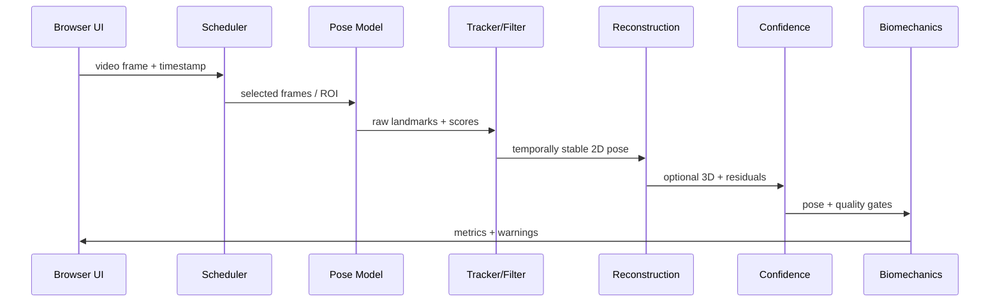

# KinematicIQ Computer Vision Subsystem Technical Specification

Generated from `Research_04_Markerless_Computer_Vision_and_Pose_Estimation.md` on 2026-07-06.

## Executive Recommendation

KinematicIQ should treat RGB video as an uncertain sensor, not as ground truth. The production browser layer should first produce calibrated, confidence-aware 2D landmarks, then lift them into a normalized 3D kinematic representation only when the input quality supports it. For biomechanics, the correct product posture is: measure what is observable, estimate what is inferable, and label everything with confidence and provenance.

Recommended stack:

| Phase | Browser-first choice | Higher-accuracy option | Why |
|---|---|---|---|
| MVP 2D pose | MoveNet Thunder/Lightning or MediaPipe BlazePose GHUM via TensorFlow.js/MediaPipe | RTMPose ONNX via ONNX Runtime Web/WebGPU | Mature browser support; good latency; RTMPose has stronger modern accuracy/speed tradeoffs but needs packaging work. |
| Tracking | Single-person ROI tracking with detector refresh | Pose-aware multi-person association | Most biomechanics workflows are single subject; multi-person should be explicit. |
| Filtering | One Euro + Kalman/RTS smoothing + bone-length constraints | Learned temporal model such as VideoPose3D/MotionBERT | Deterministic filters are debuggable and confidence-aware. |
| 3D | BlazePose normalized 3D + camera-aware scale recovery heuristics | Multi-view triangulation, SMPL/HybrIK/VIBE server-side | Monocular 3D is underconstrained; research-grade biomechanics needs calibration or multiple views. |
| Runtime | WebGPU first, WebGL/WASM fallback | Native/mobile SDK or cloud GPU for premium analysis | ONNX Runtime Web and TF.js both support browser inference acceleration. |

Primary MVP: browser-only single-person movement analysis with 33 landmarks, per-joint confidence, temporal smoothing, quality flags, and conservative biomechanical metrics. Research-grade path: add two-phone calibration, multi-view triangulation, body-model fitting, and validation against marker-based capture.

## System Architecture


Module contract:

```ts
type Landmark2D = {
  name: string;
  xPx: number; yPx: number;
  xNorm: number; yNorm: number;
  confidence: number;
  visibility?: number;
};

type Landmark3D = {
  name: string;
  x: number; y: number; z: number;
  frame: "camera" | "body" | "world";
  confidence: number;
};

type PoseFrame = {
  frameIndex: number;
  timestampMs: number;
  source: "movenet" | "blazepose" | "rtmpose" | "apple_vision" | "custom";
  personId: string;
  landmarks2d: Landmark2D[];
  landmarks3d?: Landmark3D[];
  quality: {
    globalConfidence: number;
    occlusionScore: number;
    blurScore: number;
    cameraMotionScore: number;
    biomechUsable: boolean;
    warnings: string[];
  };
};
```

## Part 1: State of the Art

### Definition

Human pose estimation localizes anatomical landmarks in 2D image coordinates or 3D coordinates. Markerless biomechanics adds temporal tracking, camera geometry, joint-center inference, segment coordinate systems, filtering, and validation against physical measurement.

### Scientific Background

Modern systems follow two dominant paradigms. Top-down pipelines detect each person and run a single-person keypoint model per crop; they are accurate but scale with person count. Bottom-up pipelines detect all joints and group them into skeletons; OpenPose uses Part Affinity Fields, and NVIDIA BodyPoseNet similarly describes a single-shot bottom-up method that avoids a separate person detector ([OpenPose CVPR paper](https://openaccess.thecvf.com/content_cvpr_2017/papers/Cao_Realtime_Multi-Person_2D_CVPR_2017_paper.pdf), [NVIDIA BodyPoseNet docs](https://docs.nvidia.com/tao/tao-toolkit/latest/text/cv_finetuning/tensorflow_1/bodypose_estimation/bodyposenet.html)).

### Comparison

| System | Architecture | Landmarks | Runtime / hardware | Strengths | Weaknesses | KinematicIQ use |
|---|---|---:|---|---|---|---|
| MediaPipe BlazePose GHUM | Detector + landmark model; 3D GHUM-inspired landmarks; optional segmentation | 33 | Browser/mobile via MediaPipe or TF.js | Strong full-body fitness baseline; available in browser; 3D-ish output | Depth is not metric; performance varies by camera angle | MVP baseline and fallback ([Google Research](https://research.google/blog/on-device-real-time-body-pose-tracking-with-mediapipe-blazepose/), [MediaPipe docs](https://github.com/google-ai-edge/mediapipe/blob/master/docs/solutions/pose.md), [TF blog](https://blog.tensorflow.org/2021/08/3d-pose-detection-with-mediapipe-blazepose-ghum-tfjs.html)). |
| MoveNet | Lightweight 17-keypoint model; Lightning/Thunder variants | 17 | TF.js, TFLite | Very fast; designed for browser fitness | Sparse foot/torso detail; no native 3D | Low-latency 2D MVP or mobile fallback ([TensorFlow blog](https://blog.tensorflow.org/2021/05/next-generation-pose-detection-with-movenet-and-tensorflowjs.html), [Kaggle model card](https://www.kaggle.com/models/google/movenet)). |
| RTMPose | Modern MMPose top-down framework; SimCC coordinate classification | COCO/whole-body variants | CPU/GPU/native; exportable to ONNX | Excellent accuracy-latency; reported RTMPose-m 75.8 AP on COCO at 90+ FPS CPU / 430+ FPS GTX 1660 Ti | Browser deployment requires ONNX/WebGPU testing | Preferred next-generation browser model if package size and WebGPU latency pass ([RTMPose arXiv](https://arxiv.org/abs/2303.07399), [MMPose docs](https://mmpose.readthedocs.io/en/latest/model_zoo.html)). |
| OpenPose | Bottom-up heatmaps + Part Affinity Fields | Body, foot, face, hands | Native GPU | Robust multi-person grouping; historically important | Heavy for browser; older accuracy/speed profile | Reference method, not browser MVP ([CVPR 2017](https://openaccess.thecvf.com/content_cvpr_2017/papers/Cao_Realtime_Multi-Person_2D_CVPR_2017_paper.pdf)). |
| AlphaPose | Top-down regional multi-person; P-NMS; tracking extensions | Body/whole-body | Native GPU | Accurate whole-body pose and tracking | Operationally heavier than browser-first models | Offline analysis candidate ([AlphaPose TPAMI](https://www.computer.org/csdl/journal/tp/2023/06/09954214/1InorY9vGXS), [RMPE arXiv](https://arxiv.org/abs/1612.00137)). |
| DeepLabCut | Transfer learning for user-defined landmarks | User-defined | Python/native GPU | Excellent for custom biomechanical points; minimal labeled frames possible | Not general-purpose browser inference; requires labeling workflow | Custom sport/lab model training ([Nature Neuroscience](https://www.nature.com/articles/s41593-018-0209-y), [PubMed](https://pubmed.ncbi.nlm.nih.gov/30127430/)). |
| OpenCap | Smartphone multi-view capture with cloud biomechanics | OpenSim-style kinematics/dynamics | Smartphones + server | Open-source; clinically relevant workflow; multi-view reduces ambiguity | Not purely browser-local; setup complexity | Model for research-grade workflow design ([OpenCap paper](https://pmc.ncbi.nlm.nih.gov/articles/PMC10586693/), [OpenCap site](https://www.opencap.ai/)). |
| Theia3D | Commercial multi-camera markerless biomechanics | Proprietary 3D skeleton | Lab cameras + desktop/cloud | Growing validation base; strong gait spatiotemporal reliability | Proprietary; not browser | Benchmark competitor; validation target ([2025 systematic review](https://www.sciencedirect.com/science/article/pii/S0933365725002672), [Theia research list](https://www.theiamarkerless.com/research)). |
| Simi Motion / Simi Shape 3D | Commercial markerless/hybrid motion capture | Proprietary | Lab cameras | Biomechanics-oriented workflow | Proprietary details; limited open model internals | Competitor reference ([Simi markerless product](https://www.simi.com/en/products/movement-analysis/markerless-motion-capture.html), [Simi validation page](https://www.simi.com/en/references/research-and-validations.html)). |
| DARI Motion | Commercial clinical markerless system | Proprietary | Multi-camera room/cloud | FDA-cleared positioning; validated movement batteries | Proprietary; fixed capture setting | Clinical workflow reference ([DARI site](https://darimotion.com/), [Frontiers reliability study](https://www.frontiersin.org/journals/sports-and-active-living/articles/10.3389/fspor.2024.1417965/full)). |
| Apple Vision | On-device iOS Vision framework | 19 2D or 17 3D joints | Apple devices | System SDK; privacy; native performance | Apple-only; not web portable | Native iOS companion app ([Apple 2D docs](https://developer.apple.com/documentation/vision/detecting-human-body-poses-in-images), [Apple 3D docs](https://developer.apple.com/documentation/vision/identifying-3d-human-body-poses-in-images)). |
| NVIDIA pose systems | TAO BodyPoseNet, Maxine AR body pose, DeepStream/TRT pose | 2D/3D depending product | NVIDIA GPU/TensorRT | Low-latency edge/server deployment | Hardware lock-in; not browser | Server/edge premium tier ([TAO BodyPoseNet](https://docs.nvidia.com/tao/tao-toolkit/latest/text/cv_finetuning/tensorflow_1/bodypose_estimation/bodyposenet.html), [Maxine AR](https://docs.nvidia.com/maxine/ar/latest/index.html), [3D body pose collection](https://catalog.ngc.nvidia.com/orgs/nvidia/maxine/collections/nvarbodyposeestimation/-)). |

### Algorithms and Architectures

Proven methods:
- Heatmap regression: predict per-joint probability maps; decode maxima or integral coordinates.
- Coordinate classification: predict separate x/y distributions, as in SimCC/RTMPose.
- Bottom-up grouping: detect joints globally and assemble skeletons via affinity fields.
- Top-down cropping: detect person, crop, normalize, infer landmarks.

Experimental methods:
- Transformer temporal encoders for 2D-to-3D lifting.
- Whole-body unified pose with face, hands, feet.
- Generative priors for temporally plausible motion.

Future directions:
- Foundation vision encoders fine-tuned for human motion.
- Physics-informed reconstruction with contact and torque constraints.

### Training, Validation, Complexity, Failure Modes

Training should use COCO/COCO-WholeBody for 2D, Human3.6M/3DPW for 3D, AMASS for motion priors, and a proprietary KinematicIQ validation set for target sports. Complexity is roughly `O(P * M)` for top-down inference where `P` is people and `M` model cost; bottom-up is closer to `O(M + grouping)` but grouping can fail in crowded scenes. Common failures: self-occlusion, loose clothing, motion blur, low resolution distal joints, unusual camera angle, floor reflections, and unseen sport-specific poses.

Recommended implementation: ship a `PoseProvider` abstraction with MoveNet/BlazePose adapters first, then add an RTMPose-ONNX adapter after WebGPU benchmarking.

## Part 2: Human Pose Estimation

### Definition

2D pose estimates image landmarks. 3D pose estimates body landmarks in camera, body, or world coordinates. Monocular reconstruction infers 3D from one camera and is inherently ambiguous; multi-view reconstruction triangulates from two or more calibrated views.

### Mathematics

2D keypoint decoding:

```text
p(j | I) = softmax(H_j)
u_j = sum_u u * p_j(u)
v_j = sum_v v * p_j(v)
```

Triangulation from calibrated cameras:

```text
x_i ~ K_i [R_i | t_i] X
X* = argmin_X sum_i rho(||pi(K_i [R_i | t_i] X) - x_i||^2 / sigma_i^2)
```

Skeleton fitting:

```text
theta*, beta*, T* =
argmin E_2d + lambda_3d E_3d + lambda_bone E_bone + lambda_pose E_prior + lambda_temp E_temp
```

where `theta` is pose, `beta` body shape, `T` global transform, and the priors penalize implausible pose, bone-length drift, and temporal acceleration.

### Algorithms

Proven:
- 2D: MoveNet/BlazePose/RTMPose.
- 3D lifting: VideoPose3D-style dilated temporal convolutions over 2D keypoints ([VideoPose3D CVPR](https://openaccess.thecvf.com/content_CVPR_2019/papers/Pavllo_3D_Human_Pose_Estimation_in_Video_With_Temporal_Convolutions_and_CVPR_2019_paper.pdf)).
- Parametric body model: SMPL for mesh and joint regression ([SMPL](https://smpl.is.tue.mpg.de/)).
- Temporal mesh: VIBE predicts SMPL over video and uses AMASS as a motion prior ([VIBE arXiv](https://arxiv.org/abs/1912.05656)).

Experimental:
- HybrIK combines neural 3D joints with analytical inverse kinematics for plausible mesh rotations ([HybrIK CVPR](https://openaccess.thecvf.com/content/CVPR2021/papers/Li_HybrIK_A_Hybrid_Analytical-Neural_Inverse_Kinematics_Solution_for_3D_Human_CVPR_2021_paper.pdf)).
- MotionBERT pretrains a motion encoder to recover 3D from noisy partial 2D observations ([MotionBERT arXiv](https://arxiv.org/abs/2210.06551)).

Future:
- Subject-specific online adaptation.
- Learned uncertainty per joint, not only detector confidence.
- Full-body mesh plus contact and ground-reaction estimation.

### Browser Feasibility and Complexity

2D pose is feasible in-browser at interactive rates. Lightweight 3D lifting over 17-33 joints is feasible if model size stays small. Full SMPL optimization is possible for short clips but should be Web Worker/WebGPU/WASM backed and should not block the UI.

### Failure Modes

Monocular depth flips, knee/ankle swaps, foot-contact ambiguity, camera roll, cropped limbs, fast distal motion, and subject-specific anthropometry. Joint centers inferred from surface-visible landmarks will not equal anatomical joint centers without model assumptions.

### Pseudocode

```ts
for (const frame of videoFrames) {
  const roi = tracker.predictOrDetect(frame);
  const raw2d = await poseModel.estimate(frame, roi);
  const associated = identityTracker.assign(raw2d);
  const filtered2d = temporalFilter.update(associated);
  const pose3d = lifter.canLift(filtered2d)
    ? lifter.estimate(filtered2d, cameraEstimate)
    : undefined;
  const quality = confidenceEngine.score(frame, raw2d, filtered2d, pose3d);
  emit({ frameIndex, timestampMs, landmarks2d: filtered2d, landmarks3d: pose3d, quality });
}
```

Recommended implementation: use 2D as the canonical observable layer, and compute 3D metrics only when confidence gates pass.

## Part 3: Camera Geometry

### Definition

Camera geometry maps 3D world points to pixels using intrinsic parameters `K`, extrinsics `[R|t]`, and distortion. Unknown camera geometry is the largest barrier between consumer video and quantitative biomechanics.

### Mathematics

Perspective projection:

```text
s [u v 1]^T = K [R | t] [X Y Z 1]^T
K = [[f_x, 0, c_x],
     [0, f_y, c_y],
     [0, 0, 1]]
```

Radial/tangential distortion:

```text
x_d = x(1 + k1 r^2 + k2 r^4 + k3 r^6) + 2p1xy + p2(r^2 + 2x^2)
y_d = y(1 + k1 r^2 + k2 r^4 + k3 r^6) + p1(r^2 + 2y^2) + 2p2xy
```

OpenCV calibration and pose estimation minimize reprojection error and expose camera matrix and distortion coefficients ([OpenCV calib3d docs](https://www.opencv.org.cn/opencvdoc/2.3.2/html/modules/calib3d/doc/camera_calibration_and_3d_reconstruction.html)).

### Algorithms

Proven:
- Guided checkerboard/Charuco calibration for research mode.
- Smartphone metadata and EXIF focal approximation when available.
- Homography floor-plane calibration from known markers or user-entered distances.
- Multi-view extrinsic calibration with synchronized calibration motion.

Experimental:
- Self-calibration from human skeleton priors.
- Bundle adjustment over person keypoints and weak anthropometric constraints.

Future:
- Browser-native camera calibration profiles by device model.
- Learned camera priors from video metadata and scene understanding.

### Browser Handling for Unknown Cameras

KinematicIQ should use three tiers:

1. No calibration: report normalized joint angles and 2D metrics only; avoid metric lengths/velocities.
2. Quick calibration: user marks floor line and known body height or object length; allow approximate 3D scale.
3. Research calibration: two-camera capture with calibration board or known walking volume; enable metric 3D and validation-grade reports.

Recommended implementation: every metric must declare `cameraAssumption = uncalibrated | weak_scale | calibrated`.

## Part 4: Robust Tracking

### Definition

Robust tracking converts per-frame detections into temporally coherent subject trajectories with confidence, identity, and recovery logic.

### Algorithms

Proven:
- ROI propagation: use previous skeleton bounding box to crop next frame; periodically refresh detector.
- Constant-velocity Kalman filter per joint.
- One Euro filter for low-latency smoothing.
- Bone-length stabilization after warm-up.
- Hungarian assignment using bounding box IoU, keypoint distance, and pose embedding.
- Visibility-aware interpolation for short occlusions.

Experimental:
- Pose-aware identity embeddings as in AlphaPose-style tracking.
- Learned temporal denoisers trained on synthetic occlusion.

Future:
- Multi-person contact reasoning.
- Joint confidence calibrated against true anatomical error.

### Confidence Framework

Per-joint confidence:

```text
C_j = sigmoid(
  w0
  + w1 model_score_j
  + w2 visibility_j
  - w3 reprojection_error_j
  - w4 temporal_residual_j
  - w5 bone_length_residual_j
  - w6 blur_penalty
)
```

Global confidence:

```text
C_global = median(C_core_joints) * coverage * camera_quality * model_domain_score
```

Quality gates:
- `C_global < 0.55`: visualization only.
- `0.55 <= C_global < 0.75`: coaching cues with disclaimers.
- `C_global >= 0.75`: eligible for numeric biomechanical summaries.
- Metric-level confidence can be lower than frame-level confidence when it depends on distal joints or depth.

### Failure Modes

Occlusion, track ID swaps, detector hysteresis, smoothing lag during explosive motion, hallucinated joints under low confidence, and mixed skeletons when multiple people overlap.

Recommended implementation: store raw, filtered, and rejected poses so users can audit the output.

## Part 5: Reconstruction Pipeline

### Data Flow



### Interface Boundaries

| Module | Input | Output | Must not do |
|---|---|---|---|
| Scheduler | MediaStream/video file | Frame packets | Infer pose |
| Detector/Pose | Frame | Raw landmarks | Smooth silently |
| Tracker | Raw landmarks | Person trajectories | Invent missing joints without flags |
| Filter | Trajectory | Smoothed landmarks + residuals | Hide lag/residual |
| Reconstruction | 2D/3D landmarks + camera | Body/world pose | Claim metric accuracy when uncalibrated |
| Confidence | All residuals | Quality flags | Use one opaque score only |
| Biomechanics | Pose + confidence | Angles, velocities, events | Compute metrics outside valid confidence gates |

### Recommended MVP Pipeline

1. Decode video with `HTMLVideoElement` or WebCodecs where available.
2. Downsample adaptively to target model input.
3. Run MoveNet Thunder or BlazePose GHUM in a Web Worker where possible.
4. Track one subject unless multi-person mode is enabled.
5. Smooth 2D landmarks with confidence-weighted One Euro filter.
6. Estimate segment angles in image plane and limited sagittal/frontal summaries.
7. Add optional BlazePose z/VideoPose3D lifting for qualitative 3D visualization.
8. Emit confidence-gated metrics and warnings.

## Part 6: Datasets and Validation

### Dataset Comparison

| Dataset | Type | Strengths | Weaknesses | KinematicIQ use |
|---|---|---|---|---|
| COCO Keypoints | 2D in-the-wild | Broad images, 17-keypoint standard, OKS evaluation | Sparse biomechanics landmarks; still images | 2D pretraining/evaluation ([COCO](https://cocodataset.org/), [Ultralytics COCO-Pose summary](https://docs.ultralytics.com/datasets/pose/coco/)). |
| COCO-WholeBody | 2D whole-body | 133 face/hand/foot/body landmarks | Annotation complexity; not 3D | Foot and distal keypoint support ([COCO-WholeBody arXiv](https://arxiv.org/abs/2007.11858), [GitHub](https://github.com/jin-s13/COCO-WholeBody)). |
| Human3.6M | Indoor 3D | 3.6M accurate 3D poses, calibrated lab | Limited actors/actions; indoor bias | 3D lifting benchmark ([Human3.6M paper](https://vision.imar.ro/human3.6m/pami-h36m.pdf), [dataset page](https://vision.imar.ro/human3.6m/)). |
| MPII | 2D activity images | Diverse everyday activities, 25K images / 40K people | Older annotation format, no 3D | Generalization checks ([MPII dataset](https://www.mpi-inf.mpg.de/departments/computer-vision-and-machine-learning/software-and-datasets/mpii-human-pose-dataset)). |
| 3DPW | Outdoor video 3D/SMPL | Moving phone camera, in-the-wild 3D reference | Smaller than COCO/H36M | Monocular 3D stress test ([3DPW](https://virtualhumans.mpi-inf.mpg.de/3DPW/), [ECCV paper](https://openaccess.thecvf.com/content_ECCV_2018/papers/Timo_von_Marcard_Recovering_Accurate_3D_ECCV_2018_paper.pdf)). |
| AMASS | Motion/SMPL | Unified large mocap corpus, >40h, >300 subjects, >11K motions | Marker-based source, not image data | Motion priors, synthetic training ([AMASS](https://amass.is.tue.mpg.de/), [arXiv](https://arxiv.org/abs/1904.03278)). |
| PoseTrack | Video 2D/tracking | Multi-person video pose and identity tracks | Not biomechanics-specific | Tracking validation ([PoseTrack arXiv](https://arxiv.org/abs/1710.10000), [CVPR PDF](https://openaccess.thecvf.com/content_cvpr_2018/papers/Andriluka_PoseTrack_A_Benchmark_CVPR_2018_paper.pdf)). |
| AthletePose3D / sports-specific datasets | Sports 3D | Better high-speed, high-acceleration coverage | Emerging; licensing/coverage varies | Domain validation ([AthletePose3D GitHub](https://github.com/calvinyeungck/AthletePose3D)). |

### Validation Plan

Metrics:
- 2D: PCK, AUC, OKS/AP, per-joint pixel error.
- 3D: MPJPE, PA-MPJPE, acceleration error, bone-length variance.
- Biomechanics: joint-angle RMSE, event timing error, velocity/ROM error, ICC, Bland-Altman limits of agreement.
- Product quality: dropped-frame rate, latency p50/p95, confidence calibration error.

Protocol:
1. Collect synchronized RGB + marker-based reference for squat, gait, jump landing, lunge, throwing, sprint start, and sport-specific motions.
2. Stratify by camera angle, clothing, body type, lighting, skin tone, speed, phone/laptop camera, and environment.
3. Report per-metric confidence calibration: `P(error < threshold | confidence bin)`.
4. Keep a holdout set that is never used for model tuning.

## Part 7: Performance Engineering

### Browser Runtime

Browser ML choices:
- TensorFlow.js: mature browser ecosystem; WebGL/WASM and WebGPU backend packages exist ([TF.js WebGPU npm](https://www.npmjs.com/package/%40tensorflow/tfjs-backend-webgpu)).
- ONNX Runtime Web: model-format flexibility and WebGPU execution provider ([ONNX Runtime Web](https://onnxruntime.ai/docs/tutorials/web/), [WebGPU EP](https://onnxruntime.ai/docs/tutorials/web/ep-webgpu.html)).
- MediaPipe: fast packaged pipelines for pose; good for immediate productization.
- WebAssembly: deterministic CPU fallback for filtering, geometry, and maybe small inference.

WebGPU is intended for high-performance graphics and general compute in browsers ([MDN WebGPU API](https://developer.mozilla.org/en-US/docs/Web/API/WebGPU_API)). Use WebGPU first, but maintain WebGL/WASM fallbacks because enterprise and mobile browser support can lag.

### Complexity and Scheduling

Frame budget at 30 FPS is 33.3 ms. A realistic browser budget:
- Decode/draw: 2-6 ms.
- Pose inference: 8-30 ms depending model/device.
- Filtering/reconstruction: 1-6 ms.
- Visualization: 2-8 ms.

Recommended scheduler:

```ts
const targetFps = deviceTier === "high" ? 30 : 15;
while (playing) {
  const frame = await nextVideoFrame();
  if (shouldSkip(frame.timestamp, targetFps, lastInferenceMs)) continue;
  poseWorker.postMessage({ frame, roi, modelQuality });
  renderLatestAvailablePose();
}
```

Optimization checklist:
- Run inference in a Worker with OffscreenCanvas where supported.
- Use adaptive input resolution.
- Avoid per-frame object churn; recycle typed arrays.
- Keep model tensors resident; dispose intermediate tensors.
- Separate visualization frame rate from inference frame rate.
- Quantize model when accuracy loss is acceptable.
- Persist device capability profile.

## Part 8: Future Directions

Proven near-term:
- RTMPose/RTMO-style efficient pose networks for better browser accuracy.
- Multi-view smartphone workflows inspired by OpenCap.
- Motion priors from AMASS for temporal plausibility.

Experimental:
- Diffusion-assisted reconstruction to fill occlusions and produce plausible motion, but never as unlabelled measurement.
- Neural radiance fields / Gaussian splatting for replay and visualization, not near-term biomechanics measurement.
- Hybrid RGB + IMU: phone/watch IMU can resolve timing, orientation, and impacts.
- Synthetic data generation for rare sport poses, camera angles, and clothing.

Future research:
- Physics-informed vision: optimize pose, contact, ground reaction, and dynamics together.
- Self-supervised personalization from repeated sessions.
- Foundation motion models that output calibrated uncertainty.

5-10 year outlook: browser 2D and lightweight 3D will become routine; research-grade monocular biomechanics will remain limited without calibration or auxiliary sensors. The winning product architecture is hybrid: local privacy-preserving inference for feedback, optional calibrated/multi-view capture for measurement.

## Part 9: KinematicIQ Implementation Blueprint

### Recommended Stack

MVP:
- `@tensorflow-models/pose-detection` with MoveNet and/or BlazePose.
- MediaPipe runtime where it wins latency; TF.js runtime where portability wins.
- Confidence-weighted One Euro + Kalman filtering.
- 2D metrics plus carefully labeled normalized 3D visualizations.
- Web Worker inference and adaptive frame scheduling.

V1:
- RTMPose ONNX prototype through ONNX Runtime Web/WebGPU.
- Two-camera capture mode with calibration.
- VideoPose3D/MotionBERT-style temporal lifter for qualitative 3D.
- Validation dashboard and per-metric confidence calibration.

Research-grade:
- SMPL/HybrIK/VIBE-style body model fitting.
- OpenSim-compatible export.
- Ground-contact and inverse dynamics only with calibrated multi-view or validated sensor fusion.

### Roadmap

| Priority | Milestone | Exit criteria |
|---:|---|---|
| P0 | Pose abstraction and browser baseline | Same API supports MoveNet and BlazePose; stores raw/filtered landmarks. |
| P0 | Confidence engine | Per-joint/global scores, quality warnings, metric gating. |
| P0 | Performance harness | p50/p95 latency by device/browser/model; dropped-frame reporting. |
| P1 | Biomechanics MVP | Squat/lunge/jump/gait 2D metrics with confidence labels. |
| P1 | Validation dataset | Marker-based or Theia/OpenCap comparison for core movements. |
| P2 | RTMPose WebGPU | Accuracy/latency beats baseline on target devices. |
| P2 | Multi-view calibrated mode | Triangulated 3D with reprojection error and scale confidence. |
| P3 | Body model fitting | SMPL/OpenSim export with documented uncertainty. |

### Engineering Rules

1. Never output a biomechanical metric without a confidence score and camera assumption.
2. Preserve raw landmarks; filtering must be reversible/auditable.
3. Distinguish anatomical joint centers from visual landmarks.
4. Treat monocular 3D as an estimate, not measurement.
5. Validate per movement class, not only aggregate pose benchmarks.
6. Prefer model adapters over hard-coded model-specific assumptions.

### MVP Acceptance Tests

- Runs on recent Chrome/Edge desktop and Android Chrome; degrades gracefully on Safari.
- Processes uploaded video and webcam feed.
- Maintains UI responsiveness during inference.
- Exports JSON pose frames with raw/filtered landmarks and quality fields.
- Produces correct warnings for cropped body, low light, multiple people, and low confidence.
- Benchmarks against a fixed internal clip suite on every release.

## References

- MediaPipe BlazePose and GHUM: [Google Research blog](https://research.google/blog/on-device-real-time-body-pose-tracking-with-mediapipe-blazepose/), [MediaPipe Pose docs](https://github.com/google-ai-edge/mediapipe/blob/master/docs/solutions/pose.md), [TensorFlow.js BlazePose GHUM](https://blog.tensorflow.org/2021/08/3d-pose-detection-with-mediapipe-blazepose-ghum-tfjs.html)
- MoveNet: [TensorFlow.js MoveNet blog](https://blog.tensorflow.org/2021/05/next-generation-pose-detection-with-movenet-and-tensorflowjs.html), [Kaggle model page](https://www.kaggle.com/models/google/movenet)
- RTMPose/MMPose: [RTMPose arXiv](https://arxiv.org/abs/2303.07399), [MMPose model zoo](https://mmpose.readthedocs.io/en/latest/model_zoo.html)
- OpenPose: [CVPR 2017 PDF](https://openaccess.thecvf.com/content_cvpr_2017/papers/Cao_Realtime_Multi-Person_2D_CVPR_2017_paper.pdf), [arXiv OpenPose](https://arxiv.org/abs/1812.08008)
- AlphaPose/RMPE: [AlphaPose TPAMI page](https://www.computer.org/csdl/journal/tp/2023/06/09954214/1InorY9vGXS), [RMPE arXiv](https://arxiv.org/abs/1612.00137)
- DeepLabCut: [Nature Neuroscience](https://www.nature.com/articles/s41593-018-0209-y), [PubMed](https://pubmed.ncbi.nlm.nih.gov/30127430/)
- OpenCap: [OpenCap paper](https://pmc.ncbi.nlm.nih.gov/articles/PMC10586693/), [OpenCap site](https://www.opencap.ai/)
- Commercial markerless systems: [Theia3D systematic review](https://www.sciencedirect.com/science/article/pii/S0933365725002672), [Simi Shape 3D](https://www.simi.com/en/products/movement-analysis/markerless-motion-capture.html), [DARI Motion](https://darimotion.com/)
- Platform systems: [Apple Vision 2D pose](https://developer.apple.com/documentation/vision/detecting-human-body-poses-in-images), [Apple Vision 3D pose](https://developer.apple.com/documentation/vision/identifying-3d-human-body-poses-in-images), [NVIDIA TAO BodyPoseNet](https://docs.nvidia.com/tao/tao-toolkit/latest/text/cv_finetuning/tensorflow_1/bodypose_estimation/bodyposenet.html), [NVIDIA Maxine AR](https://docs.nvidia.com/maxine/ar/latest/index.html)
- 3D pose/body models: [SMPL](https://smpl.is.tue.mpg.de/), [VideoPose3D CVPR](https://openaccess.thecvf.com/content_CVPR_2019/papers/Pavllo_3D_Human_Pose_Estimation_in_Video_With_Temporal_Convolutions_and_CVPR_2019_paper.pdf), [VIBE arXiv](https://arxiv.org/abs/1912.05656), [HybrIK CVPR](https://openaccess.thecvf.com/content/CVPR2021/papers/Li_HybrIK_A_Hybrid_Analytical-Neural_Inverse_Kinematics_Solution_for_3D_Human_CVPR_2021_paper.pdf), [MotionBERT arXiv](https://arxiv.org/abs/2210.06551)
- Datasets: [COCO](https://cocodataset.org/), [COCO-WholeBody](https://arxiv.org/abs/2007.11858), [Human3.6M](https://vision.imar.ro/human3.6m/), [MPII](https://www.mpi-inf.mpg.de/departments/computer-vision-and-machine-learning/software-and-datasets/mpii-human-pose-dataset), [3DPW](https://virtualhumans.mpi-inf.mpg.de/3DPW/), [AMASS](https://amass.is.tue.mpg.de/), [PoseTrack](https://arxiv.org/abs/1710.10000)
- Browser/runtime: [ONNX Runtime Web](https://onnxruntime.ai/docs/tutorials/web/), [ONNX WebGPU EP](https://onnxruntime.ai/docs/tutorials/web/ep-webgpu.html), [TF.js WebGPU backend](https://www.npmjs.com/package/%40tensorflow/tfjs-backend-webgpu), [MDN WebGPU API](https://developer.mozilla.org/en-US/docs/Web/API/WebGPU_API), [OpenCV camera calibration](https://www.opencv.org.cn/opencvdoc/2.3.2/html/modules/calib3d/doc/camera_calibration_and_3d_reconstruction.html)
