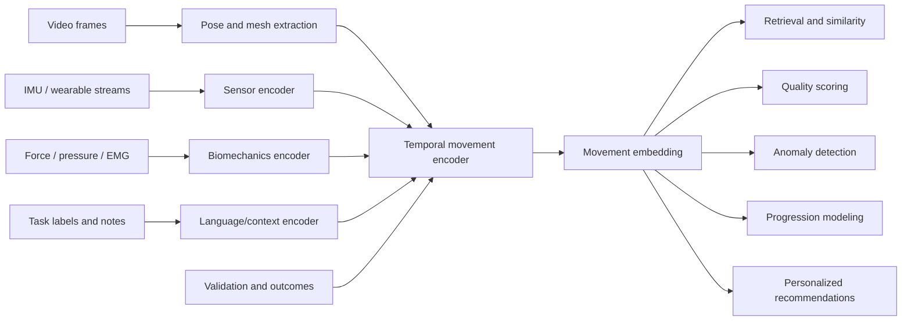
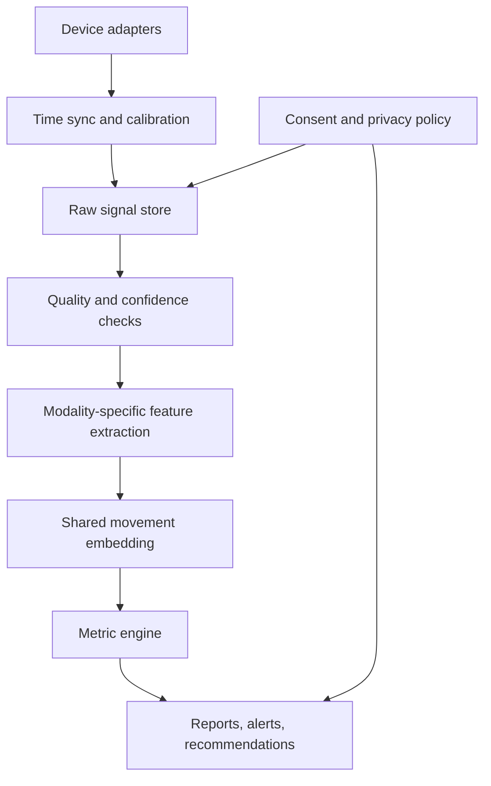
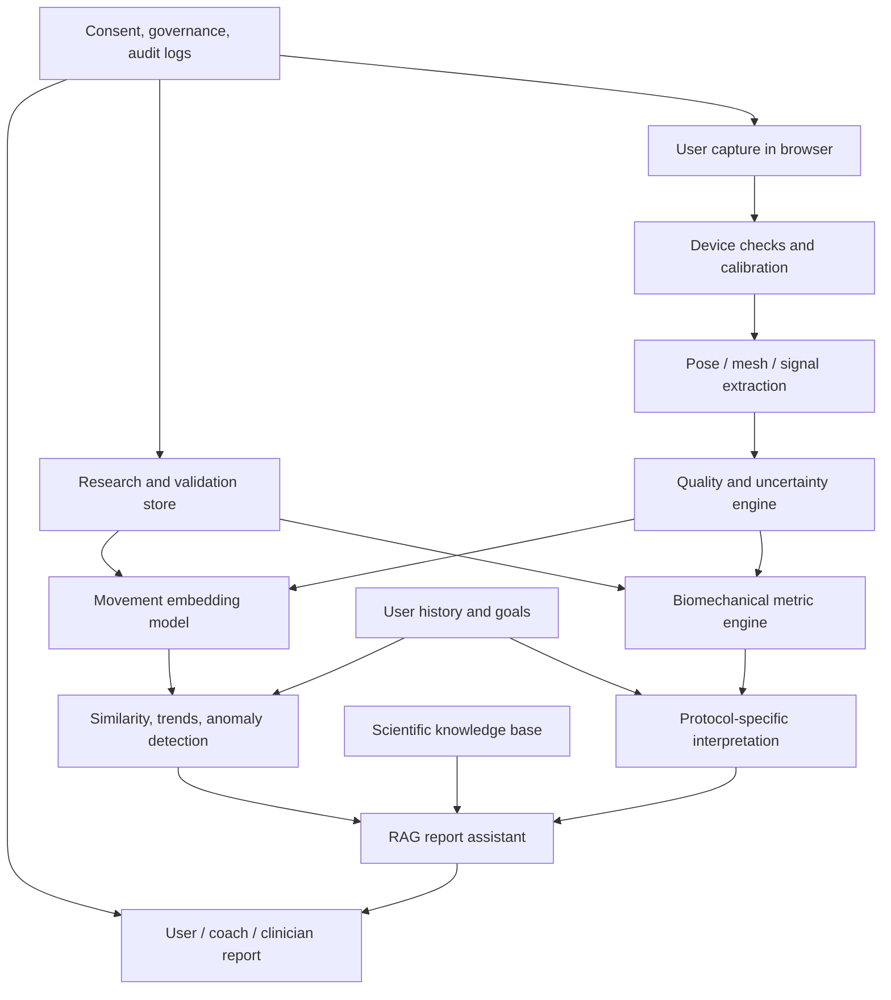

# KinematicIQ Future of Movement Intelligence, AI, and R&D Roadmap

Prepared: July 6, 2026

## Executive Thesis

Movement intelligence is the ability to sense, model, interpret, predict, and improve human movement across contexts. It is broader than pose estimation, motion capture, or biomechanics alone. The field is moving from "Where are the joints?" toward "What does this movement mean, what will happen next, and what should this person do differently?"

KinematicIQ should position itself as a movement intelligence platform, not a pose estimation app. The defensible opportunity is to combine accessible capture, clinically and sport-science-literate interpretation, longitudinal personalization, and validated AI models into a system that learns from every movement session while protecting user privacy.

The core strategic bet:

1. In 1-3 years, browser-based markerless analysis becomes good enough for high-volume screening, coaching feedback, and longitudinal tracking, but not universally valid for clinical-grade kinetics or injury prediction.
2. In 3-5 years, multimodal movement embeddings become the main abstraction layer: video, keypoints, IMU, force, pressure, EMG, history, and notes are mapped into comparable movement representations.
3. In 5-10 years, personalized movement profiles and digital biomechanical twins become practical for selected workflows, especially rehabilitation, return-to-sport, ergonomics, remote monitoring, and athlete development.
4. In 10-15 years, movement intelligence systems become proactive: they simulate likely adaptation, forecast risk and readiness, recommend interventions, and coordinate with clinicians, coaches, robotics, and digital health ecosystems.

The company should invest aggressively in a Movement Foundation Model, validation infrastructure, multimodal data architecture, and privacy-preserving personalization. It should avoid building a generic fitness content app, a claims-heavy injury predictor, or a purely visual pose-estimation wrapper.

## Definitions and Technology Readiness

| Term | Definition | State in 2026 | KinematicIQ implication |
|---|---|---:|---|
| Pose estimation | Estimating body landmarks or joint positions from images/video. | Proven for many 2D/3D landmark tasks; accuracy varies by task, view, camera, body type, and occlusion. | Necessary input layer, not the product moat. |
| Motion capture | Recording motion trajectories, historically using optical markers, inertial sensors, or markerless systems. | Proven in labs; markerless is advancing rapidly. | Use as validation reference and acquisition mode. |
| Biomechanics | Mechanics of biological movement, including kinematics, kinetics, forces, moments, and tissue loading. | Mature science, but expensive to measure in the wild. | Must ground metrics and recommendations. |
| Motor control | How the nervous system plans, learns, adapts, and executes movement. | Mature theory; limited consumer translation. | Critical for skill progression and rehab personalization. |
| Human performance | Applied science of training, fatigue, recovery, and adaptation. | Strong in elite environments, fragmented elsewhere. | Important product wedge, but claims need validation. |
| Digital health | Regulated or semi-regulated technologies for health monitoring and intervention. | Growing, evidence requirements high. | Requires conservative claims, auditability, and clinical partnerships. |
| Robotics | Physical systems that perceive, plan, and move. | Mature in industrial contexts, emerging in human-assistive contexts. | Long-term bridge for exoskeletons, rehab robots, and embodied AI. |
| Movement intelligence | Unified sensing, representation, interpretation, prediction, and intervention for human movement. | Emerging field. | KinematicIQ's category. |

### Proven, Emerging, Speculative

| Category | Examples | Product posture |
|---|---|---|
| Proven technology | 2D pose estimation, basic 3D keypoint inference, video-based gait temporal metrics, IMU activity classification, conventional biomechanics models, OpenSim workflows. | Ship with clear confidence and limitations. |
| Emerging research | Markerless kinetics, motion embeddings, movement-language models, browser WebGPU inference, personalized digital twins, sensor fusion at scale, predictive recovery models. | Build pilots, validation datasets, and restricted beta features. |
| Informed speculation | General-purpose Movement Foundation Models with causal reasoning, lifelong movement profiles used across health and sport, simulation-based injury prevention, agentic movement coaches. | Invest in architecture and research options; avoid overclaiming. |

## Part 1: What Is Movement Intelligence?

Movement intelligence is a computational field that converts motion data into actionable understanding. It has five layers:

1. Capture: RGB, depth, IMU, force, pressure, EMG, radar, wearables, and manual annotations.
2. Reconstruction: pose, body mesh, joint angles, velocities, accelerations, segment positions, and uncertainty.
3. Biomechanical inference: loads, moments, asymmetries, coordination, movement variability, efficiency, and constraints.
4. Interpretation: task identity, skill level, compensation patterns, fatigue signatures, recovery status, risk indicators, and contextual meaning.
5. Action: feedback, recommendations, progressions, simulation, alerts, referrals, and training or rehab plans.

Pose estimation answers: "Where is the body?" Biomechanics answers: "What forces and mechanics are present?" Motor control asks: "How is the nervous system solving the movement problem?" Movement intelligence asks: "What does this movement reveal about this person's capacity, constraints, goals, and likely future?"

This distinction matters because the valuable product is not a skeleton overlay. The valuable product is a trusted movement reasoning system.

## Part 2: AI Foundations

### Foundation Models

Foundation models are large pretrained models adapted to many downstream tasks. In movement, the analogous asset is not a language model alone, but a model pretrained on massive multimodal motion sequences. Time-series foundation model surveys show momentum toward general models for forecasting, anomaly detection, classification, and trend analysis. Multimodal foundation model research shows the path from specialist vision models to general assistants that combine images, video, text, and tools.

For KinematicIQ, a foundation model should learn from:

- 2D and 3D keypoints
- SMPL-like body parameters
- raw or lightly processed video embeddings
- task labels and natural-language annotations
- force, pressure, IMU, EMG, and wearable streams
- clinical, sport, rehab, and ergonomic outcomes
- longitudinal user baselines

Recommendation: build a Movement Foundation Model program, but start with a compact movement encoder rather than a giant general model. The first strategic goal should be reusable embeddings that improve downstream classification, retrieval, anomaly detection, progress tracking, and report generation.

### Self-Supervised and Contrastive Learning

Self-supervised learning is essential because labeled high-quality biomechanical data is scarce. Contrastive methods such as SimCLR demonstrated that useful representations can be learned by making augmented views of the same sample agree in latent space. For movement, positive pairs could include:

- same repetition from two camera views
- same movement rendered as video, keypoints, and joint angles
- adjacent repetitions within a stable set
- pre/post denoised versions of the same sequence
- synthetic perturbations that preserve movement identity

Hard negatives matter. A poor squat and good squat may look similar to a generic model, but are distinct to a movement intelligence system. KinematicIQ should define domain-specific augmentations that preserve biomechanics, not just generic video transformations.

### Representation Learning and Motion Embeddings

The core abstraction should be a movement embedding: a compact vector or sequence representation that preserves task, style, coordination, load, skill, and risk-relevant mechanics. MotionBERT is an important signal: pretrained motion encoders can transfer across 3D pose estimation, action recognition, and mesh recovery by learning spatiotemporal structure from noisy 2D observations.

KinematicIQ should treat embeddings as product infrastructure:

- similarity search: "show movements like this"
- clustering: "find technique families"
- anomaly detection: "this is unlike your baseline"
- progression: "your control profile is converging toward target"
- personalization: "your optimal pattern differs from population average"

### Graph Neural Networks

Human skeletons are naturally graphs. Spatial-temporal graph convolutional networks showed that learning over joint topology and time can improve skeleton-based action recognition. GNNs remain useful for models that need explicit joint connectivity, segment constraints, or interpretable body-region relationships.

Use GNNs where topology matters: joint coordination, asymmetry propagation, compensation chains, and physics-aware representations. Use transformers where long-range temporal context and multimodal attention matter.

### Transformers

Transformers are well suited for motion because they can attend across joints, time, modalities, and context. They support:

- long sequence modeling
- masked motion modeling
- multi-view fusion
- natural language conditioning
- retrieval-augmented explanations
- longitudinal history modeling

The barrier is compute and data. KinematicIQ should train small-to-medium specialized transformers first, deploy distilled browser models, and reserve larger models for cloud analysis and research.

### World Models

World models learn compressed representations and predict future states. For movement intelligence, the analogous world model predicts how a person's movement evolves under fatigue, recovery, load, practice, pain, or intervention.

Near-term use:

- next-repetition quality prediction
- fatigue-state progression within a session
- likely failure modes under increasing intensity

Long-term use:

- simulate training adaptations
- compare intervention options
- optimize return-to-sport progressions

World models are promising but speculative for clinical decision-making. They require causal data, intervention logs, and careful validation.

### Multimodal AI

Movement is inherently multimodal. Video sees shape and external kinematics. IMUs capture high-frequency motion. Force plates and pressure insoles capture loading. EMG captures muscle activation. Notes and goals provide context.

The platform should use late fusion first, then hybrid fusion:

- early fusion: synchronize raw streams where sampling and calibration are stable
- mid fusion: align modality-specific embeddings into a shared movement space
- late fusion: combine calibrated outputs and confidence estimates

### Physics-Informed AI

Physics-informed models constrain learning with laws, geometry, and biomechanical plausibility. The original PINN literature focused on differential equations, but the product principle is broader: do not let learned models violate obvious constraints such as segment lengths, joint limits, center-of-mass continuity, or ground contact logic.

KinematicIQ should use physics in three places:

- reconstruction constraints
- uncertainty detection
- simulation and recommendation guardrails

### Retrieval-Augmented Systems

RAG is valuable for movement reports because scientific knowledge changes and user-specific evidence matters. A movement RAG system should retrieve:

- KinematicIQ's validated metric definitions
- peer-reviewed references
- protocol-specific normative data
- clinician-approved guidance
- the user's longitudinal history
- product policy and claim constraints

RAG should not be used to generate unsupported medical claims. It should generate cited explanations and decision support with provenance.

### Agentic AI

Agentic systems can plan, use tools, retrieve evidence, and monitor progress. For KinematicIQ, agentic AI is best used behind the scenes:

- assemble assessment reports
- flag low-confidence captures
- recommend next tests
- route concerning findings to professionals
- generate coach or clinician summaries

Do not position an autonomous agent as a replacement clinician. Use it as a workflow assistant with clear accountability.

## Part 3: Movement Embeddings and the Movement Foundation Model

### Recommended Architecture

### Training Objectives

| Objective | Purpose | Example |
|---|---|---|
| Masked joint reconstruction | Learn kinematic structure. | Predict hidden joints from visible joints and history. |
| Cross-view contrastive learning | Learn view-invariant motion. | Same jump from front and side views should align. |
| Cross-modal alignment | Map video, IMU, and force to shared space. | Video squat embedding aligns with pressure/force signature. |
| Future-state prediction | Learn dynamics. | Predict movement degradation over a fatigue protocol. |
| Task and phase classification | Learn semantic structure. | Eccentric, bottom, concentric phases. |
| Outcome supervision | Connect motion to validated endpoints. | Rehab progress, return-to-sport criteria, pain/function scores. |
| Uncertainty calibration | Avoid overconfidence. | Low light or occlusion triggers retake. |

### Data Flywheel

KinematicIQ's moat should be a consented, de-identified movement dataset with high-quality metadata:

- capture setup
- camera/device model
- calibration quality
- task/protocol
- user demographics where consented
- sport/clinical context
- ground truth where available
- outcomes and longitudinal follow-up
- model confidence and error estimates

The flywheel is not "more video." It is more validated, contextualized, longitudinal movement data.

## Part 4: Digital Humans

Digital humans include statistical body models, musculoskeletal simulation, avatars, and individualized digital twins.

### Current State

SMPL is a foundational statistical human body model that represents body shape and pose in a graphics-compatible mesh. AMASS unified multiple mocap datasets into a common SMPL-based representation, enabling larger-scale learning of human motion. OpenSim provides an extensible framework for musculoskeletal modeling, simulation, and neuromuscular control research. OpenCap shows how smartphone video can estimate kinematics and dynamics with a more accessible workflow.

### KinematicIQ Opportunity

Digital humans should be used in layers:

1. Visual avatar for user trust and feedback.
2. Body model for consistent joint/segment representation.
3. Personalized anthropometrics for better estimates.
4. Musculoskeletal model for selected high-value analyses.
5. Digital twin for longitudinal simulation and intervention planning.

### Browser Feasibility

| Capability | Browser feasibility in 2026 | Notes |
|---|---|---|
| 2D pose overlay | High | Feasible on common phones/laptops. |
| Lightweight 3D pose | Medium-high | Depends on model, device, and frame rate. |
| SMPL-like mesh fitting | Medium | Use cloud or hybrid for high quality; browser for preview. |
| Full musculoskeletal simulation | Low-medium | Possible for simplified models, not robust real-time general use. |
| Personalized digital twin | Low today, rising | Needs longitudinal data, calibration, and validation. |

Recommendation: build a browser avatar and pose/mesh pipeline now, but keep detailed musculoskeletal simulation as a server-side or research workflow until WebGPU, model compression, and validation mature.

## Part 5: Sensor Fusion

KinematicIQ should not bet on RGB alone. RGB is the best adoption wedge, but sensor fusion is the long-term platform.

### Sensor Roles

| Sensor | Strengths | Weaknesses | Best use |
|---|---|---|---|
| RGB camera | Cheap, ubiquitous, context-rich. | Occlusion, lighting, privacy, limited kinetics. | Screening, coaching, remote assessments. |
| Depth camera | Better 3D geometry. | Hardware availability, outdoor limits. | Clinics, labs, controlled facilities. |
| IMU | High-rate motion, portable. | Drift, placement sensitivity, calibration burden. | Reps, velocity, gait, field monitoring. |
| Force plate | Gold-standard external force. | Expensive, fixed location. | Validation, elite/lab testing. |
| Pressure insoles | Foot loading in field. | Cost, calibration, durability. | Running, gait, return-to-sport. |
| EMG | Muscle activation proxy. | Noise, placement, interpretation complexity. | Rehab, neuromuscular control, prosthetics. |
| Wearables | Physiology and workload. | Consumer data quality varies. | Readiness and recovery context. |
| Radar | Privacy-preserving, works in low light. | Lower semantic detail, sparse point clouds. | Home/clinical monitoring. |
| Smart clothing | Integrated motion/pressure/EMG potential. | Comfort, washability, standards. | Long-term continuous monitoring. |

### Extensible Sensor Architecture

Design principles:

- Every sensor stream gets timestamp, sampling rate, calibration metadata, device identity, and quality score.
- The platform stores raw signals only when necessary and consented.
- Derived features and embeddings are versioned by model and protocol.
- Sensor absence should degrade gracefully, not break workflows.
- Fusion should expose confidence, not just a single score.

## Part 6: Predictive Movement Intelligence

Predictive movement intelligence includes fatigue prediction, recovery prediction, injury-risk monitoring, performance forecasting, technique evolution, rehab progress, and readiness estimation.

### Evidence and Limitations

Wearables and AI can identify fatigue-related patterns when multimodal physiological and motion data are available, but real-world generalization remains difficult. Sports injury prediction research is expanding, yet reviews repeatedly highlight issues with small datasets, heterogeneous definitions, insufficient external validation, limited female-athlete representation, confounding, and weak clinical utility.

The correct product stance is:

- call early systems "risk indicators," "load-response signals," or "monitoring insights"
- avoid deterministic "injury prediction" claims unless prospectively validated for a specific population and endpoint
- emphasize longitudinal change from personal baseline
- provide uncertainty and recommended next assessment
- keep clinicians/coaches in the loop for consequential decisions

### Prediction Targets

| Target | Near-term feasibility | Key signals | Risk |
|---|---:|---|---|
| Fatigue state within a session | High-medium | velocity loss, coordination variability, HR, RPE, IMU, EMG. | Confusing local fatigue with skill/noise. |
| Recovery/readiness | Medium | sleep, HRV, workload, soreness, movement baseline. | Consumer wearables vary; causality weak. |
| Technique evolution | High | movement embeddings over time. | Needs task-specific definitions of "better." |
| Rehab progress | Medium-high | adherence, ROM, symmetry, function tests, PROs. | Clinical claims require validation. |
| Injury-risk monitoring | Medium-low | load spikes, asymmetry, fatigue, history. | High liability and false positives. |
| Performance forecasting | Medium | trend, workload, skill metrics, context. | Sport-specific and sensitive to environment. |

## Part 7: Personalized Intelligence

A lifelong movement profile should combine a person's stable traits, current state, and adaptation history.

### Profile Components

| Component | Description |
|---|---|
| Identity-safe profile | Pseudonymous ID, consent, data rights, privacy settings. |
| Anthropometrics | Height, mass, limb estimates, body model parameters when consented. |
| Baselines | Personal norms for tasks, joint ranges, symmetry, speed, control, variability. |
| Movement fingerprints | Embeddings that capture individual coordination style and constraints. |
| Goals | Sport, rehab, pain reduction, mobility, performance, longevity. |
| Context | Training load, sleep, soreness, injury history, equipment, surface. |
| Adaptation record | How metrics respond to training, fatigue, rest, interventions. |
| Recommendation memory | What advice was given, followed, ignored, or effective. |

### Privacy-Preserving Personalization

KinematicIQ should assume movement data is sensitive biometric data. Core controls:

- explicit consent by use case
- local-first processing where possible
- user-visible deletion and export
- separation of identity from motion data
- federated or split learning research for personalization
- differential privacy for aggregate analytics where appropriate
- strict policy for health claims and third-party sharing

## Part 8: Research Opportunities

### Priority Research Agenda

| Rank | Research opportunity | Why it matters | KinematicIQ contribution |
|---:|---|---|---|
| 1 | Validated browser markerless biomechanics | Unlocks scalable movement assessment. | Build benchmark protocols against lab systems across tasks and devices. |
| 2 | Movement embeddings | Core platform abstraction. | Release task-specific embedding evaluations and internal foundation model. |
| 3 | Confidence-aware movement metrics | Prevents overclaiming from bad captures. | Publish uncertainty calibration methods for consumer video. |
| 4 | Longitudinal personalization | Differentiates from one-time screening apps. | Study personal baselines and adaptation curves. |
| 5 | Multimodal fusion | Improves kinetics, fatigue, and recovery inference. | Build sensor adapter architecture and validation datasets. |
| 6 | Explainable movement intelligence | Required for coaches, clinicians, and trust. | Connect model outputs to interpretable biomechanical features. |
| 7 | Browser AI performance | Reduces cost and protects privacy. | Optimize WebGPU/WASM deployment and fallback model tiers. |
| 8 | Ethical predictive monitoring | Needed before risk products. | Define policy, thresholds, and human-review workflows. |

### Open Questions

- Which movement embeddings transfer across sport, age, sex, injury history, and camera setup?
- How much personalized baseline data is needed before recommendations outperform population norms?
- Can browser-only systems estimate clinically useful 3D kinematics across real-world environments?
- When do markerless outputs become reliable enough for intervention decisions?
- How should movement AI communicate uncertainty without overwhelming users?
- Which metrics are robust, actionable, and resistant to gaming?
- How can KinematicIQ reduce bias across body types, skin tones, clothing, mobility aids, and atypical movement patterns?

## Part 9: Strategic Vision

### 1 Year

Product:

- Browser-based movement capture for selected protocols.
- Clear quality checks and retake guidance.
- Foundational metrics: range, symmetry, tempo, phase timing, consistency, and simple technique markers.
- Coach/clinician-facing reports with confidence indicators.

Science:

- Define metric ontology.
- Establish validation protocols.
- Start prospective longitudinal dataset.

Engineering:

- Versioned pipelines for capture, pose, metrics, reports, and models.
- Model confidence and data-quality layer.
- Early embedding service for similarity and clustering.

Do not build:

- Broad injury prediction.
- Generic exercise library as the core product.
- Unvalidated "AI diagnosis."

### 3 Years

Product:

- Movement profile with baselines and trend detection.
- Multi-session progress tracking.
- Sport/rehab-specific protocols.
- Optional IMU and wearable integration.
- Report assistant for professionals.

Science:

- Publish validation studies.
- Build task-specific normative datasets.
- Validate movement embeddings against outcomes.

Engineering:

- Shared movement embedding.
- RAG-backed explanation system.
- WebGPU/WASM model tiers.
- Sensor fusion framework.

### 5 Years

Product:

- Personalized recommendations based on baseline and response.
- Fatigue and readiness indicators for selected populations.
- Rehab progression monitoring.
- Enterprise integrations for clinics, teams, and labs.

Science:

- Prospective studies on risk indicators and intervention effects.
- Digital-human models for selected workflows.
- Benchmark against commercial and lab systems.

Engineering:

- Movement Foundation Model v2.
- Hybrid browser/cloud inference.
- Privacy-preserving personalization experiments.
- Simulation-assisted scenario analysis.

### 10 Years

Product:

- Lifelong movement intelligence profile.
- Personalized digital biomechanical twin for high-value users.
- Cross-context ecosystem: sport, rehab, occupational health, aging, robotics.
- Agentic workflow support for coaches and clinicians.

Science:

- Causal models of adaptation and intervention response.
- Validated simulation for selected decisions.
- Large-scale real-world evidence programs.

Engineering:

- Multimodal foundation model with robust uncertainty.
- Federated learning for personalization.
- API ecosystem for sensors, EHR, wearables, equipment, and robotics.

## Part 10: KinematicIQ Master Roadmap

### Integrated Roadmap

| Initiative | Scientific value | User value | Complexity | Differentiation | Strategic importance | Priority |
|---|---:|---:|---:|---:|---:|---:|
| Capture quality and confidence engine | High | High | Medium | High | High | P0 |
| Movement metric ontology | High | Medium | Medium | High | High | P0 |
| Browser markerless protocols | Medium | High | Medium | Medium | High | P0 |
| Validation dataset and lab partnerships | Very high | Medium | High | Very high | Very high | P0 |
| Movement embedding v1 | Very high | Medium | High | Very high | Very high | P0 |
| Longitudinal movement profile | High | Very high | Medium | High | Very high | P1 |
| RAG report assistant | Medium | High | Medium | Medium | High | P1 |
| Sensor fusion architecture | High | Medium | High | High | High | P1 |
| IMU/wearable integrations | Medium | High | Medium | Medium | High | P1 |
| Fatigue indicators | Medium | High | Medium | Medium | Medium | P2 |
| Personalized recommendations | High | Very high | High | High | Very high | P2 |
| Digital-human simulation | Very high | Medium | Very high | High | High | P2 |
| Injury-risk monitoring | High | High | Very high | High | High | P3 until validated |
| General digital twin | Very high | High | Very high | Very high | High | Research |

### Scientific Roadmap

1. Define metric ontology and protocol taxonomy.
2. Validate capture and pose accuracy by task, device, and environment.
3. Build reliability studies for repeat measurements.
4. Train and evaluate movement embeddings.
5. Connect embeddings to longitudinal outcomes.
6. Establish prospective evidence for selected predictive indicators.
7. Publish research selectively to build credibility and recruiting advantage.

### Engineering Roadmap

1. Browser capture SDK with calibration and quality scoring.
2. Versioned model pipeline: pose, mesh, metric extraction, uncertainty, embeddings.
3. Secure movement data lake with consent, lineage, and governance.
4. Movement embedding service with retrieval and clustering.
5. Report generation service with RAG and citation controls.
6. Sensor adapter framework with timestamping and calibration metadata.
7. Hybrid inference: browser for capture/preview, cloud for heavy analysis, edge for privacy-critical workflows.

### Product Roadmap

1. Start with narrow protocols where feedback is actionable.
2. Build professional trust with explainable metrics and confidence.
3. Add longitudinal baselines and progress reports.
4. Expand into sport, rehab, and occupational verticals with tailored protocols.
5. Add personalization only after enough baseline data exists.
6. Introduce predictive features as monitored indicators, not deterministic claims.

### Validation Roadmap

Validation should be treated as infrastructure, not a one-time study.

| Validation layer | Question | Evidence |
|---|---|---|
| Technical validity | Does the system measure what it claims? | Comparison to marker-based mocap, force plates, IMUs. |
| Reliability | Does it produce stable results across sessions? | Test-retest and inter-device studies. |
| Construct validity | Does the metric relate to meaningful movement constructs? | Correlation with accepted biomechanical and clinical metrics. |
| Predictive validity | Does it forecast future outcomes? | Prospective longitudinal studies. |
| Clinical/user utility | Does it improve decisions or outcomes? | Pragmatic trials, workflow studies, A/B experiments. |
| Bias/fairness | Does it work across populations? | Stratified performance audits. |

### AI Roadmap

1. Pose and metric pipeline with uncertainty.
2. Movement embeddings for retrieval and clustering.
3. Task-specific scoring models.
4. Longitudinal personalization models.
5. Multimodal fusion models.
6. Predictive state models.
7. Simulation and world-model research.
8. Agentic workflow assistant with human oversight.

### Commercial Roadmap

Best first markets:

- physical therapy and rehabilitation monitoring
- strength and conditioning organizations
- sports performance clinics
- remote coaching platforms
- occupational movement screening
- research labs needing scalable data collection

Avoid first:

- direct-to-consumer injury prediction
- general wellness content subscription
- highly regulated diagnosis without partners
- expensive proprietary hardware as the primary wedge

Commercial principle: sell trusted movement insight, not raw tracking.

## What KinematicIQ Should Not Build

- A generic pose-estimation wrapper with branded scores.
- An injury prediction feature without prospective validation and clear claims controls.
- A hardware-dependent platform that blocks adoption.
- A single "perfect movement score" that hides context and uncertainty.
- A purely cloud-dependent workflow for privacy-sensitive video.
- A content-first exercise app where AI is a novelty layer.
- A black-box clinical recommendation engine.

## What KinematicIQ Should Invest In Aggressively

- Validation partnerships with universities, clinics, and sport science labs.
- A proprietary movement ontology and metric versioning system.
- Movement embeddings and foundation-model research.
- Browser AI, WebGPU/WASM deployment, and on-device privacy.
- Confidence scoring and explainability.
- Longitudinal personalization.
- Sensor fusion architecture.
- Data governance and consent as product features.
- Scientific credibility through selective publications.

## Decision Framework

Before building a feature, ask:

1. Is the metric technically valid for the capture setup?
2. Is it reliable enough across sessions and devices?
3. Is the output actionable for the user or professional?
4. Can the system express uncertainty clearly?
5. Does the feature improve with longitudinal data?
6. Does it strengthen the movement data moat?
7. Does it create regulatory, privacy, or liability exposure?
8. Can it be validated prospectively?

If a feature fails questions 1-4, do not ship it as a user-facing recommendation. If it passes 1-4 but fails 5-8, ship it as a descriptive or exploratory insight with cautious language.

## Reference Architecture

## Timeline by Topic

| Topic | 1-3 years | 3-5 years | 5-10 years | 10-15 years |
|---|---|---|---|---|
| Markerless pose | Robust for selected protocols. | Wider device/task coverage. | Lab-grade for many kinematics. | Commodity infrastructure. |
| Markerless kinetics | Limited estimates. | Validated in narrow tasks. | More practical with fusion. | Routine for selected contexts. |
| Movement embeddings | Internal v1. | Product-wide abstraction. | Cross-domain foundation model. | Standard movement identity layer. |
| Digital humans | Avatar and mesh preview. | Personalized body models. | Selected musculoskeletal twins. | Longitudinal digital twins. |
| Sensor fusion | Architecture and pilots. | IMU/wearable integrations. | Force/pressure/EMG at scale. | Ambient multimodal monitoring. |
| Prediction | Descriptive indicators. | Fatigue/recovery pilots. | Validated risk monitoring for selected groups. | Simulation-driven intervention planning. |
| Browser AI | Lightweight inference. | WebGPU production tiers. | Complex hybrid models. | Local-first multimodal AI. |
| Agentic AI | Report assistance. | Workflow orchestration. | Decision support. | Human-supervised adaptive coaching ecosystems. |

## Cross-Topic Technical Dossiers

The following dossiers make the global evaluation dimensions explicit for each major technology area.

### Markerless Capture and Biomechanics

| Dimension | Assessment |
|---|---|
| Current state of the art | Strong 2D pose and improving 3D markerless kinematics. OpenCap, Theia3D-style systems, MediaPipe, OpenPose-derived workflows, and video gait research show practical promise, especially for spatiotemporal metrics and selected joint kinematics. |
| Scientific foundation | Photogrammetry, camera calibration, human pose estimation, rigid-body kinematics, inverse kinematics, inverse dynamics, anthropometry, and musculoskeletal modeling. |
| Key algorithms | CNN/transformer pose estimators, heatmap regression, direct coordinate regression, temporal filters, multi-view triangulation, bundle adjustment, inverse kinematics, differentiable optimization, Kalman/particle filters. |
| Mathematical concepts | Projective geometry, SE(3) transformations, graph structures, least-squares optimization, temporal smoothing, joint-angle parameterization, uncertainty propagation, inverse dynamics. |
| Technical barriers | Occlusion, camera placement, clothing, lighting, body-type bias, fast motion blur, floor contact detection, kinetic inference without force measurement, benchmark inconsistency. |
| Hardware requirements | Near term: smartphone/laptop RGB camera. Higher validity: multi-camera setup, calibration target, optional depth, IMU, force plate, or pressure insoles. |
| Browser feasibility | High for capture, quality checks, 2D pose, lightweight 3D, and feedback. Medium for mesh fitting. Low-medium for high-fidelity kinetics and musculoskeletal simulation. |
| Expected timeline | 1-3 years for robust protocolized screening; 3-5 years for broader validated kinematics; 5-10 years for fusion-assisted kinetics; 10-15 years for commodity markerless biomechanics in many contexts. |
| Supporting evidence | OpenCap, OpenSim, MediaPipe/BlazePose, markerless gait reviews, and video-based clinical gait studies. |
| Risks | Overstated accuracy, poor generalization, privacy concerns, false reassurance, biased performance across populations. |
| Opportunities | Scalable assessment, remote rehab, accessible sport science, large longitudinal datasets. |
| Recommendation | Ship only validated task-specific metrics with visible confidence and retake guidance. Treat raw pose as infrastructure, not the product. |

### AI Foundation Models and Movement Embeddings

| Dimension | Assessment |
|---|---|
| Current state of the art | MotionBERT, AMASS, HumanML3D, Motion-X, text-to-motion, and diffusion models show that reusable motion representations are viable, but general movement foundation models for biomechanics are still emerging. |
| Scientific foundation | Representation learning, time-series modeling, human motion priors, motor control, statistical learning, and transfer learning. |
| Key algorithms | Transformers, masked modeling, contrastive learning, temporal convolution, GNNs, diffusion models, retrieval, multimodal alignment, autoencoders. |
| Mathematical concepts | Embedding spaces, metric learning, attention, sequence likelihood, graph Laplacians, variational inference, diffusion processes, optimal transport/alignment, calibration. |
| Technical barriers | Limited labeled outcomes, incompatible datasets, weak clinical labels, domain shift, high compute cost, difficulty evaluating embeddings. |
| Hardware requirements | Training: GPUs/accelerators and curated datasets. Inference: browser/WebGPU for small encoders, cloud for large models. |
| Browser feasibility | Medium-high for distilled encoders and retrieval features; low for large training or heavy multimodal models. |
| Expected timeline | 1-3 years for internal embeddings; 3-5 years for product-wide embeddings; 5-10 years for domain foundation models; 10-15 years for general movement reasoning models. |
| Supporting evidence | MotionBERT, AMASS, HumanML3D, MDM, time-series foundation model surveys, multimodal foundation model surveys. |
| Risks | Embeddings that learn capture artifacts instead of movement, unclear validation, black-box recommendations, dataset bias. |
| Opportunities | Defensible moat, personalization, retrieval, anomaly detection, transfer learning, lower labeling burden. |
| Recommendation | Build a compact Movement Foundation Model roadmap now, starting with embeddings evaluated on practical downstream tasks. |

### Digital Humans and Simulation

| Dimension | Assessment |
|---|---|
| Current state of the art | SMPL-like body models, AMASS datasets, OpenSim musculoskeletal simulation, and OpenCap-style pipelines make digital human modeling practical in research and selected products. Personalized full-body simulation remains hard. |
| Scientific foundation | Anatomy, musculoskeletal dynamics, Hill-type muscle models, rigid-body mechanics, statistical shape models, optimal control. |
| Key algorithms | SMPL fitting, inverse kinematics, inverse dynamics, finite-state gait/event detection, optimal control, differentiable simulation, neural body models. |
| Mathematical concepts | Mesh deformation, linear blend skinning, constrained optimization, forward/inverse dynamics, differential equations, parameter identification. |
| Technical barriers | Personalized anatomy, soft tissue, muscle activation, ground reaction estimation, calibration, compute cost, validation. |
| Hardware requirements | Browser avatar needs GPU-capable device. Research simulation benefits from server compute and validated force/kinematic inputs. |
| Browser feasibility | High for visualization, medium for simple body model fitting, low-medium for detailed simulation. |
| Expected timeline | 1-3 years for avatars/mesh previews; 3-5 years for personalized body models; 5-10 years for selected musculoskeletal twins; 10-15 years for routine longitudinal twins in high-value workflows. |
| Supporting evidence | SMPL, AMASS, OpenSim, OpenCap. |
| Risks | False precision, user misunderstanding of avatars as exact anatomy, compute burden, validation gaps. |
| Opportunities | Better feedback, personalization, simulation, clinician trust, advanced analytics. |
| Recommendation | Use digital humans first as interpretable visualization and coordinate system; reserve clinical simulation claims for validated workflows. |

### Sensor Fusion

| Dimension | Assessment |
|---|---|
| Current state of the art | IMU motion capture, camera-IMU fusion, wearables, pressure insoles, EMG, and radar each solve different pieces. Fusion research is active but fragmented. |
| Scientific foundation | Signal processing, Bayesian filtering, multimodal learning, biomechanics, sensor calibration, time synchronization. |
| Key algorithms | Kalman filters, complementary filters, dynamic optimization, cross-modal transformers, late-fusion classifiers, probabilistic graphical models, signal feature extraction. |
| Mathematical concepts | State estimation, sensor covariance, sampling theory, synchronization, quaternion orientation, coordinate transforms, multimodal embedding alignment. |
| Technical barriers | Calibration burden, sensor placement, clock drift, missing data, consumer device variability, user comfort, interoperability. |
| Hardware requirements | RGB camera for base product; optional IMU, wearable APIs, pressure insoles, EMG, force plates, radar, or smart textiles for advanced tiers. |
| Browser feasibility | High for camera and some Bluetooth sensors; medium for real-time multi-device fusion; low for specialized hardware without native bridges. |
| Expected timeline | 1-3 years for adapter architecture; 3-5 years for IMU/wearable fusion; 5-10 years for pressure/EMG/radar workflows; 10-15 years for ambient multimodal monitoring. |
| Supporting evidence | Inertial motion capture reviews, wearable sports medicine reviews, camera-IMU fusion studies, EMG and mmWave radar research. |
| Risks | More sensors can produce more noise, not more truth; support burden; fragmented hardware ecosystem. |
| Opportunities | Stronger fatigue, loading, and recovery inference; better field validity; enterprise partnerships. |
| Recommendation | Make RGB the adoption wedge, but design all data models as sensor-extensible from day one. |

### Predictive Movement Intelligence

| Dimension | Assessment |
|---|---|
| Current state of the art | Fatigue and workload indicators are increasingly feasible. Injury prediction is scientifically attractive but not mature enough for broad deterministic claims. Rehab progress prediction is promising with structured protocols. |
| Scientific foundation | Training load theory, tissue adaptation, fatigue physiology, motor control, epidemiology, survival analysis, causal inference. |
| Key algorithms | Gradient boosting, random forests, temporal transformers, recurrent models, survival models, Bayesian models, anomaly detection, causal graphs. |
| Mathematical concepts | Time-to-event modeling, calibration, sensitivity/specificity, AUROC/AUPRC, base rates, longitudinal mixed models, causal confounding, uncertainty. |
| Technical barriers | Rare outcomes, label noise, inconsistent injury definitions, confounding, small samples, missing data, population shift, liability. |
| Hardware requirements | Minimum: longitudinal movement captures and self-reported context. Better: workload, HR/HRV, sleep, IMU/GPS, force/pressure, clinical outcomes. |
| Browser feasibility | Medium for data collection and trend indicators; low for standalone high-stakes prediction without cloud validation and human oversight. |
| Expected timeline | 1-3 years for descriptive indicators; 3-5 years for fatigue/recovery pilots; 5-10 years for validated risk monitoring in narrow populations; 10-15 years for simulation-aided intervention planning. |
| Supporting evidence | Fatigue wearables review, wearable sports medicine review, BJSM machine learning injury prediction review, AI rehabilitation reviews. |
| Risks | False positives/negatives, behavior changes from alerts, medical/regulatory exposure, biased risk estimates. |
| Opportunities | Retention through longitudinal value, clinician/coach decision support, proactive care, enterprise differentiation. |
| Recommendation | Use conservative language, prospective validation, human oversight, and personal-baseline deltas. |

### Personalized Intelligence

| Dimension | Assessment |
|---|---|
| Current state of the art | Wearables and digital health platforms maintain longitudinal profiles, but deep movement-specific personalization remains early. |
| Scientific foundation | Individual baselines, motor learning, adaptation, longitudinal statistics, personalization, privacy-preserving ML. |
| Key algorithms | Personal baseline modeling, hierarchical Bayesian models, metric learning, anomaly detection, recommender systems, federated learning, continual learning. |
| Mathematical concepts | Within-subject variance, z-scores against personal norms, Bayesian updating, drift detection, representation stability, privacy budgets. |
| Technical barriers | Cold start, habit/adherence, missing context, model drift, privacy, consent, explaining personalized deviations from population norms. |
| Hardware requirements | Repeated captures; optional wearables and sensors improve state estimation. |
| Browser feasibility | High for profile access, capture, and local summaries; medium for on-device personalization; cloud or federated systems for larger learning. |
| Expected timeline | 1-3 years for baselines; 3-5 years for adaptive norms; 5-10 years for individualized recommendations; 10-15 years for lifelong movement profiles. |
| Supporting evidence | Wearable monitoring literature, time-series foundation work, clinical AI personalization research. |
| Risks | Privacy loss, overfitting to noisy baselines, inappropriate recommendations after injury or life changes. |
| Opportunities | Durable user value, defensible data asset, improved outcomes, cross-context continuity. |
| Recommendation | Build personalization as opt-in, transparent, and reversible, with clear separation between descriptive trends and prescriptive advice. |

### Browser AI and Deployment

| Dimension | Assessment |
|---|---|
| Current state of the art | WebGPU, WebAssembly, TensorFlow.js, and ONNX Runtime Web make browser inference increasingly practical for lightweight and medium models. Performance remains device- and browser-dependent. |
| Scientific foundation | Edge inference, model compression, GPU compute, privacy-preserving local processing, real-time systems. |
| Key algorithms | Quantization, distillation, pruning, operator fusion, WebGPU kernels, WASM SIMD, streaming inference, frame skipping. |
| Mathematical concepts | Numerical precision, latency/throughput tradeoffs, memory bandwidth, approximation error, model calibration after quantization. |
| Technical barriers | Browser compatibility, mobile thermals, camera permissions, memory limits, inconsistent GPU drivers, model download size. |
| Hardware requirements | Modern smartphone/laptop for lightweight models; GPU-capable device for WebGPU acceleration; cloud fallback for heavy analyses. |
| Browser feasibility | High for capture, lightweight inference, privacy-preserving previews; medium for complex multi-model pipelines; low for large training. |
| Expected timeline | 1-3 years for production lightweight inference; 3-5 years for WebGPU-first model tiers; 5-10 years for richer hybrid local/cloud AI; 10-15 years for local-first multimodal movement intelligence. |
| Supporting evidence | W3C WebGPU, Chrome WebGPU docs, WebAssembly/WebGPU AI guidance, ONNX Runtime Web/WebGPU documentation. |
| Risks | Fragmentation, degraded experience on low-end devices, hidden energy costs, inconsistent inference outputs across runtimes. |
| Opportunities | Lower cloud cost, privacy advantage, offline capture, instant feedback, scalable distribution. |
| Recommendation | Use tiered inference: browser for capture and immediate feedback, cloud for validated heavy analysis, edge/local-first where privacy is central. |

## Vision Statement

If executed successfully, KinematicIQ becomes the trusted intelligence layer for human movement. It helps people, coaches, clinicians, researchers, and organizations understand not just how bodies move, but how movement changes, adapts, breaks down, recovers, and improves over time.

The long-term win is not owning a camera workflow or a scoring dashboard. It is owning the validated representation of movement itself: a privacy-respecting, scientifically grounded, personalized movement intelligence platform that turns everyday motion into useful, trustworthy insight.

## Selected Sources

- OpenCap, "Human movement dynamics from smartphone videos," PLOS Computational Biology: https://journals.plos.org/ploscompbiol/article?id=10.1371/journal.pcbi.1011462
- OpenSim, "Simulating musculoskeletal dynamics and neuromuscular control," PLOS Computational Biology: https://journals.plos.org/ploscompbiol/article?id=10.1371/journal.pcbi.1006223
- OpenSim original open-source software paper: https://nmbl.stanford.edu/publications/pdf/Delp2007.pdf
- SMPL model project and paper links: https://smpl.is.tue.mpg.de/
- AMASS dataset, ICCV 2019: https://amass.is.tue.mpg.de/
- BlazePose, Google Research: https://research.google/blog/on-device-real-time-body-pose-tracking-with-mediapipe-blazepose/
- MediaPipe Pose Landmarker documentation: https://developers.google.com/edge/mediapipe/solutions/vision/pose_landmarker
- MotionBERT, ICCV 2023/arXiv: https://arxiv.org/abs/2210.06551
- HumanML3D, CVPR 2022: https://ericguo5513.github.io/text-to-motion/
- Human Motion Diffusion Model: https://arxiv.org/abs/2209.14916
- ST-GCN skeleton action recognition: https://arxiv.org/abs/1801.07455
- SimCLR contrastive learning: https://arxiv.org/abs/2002.05709
- Physics-informed neural networks: https://www.sciencedirect.com/science/article/pii/S0021999118307125
- World Models: https://worldmodels.github.io/
- Time-series foundation model survey: https://arxiv.org/abs/2405.02358
- Multimodal foundation model survey: https://arxiv.org/abs/2309.10020
- Retrieval-Augmented Generation survey: https://arxiv.org/abs/2312.10997
- Original RAG paper: https://arxiv.org/abs/2005.11401
- Inertial-based human motion capture review: https://pmc.ncbi.nlm.nih.gov/articles/PMC8024877/
- Wearable sensors in sports medicine review: https://www.nature.com/articles/s41746-019-0149-2
- Markerless camera-based 3D gait review/meta-analysis: https://www.mdpi.com/1424-8220/24/11/3686
- Pose estimation models in movement/posture review: https://pmc.ncbi.nlm.nih.gov/articles/PMC11566680/
- Clinical gait analysis using video-based pose estimation: https://journals.plos.org/digitalhealth/article?id=10.1371/journal.pdig.0000467
- Fatigue monitoring using wearables and AI: https://arxiv.org/html/2412.16847v1
- Machine learning approaches to sports injury prediction, BJSM: https://bjsm.bmj.com/content/59/7/491
- AI in rehabilitation medicine opportunities and challenges: https://www.e-arm.org/journal/view.php?doi=10.5535/arm.23131
- WebGPU W3C specification: https://www.w3.org/TR/webgpu/
- Chrome WebGPU overview: https://developer.chrome.com/docs/web-platform/webgpu/overview
- Chrome WebAssembly/WebGPU AI enhancements: https://developer.chrome.com/blog/io24-webassembly-webgpu-1
- ONNX Runtime Web documentation: https://onnxruntime.ai/docs/tutorials/web/
- ONNX Runtime WebGPU execution provider: https://onnxruntime.ai/docs/tutorials/web/ep-webgpu.html
