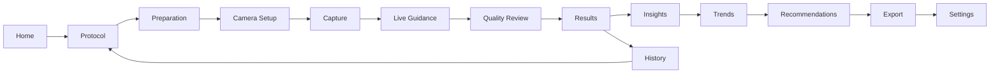
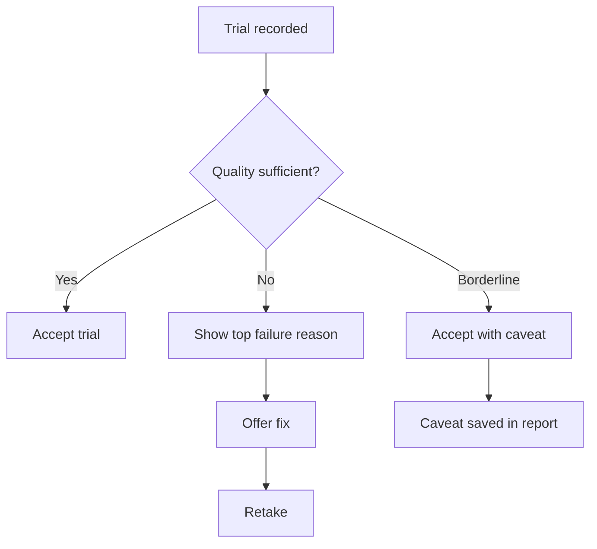
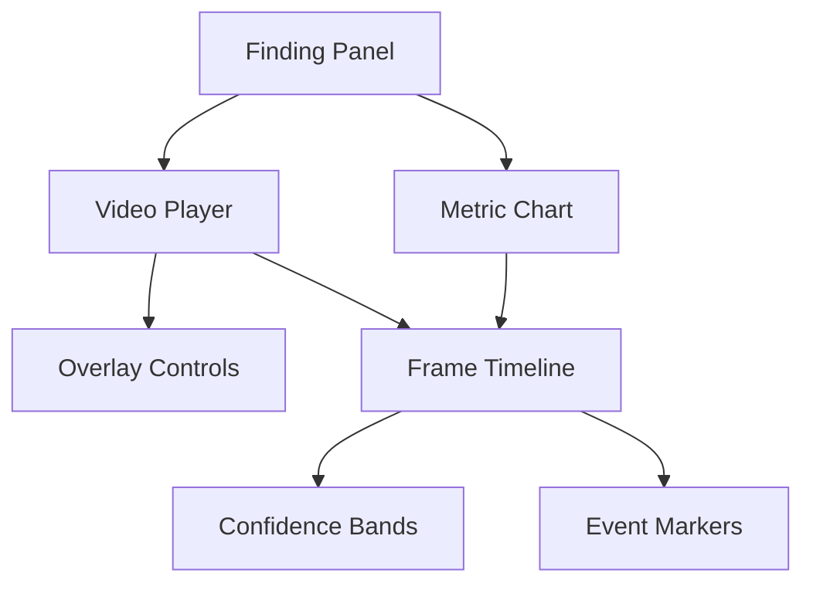
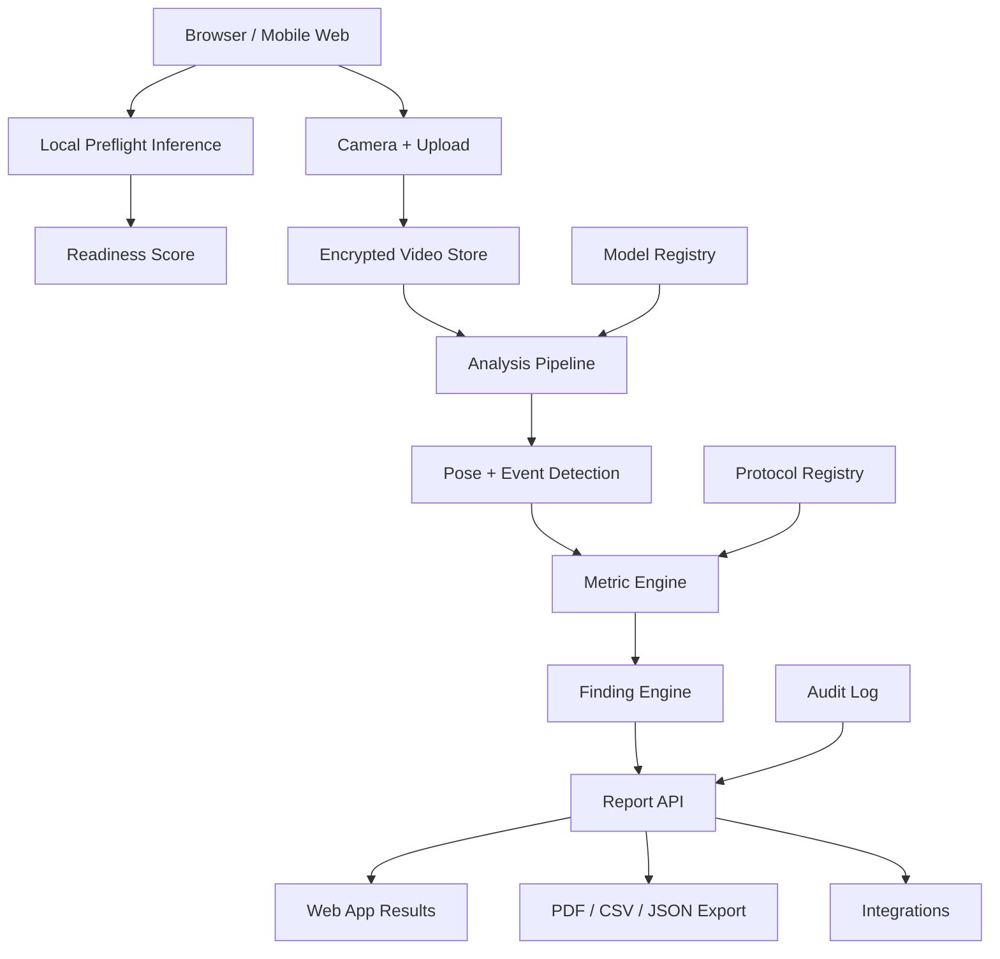
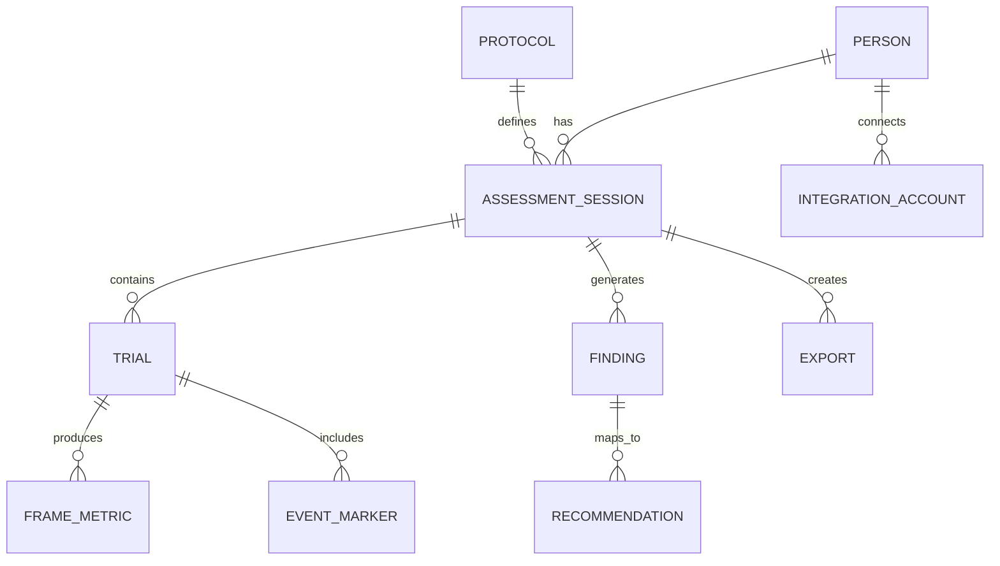
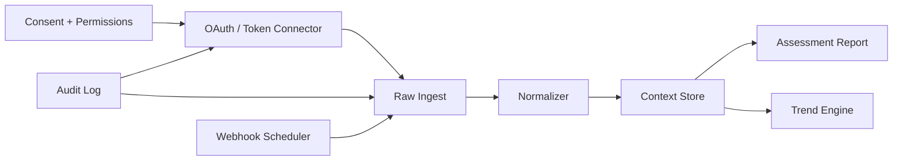

# KinematicIQ Product Experience Bible

Research prompt executed: 2026-07-06  
Primary interpretation: KinematicIQ is a browser and mobile-first movement intelligence platform for athletes, coaches, clinicians, biomechanists, and performance organizations.

## Executive Summary

KinematicIQ should feel like a precise instrument that happens to be friendly. The product should not behave like a generic fitness app, a medical dashboard, or a novelty AI demo. It should behave like a calibrated movement lab compressed into a clear guided workflow: choose a protocol, prepare the environment, capture motion, verify quality, review findings, understand uncertainty, and act on the next best training or clinical step.

The central product promise is: make high-quality movement insight accessible without pretending that camera-based biomechanics is magic. Trust is the product. Visual polish, AI explanations, and beautiful reports matter only if the user believes the capture was valid, the analysis was honest, and the recommendation respects context.

The recommended product shape:

| Area | Recommendation | Evidence strength | Implementation priority |
|---|---|---:|---:|
| Core UX | Guided assessment flow with progressive disclosure and quality gates | Strong | P0 |
| Capture | Live camera readiness score before recording | Strong | P0 |
| Results | Three-layer reporting: summary, evidence, expert detail | Strong | P0 |
| AI | Show confidence, constraints, and rationale. Avoid anthropomorphic certainty | Strong | P0 |
| Motion display | Start with skeleton plus video overlay, then add trails, ghost comparison, and joint timelines | Medium | P0/P1 |
| Design system | Dense, calm, high-contrast operational UI with restrained motion | Medium | P0 |
| Architecture | Local-first capture and inference where feasible, cloud analysis for heavier pipelines | Strong | P0 |
| Developer ecosystem | MediaPipe or custom model for MVP pose, ONNX Runtime Web for deployable model portability, Three.js for 3D, D3/Observable Plot for analysis views | Strong | P0/P1 |
| Integrations | Apple HealthKit, Android Health Connect, Strava, Oura, WHOOP, Garmin, VALD, Catapult, Hawkin, FHIR/Epic as phased integrations | Strong | P1-P3 |
| Roadmap | MVP protocol engine first, validated biomechanics platform second, enterprise intelligence platform third | Heuristic plus market evidence | P0-P3 |

## Evidence Model

Evidence-supported guidance means the recommendation is grounded in standards, official platform documentation, peer-reviewed research, or highly established UX/product practice.

Expert heuristic means the recommendation is based on product judgment, design pattern synthesis, sports-science practice, or competitive interpretation.

Original recommendation means a proposed KinematicIQ-specific synthesis that should be tested with users and validated technically.

Key sources used:

- Google MediaPipe Pose Landmarker outputs body landmarks in image and 3D world coordinates and supports image, video, and live-stream modes: [Google AI Edge Pose Landmarker](https://developers.google.com/edge/mediapipe/solutions/vision/pose_landmarker), [Web guide](https://developers.google.com/edge/mediapipe/solutions/vision/pose_landmarker/web_js)
- WebGPU is the modern browser GPU API for graphics and compute: [MDN WebGPU](https://developer.mozilla.org/en-US/docs/Web/API/WebGPU_API), [Chrome WebGPU overview](https://developer.chrome.com/docs/web-platform/webgpu/overview)
- ONNX Runtime Web supports browser ML deployment and WebGPU execution: [ONNX Runtime WebGPU](https://onnxruntime.ai/docs/tutorials/web/ep-webgpu.html)
- Health and performance integrations: [Apple HealthKit](https://developer.apple.com/documentation/healthkit), [Android Health Connect](https://developer.android.com/health-and-fitness/health-connect), [Garmin Health API](https://developer.garmin.com/gc-developer-program/health-api/), [WHOOP API](https://developer.whoop.com/api/), [Fitbit API](https://www.fitbit.com/dev), [Oura API V2](https://cloud.ouraring.com/v2/docs), [Strava API](https://developers.strava.com/docs/reference/)
- Healthcare interoperability: [HL7 FHIR R5](https://hl7.org/fhir/R5/), [SMART on FHIR](https://docs.smarthealthit.org/), [Epic on FHIR](https://fhir.epic.com/)
- UX, accessibility, and human-centered design: [WCAG 2.2](https://www.w3.org/TR/WCAG22/), [WCAG overview](https://www.w3.org/WAI/standards-guidelines/wcag/), [ISO 9241-210](https://www.iso.org/standard/77520.html), [NN/g progressive disclosure](https://www.nngroup.com/articles/progressive-disclosure/), [NN/g cognitive load in forms](https://www.nngroup.com/articles/4-principles-reduce-cognitive-load/), [NN/g explainable AI](https://www.nngroup.com/articles/explainable-ai/)
- Motion-capture and biomechanics references: [OpenCap](https://www.opencap.ai/), [OpenCap PLOS/PMC paper](https://pmc.ncbi.nlm.nih.gov/articles/PMC10586693/), [Theia3D](https://www.theiamarkerless.com/), [VALD ForceDecks](https://valdperformance.com/products/forcedecks), [VALD NordBord](https://valdperformance.com/products/nordbord), [Reboot Motion](https://rebootmotion.com/), [Hawkin Dynamics Connect](https://connect.hawkindynamics.com/), [Catapult API tokens](https://support.catapultsports.com/hc/en-us/articles/360002186896-API-Tokens)

## 1. Product Philosophy

### Mission

Make high-quality movement intelligence usable outside elite labs, without lowering the standard of evidence.

### Vision

KinematicIQ becomes the trusted operating system for movement assessment: a place where capture, context, analysis, intervention, and longitudinal change live together.

### Values

| Value | Product behavior |
|---|---|
| Scientific humility | Always show quality, confidence, assumptions, and what was not measured. |
| Human clarity | Translate biomechanics into decisions, not just charts. |
| Respect for context | Athlete goals, pain state, fatigue, equipment, and sport demands alter interpretation. |
| Coachability | Make it easy for a coach or clinician to explain a result in plain language. |
| Privacy by design | Treat video and body data as sensitive, with local processing where practical. |
| Progressive depth | A novice sees next steps. An expert can inspect raw metrics, time-series, and model confidence. |

### Product Personality

KinematicIQ should sound calm, precise, and encouraging. It should never sound cute, mystical, alarmist, or overconfident.

Good:

- "Capture quality is high. Knee tracking is partially occluded during frames 142-170."
- "This asymmetry is worth reviewing because it appeared in 3 of 4 trials."
- "Recommendation confidence is moderate. Retest after fatigue is controlled."

Avoid:

- "Your movement is broken."
- "AI detected a major injury risk."
- "Perfect form achieved."

### Trust Principles

1. Show how the result was produced.
2. Separate measurement from interpretation.
3. Separate interpretation from recommendation.
4. Make uncertainty visible but not paralyzing.
5. Let users inspect, correct, and annotate context.
6. Never imply diagnosis unless the workflow, regulatory status, and clinician context support it.

### Recommendation Card: Product Philosophy

| Field | Specification |
|---|---|
| Purpose | Establish KinematicIQ as a trusted movement-intelligence instrument. |
| User problem solved | Athletes and coaches need useful analysis but fear black-box claims, false precision, and generic advice. |
| UX rationale | Trust increases when users understand workflow state, data quality, uncertainty, and next actions. |
| Engineering implications | Every metric should carry metadata: source, protocol, trial, confidence, model version, calibration state, and relevant exclusions. |
| Accessibility | Plain-language summaries must be available alongside charts and overlays. Never rely only on color, motion, or spatial visualization. |
| Tradeoffs | More transparency can make the UI feel heavier. Progressive disclosure solves this by keeping the first layer simple. |
| Browser feasibility | Strong. Metadata, confidence display, quality gates, and local-first video workflows are feasible in modern browsers. |
| Evidence strength | Strong for human-centered design and accessibility; medium for movement-specific product synthesis. |
| Recommended implementation | Use a `ResultExplanation` data model that stores measurement, interpretation, confidence, caveats, and recommendation separately. |

## 2. UX Philosophy

The UX should be built around mental load management. A movement assessment is already cognitively demanding: the user is thinking about camera placement, clothing, lighting, body position, timing, protocol instructions, and whether the result will be judged. The interface should reduce the number of simultaneous decisions.

### Core UX Laws For KinematicIQ

| Principle | Rule |
|---|---|
| One primary task per screen | Each screen should have one dominant action: choose, prepare, align, capture, review, understand, export. |
| Quality before speed | A slightly slower valid capture beats a fast unusable capture. |
| Explain at the moment of need | Show lighting guidance during setup, not in a help center after a failed recording. |
| Defaults for novices, controls for experts | Presets should work for athletes and coaches; labs can tune protocol thresholds. |
| Confidence is UX, not metadata | Confidence must be visible in capture, review, and reporting. |
| Recovery paths are first-class | Retake, trim, exclude trial, change side, annotate pain, and mark occlusion should be obvious. |

### Novice vs Expert Workflows

| User | Needs | UX pattern |
|---|---|---|
| Self-guided athlete | Clear instructions, low anxiety, minimal jargon | Wizard with visual feedback and friendly validation |
| Coach | Fast repeated capture, roster context, session comparison | Batch workflow, templates, roster queue |
| Clinician | Defensible notes, patient context, exportable report | Protocol rigor, audit trail, PDF/FHIR export |
| Biomechanist | Raw time-series, model settings, confidence, export | Expert mode, CSV/C3D/JSON, comparison workbench |
| Developer/customer admin | API keys, webhooks, integration status | Developer console with logs and docs |

### AI Trust Pattern

AI should not be presented as an oracle. The interface should present AI output as a structured analysis assistant:

- Observation: "Trunk lean increased during landing."
- Evidence: "Observed in frames 92-118 across 3 valid trials."
- Confidence: "High landmark confidence for hip/shoulder; moderate for right knee."
- Interpretation: "Pattern may indicate load-management or motor-control issue."
- Action: "Review single-leg landing drill and retest after warm-up."
- Boundary: "This is not a diagnosis."

### Recommendation Card: UX Philosophy

| Field | Specification |
|---|---|
| Purpose | Keep users moving through a complex assessment without hiding rigor. |
| User problem solved | Users abandon or mistrust complex tools when they face too many decisions or unclear feedback. |
| UX rationale | Progressive disclosure is an established pattern for reducing complexity; form and setup flows benefit from structure, transparency, clarity, and support. |
| Engineering implications | Build workflow state machines for protocols, not loose page navigation. Store state transitions, invalidation reasons, and recovery actions. |
| Accessibility | Each capture instruction needs text, icon, audio optionality, keyboard/switch operability where possible, and clear focus states. |
| Tradeoffs | State machines require more product design and QA up front but reduce long-term flow bugs. |
| Browser feasibility | Strong. XState or a typed reducer can manage protocol state; camera APIs and Web Workers support live feedback. |
| Evidence strength | Strong. Based on NN/g progressive disclosure, cognitive-load guidance, WCAG, and ISO human-centered design. |
| Recommended implementation | Use a protocol-state architecture with explicit states: `select`, `prepare`, `cameraCheck`, `calibrate`, `capture`, `qualityReview`, `results`, `export`. |

## 3. Information Architecture

### Primary Navigation

KinematicIQ should not feel like a marketing site or a generic dashboard. It should be organized around repeatable work.

Recommended top-level navigation:

| Nav item | Primary job |
|---|---|
| Assess | Start or continue a movement assessment. |
| Athletes / Patients | Manage people, profiles, history, consent, and notes. |
| Results | Review completed sessions and findings. |
| Trends | Longitudinal change, benchmarks, and cohort analytics. |
| Protocols | Manage templates, thresholds, instructions, and equipment requirements. |
| Recommendations | Exercise, training, and intervention library mapped to findings. |
| Integrations | Wearables, AMS, EHR, exports, webhooks, API keys. |
| Settings | Organization, permissions, privacy, model versions, branding. |

### Required Workflow

### Screen Responsibilities

| Screen | Primary action | Secondary actions | Hidden until needed |
|---|---|---|---|
| Home | Continue next assessment | View recent results | Organization analytics |
| Protocol | Select assessment | Filter by sport/body region | Protocol editor |
| Preparation | Confirm environment and readiness | Clothing/space tips | Scientific rationale |
| Camera Setup | Achieve valid framing | Switch camera, mirror, rotate | Advanced calibration |
| Capture | Record trial | Pause, restart | Manual markers |
| Live Guidance | Correct positioning | Show voice prompts | Model confidence debug |
| Quality Review | Accept or retake | Trim, annotate, exclude | Frame-level confidence |
| Results | Understand top findings | Compare trials | Raw time-series |
| Insights | Explain patterns | Add coach note | Alternative hypotheses |
| Trends | Compare over time | Filter protocol | Cohort percentile rules |
| Recommendations | Assign next steps | Modify plan | Exercise library logic |
| Export | Share report | Download CSV/PDF/API | FHIR mapping |
| History | Reopen session | Compare | Audit trail |
| Settings | Configure org | Permissions, billing | Developer tools |

### Recommendation Card: Information Architecture

| Field | Specification |
|---|---|
| Purpose | Organize the product around repeated assessment work and longitudinal intelligence. |
| User problem solved | Users need to know where they are in a protocol and how to return to prior sessions. |
| UX rationale | Workflow-first IA reduces navigation ambiguity and supports repeated use. |
| Engineering implications | Use route groups around workflow phases. Persist session state so users can resume after camera/device interruptions. |
| Accessibility | Breadcrumbs, headings, landmark regions, and stepper state must be screen-reader friendly. |
| Tradeoffs | A guided flow can feel rigid to experts; provide expert shortcuts and batch modes. |
| Browser feasibility | Strong. Standard SPA routing plus persisted state. |
| Evidence strength | Medium. Based on established workflow UX and product synthesis. |
| Recommended implementation | Build `AssessmentSession` as the core entity; pages are projections of session state rather than disconnected forms. |

## 4. Capture Experience

Capture quality is the make-or-break experience. If the user gets a beautiful report from a poor capture, the product becomes dangerous. If the product blocks capture too aggressively, it becomes annoying. The goal is calibrated guidance.

### Capture Readiness Score

Display a readiness meter before recording:

| Dimension | Examples | Blocking? |
|---|---|---|
| Framing | Full body visible, required joints in frame | Yes for critical joints |
| Distance | Body size within target range | Yes if outside model limits |
| Lighting | Subject contrast and exposure | Warn or block depending severity |
| Occlusion | Hands, equipment, furniture, other people | Warn or block |
| Camera stability | Excessive motion, angle drift | Warn/block |
| Protocol setup | Side view, front view, two-camera if required | Yes |
| Clothing | Contrast, loose garments, reflective surfaces | Warn |
| Calibration | Known dimensions, floor plane, camera height | Required for advanced metrics |

### Live Guidance Copy

Use short, direct instructions:

- "Step back until your feet are visible."
- "Turn your body 90 degrees to the camera."
- "Move the camera lower. Aim at hip height."
- "Lighting is low. Face a brighter area."
- "Right knee is hidden during landing. Retake from a clearer angle."

Avoid vague instructions:

- "Improve capture."
- "Bad lighting."
- "Pose not detected."

### Retake Flow

Retakes must feel normal, not punitive. A failed capture should produce a specific reason and a one-action repair.

### Accessibility In Capture

Capture is hard to make fully accessible because it depends on camera positioning and physical movement. Still, the product must support:

- Text instructions and optional audio prompts.
- High-contrast overlays.
- Non-color indicators for readiness, such as labels, icons, and numbers.
- Large hit targets for record, pause, and retake.
- Reduced motion option for animated overlays.
- Caregiver/coach-assisted mode.
- Manual upload mode for users who cannot operate live capture.
- Captions/transcripts for instruction videos.
- No auto-start recording without explicit consent.

### Recommendation Card: Capture Experience

| Field | Specification |
|---|---|
| Purpose | Maximize valid assessments and minimize user frustration. |
| User problem solved | Users do not know whether their recording will produce useful analysis until it is too late. |
| UX rationale | Immediate, specific feedback reduces failed attempts and builds confidence. |
| Engineering implications | Build a real-time preflight service using pose confidence, segmentation/visibility checks, camera metadata, and protocol requirements. |
| Accessibility | Provide multimodal guidance, large controls, captions, and assisted capture workflows. |
| Tradeoffs | Real-time checks can increase CPU/GPU load and battery use. Use adaptive frame sampling. |
| Browser feasibility | Strong for single-camera pose readiness with MediaPipe/Web APIs; medium for clinically valid 3D metrics without calibration or multi-camera setup. |
| Evidence strength | Strong for feasibility of browser pose landmarks; medium for readiness-score UX. |
| Recommended implementation | MVP: MediaPipe Pose Landmarker in live-stream mode, sampled at 10-15 fps in a Worker when possible, with readiness dimensions computed separately from final analysis. |

## 5. Results Experience

Results should answer four questions in order:

1. Was the capture valid?
2. What changed or stood out?
3. Why does it matter?
4. What should I do next?

### Three-Layer Report

| Layer | Audience | Content |
|---|---|---|
| Summary | Athlete, parent, general coach | Top 3 findings, simple confidence, next steps |
| Evidence | Coach, clinician, trainer | Trial comparison, annotated clips, metric definitions |
| Expert | Biomechanist, researcher, enterprise customer | Time-series, frame confidence, model version, export |

### Result Card Anatomy

Each finding should include:

- Finding title: "Right knee valgus increased during landing."
- Severity or priority: "Moderate priority."
- Confidence: "High capture quality, medium model confidence."
- Evidence: "Observed in 3 of 4 trials."
- Visual: video overlay, angle timeline, or before/after frame.
- Meaning: "May increase load on knee structures under fatigue."
- Action: "Assign landing control progression."
- Caveat: "No pain data entered; interpret with athlete context."

### Confidence Visualization

Do not use a single "AI confidence" score. Split confidence into:

| Confidence type | Meaning |
|---|---|
| Capture quality | Was video adequate? |
| Landmark confidence | Did model track required points? |
| Metric reliability | Is this metric valid for this protocol and view? |
| Interpretation confidence | How strongly does the metric support the narrative? |
| Recommendation confidence | How appropriate is the suggested next step? |

Recommended UI:

- Use labels: High, Moderate, Low.
- Add short reason: "Low because left ankle was occluded."
- Avoid false precision like "92.71% injury risk."

### Coach vs Athlete Reports

| Report type | Tone | Detail | Actions |
|---|---|---|---|
| Athlete | Encouraging, clear | Minimal jargon | View, understand, follow plan |
| Coach | Practical and comparative | Trial and roster context | Assign drills, retest, share |
| Clinician | Defensible, note-ready | Caveats, history, measurements | Export, annotate, sign |
| Researcher | Transparent | Raw data, model metadata | Export, audit, reproduce |

### Recommendation Card: Results Experience

| Field | Specification |
|---|---|
| Purpose | Convert motion data into trusted, actionable understanding. |
| User problem solved | Raw biomechanics data is hard to interpret and easy to overstate. |
| UX rationale | Layered reporting supports novice and expert users without compromising rigor. |
| Engineering implications | Store findings as structured objects with evidence links to trials, frames, metrics, and confidence categories. |
| Accessibility | Every chart/overlay needs textual summary and data-table access. Provide static alternatives for animated clips. |
| Tradeoffs | More structure slows early iteration but enables exports, APIs, auditability, and consistent reports. |
| Browser feasibility | Strong for summary/report UI; medium for heavy video rendering and advanced 3D visualization on low-end devices. |
| Evidence strength | Strong for explainable AI and accessibility; medium for biomechanics report pattern. |
| Recommended implementation | Create a `Finding` schema with `measurement`, `evidence`, `interpretation`, `recommendation`, `confidence`, and `caveats` fields. |

## 6. Visual Design Language

### Competitive Synthesis

| Product | What to learn | What to avoid |
|---|---|---|
| Apple Health | Plain language, health data hierarchy, calm trust | Over-simplification for expert workflows |
| WHOOP | Recovery/readiness storytelling, habit loops | Proprietary score opacity |
| Strava | Activity history, social motivation, segment comparison | Gamified comparison that may distort rehab/training decisions |
| Linear | Dense, fast, keyboard-friendly operational UI | Too abstract for novice capture |
| Arc | Fluid, modern interaction quality | Decorative novelty over function |
| Figma | Inspector patterns, collaboration, components | Too many controls exposed too early |
| Tesla | Real-time spatial visualization | Overconfidence in automated interpretation |
| OpenCap | Research credibility, open science positioning | Setup complexity for casual users |
| VALD | Clear performance assessment productization | Hardware-dependent workflows |
| Theia3D | Markerless-mocap rigor and export formats | Specialist-only complexity |
| Reboot Motion | Sport-specific actionable biomechanics | Enterprise opacity for self-guided users |

### Visual Direction

KinematicIQ should use a restrained, clinical-performance visual language:

- Background: near-white or neutral dark depending context, not a one-note blue/purple gradient.
- Accent palette: functional colors for state, not branding decoration.
- Typography: highly legible sans-serif, tabular numbers for metrics.
- Density: moderate to high in expert screens, lower in capture and athlete summaries.
- Motion: purposeful, short, and reducible.
- Components: tool-like controls, not marketing cards.

### Color Semantics

| Token | Use |
|---|---|
| `success` | Valid capture, accepted trial, improved metric |
| `warning` | Borderline quality, caveat, needs review |
| `danger` | Invalid capture, missing required data, high-priority concern |
| `info` | Guidance, educational notes |
| `neutral` | Baseline metrics, inactive states |
| `confidenceHigh` | High-confidence data |
| `confidenceMed` | Moderate-confidence data |
| `confidenceLow` | Low-confidence data |

Do not map red directly to "bad movement" in a way that shames the user. Use it for system state and clear risk flags, not moral judgment.

### Typography

| Use | Recommendation |
|---|---|
| App font | Inter, Geist, or system sans |
| Metric numerals | Tabular numbers |
| Headings | Compact, not oversized except true product entry states |
| Labels | Sentence case |
| Report text | Plain English with expert definition links |

### Interaction Language

- Buttons should name the action: "Start capture", "Accept trial", "Retake", "Assign plan".
- Icon buttons should be reserved for obvious tool actions: play, pause, trim, download, compare, annotate.
- Sliders for timeline/frame scrub.
- Segmented controls for view mode: Video, Skeleton, Metrics, Compare.
- Toggles for overlays: Skeleton, Angles, Trails, Heatmap.
- Tabs for report depth: Summary, Evidence, Expert.

### Recommendation Card: Visual Design

| Field | Specification |
|---|---|
| Purpose | Make KinematicIQ feel trustworthy, precise, and useful across athlete and expert contexts. |
| User problem solved | Users need clarity and credibility without sterile complexity. |
| UX rationale | Calm visual hierarchy helps users interpret complex data. |
| Engineering implications | Build design tokens early: color, spacing, type, elevation, motion, chart semantics. |
| Accessibility | Meet WCAG 2.2 AA contrast; use non-color encodings; support reduced motion and keyboard focus. |
| Tradeoffs | A restrained interface may feel less exciting in marketing, but it improves repeated professional use. |
| Browser feasibility | Strong. |
| Evidence strength | Strong for accessibility; medium for competitive synthesis. |
| Recommended implementation | Establish tokens in CSS variables or design-token JSON and enforce chart color semantics in code. |

## 7. Motion Visualization

Motion visualization should begin with what the user already understands: their own video. Add computation as overlays, not as a replacement.

### Visualization Decision Matrix

| Visualization | Purpose | Best for | Risk | Recommendation |
|---|---|---|---|---|
| Video with skeleton overlay | Ground results in real motion | All users | Can imply false precision | P0 default |
| Joint angle labels | Explain specific metric | Coaches, clinicians | Clutter | P0 on selected frames |
| Motion trails | Show path and consistency | Athletes, coaches | Hard to interpret | P1 |
| Ghost overlay | Compare self vs prior/baseline | Athletes, coaches | Misleading if timing differs | P1 with phase normalization |
| Heatmaps | Aggregate load or error | Experts | Can look more scientific than it is | P2 with clear definitions |
| Center-of-mass path | Explain balance/strategy | Coaches, biomechanists | Requires assumptions | P1/P2 |
| Joint trajectories | Analyze movement pattern | Experts | Dense | P1 expert tab |
| Velocity vectors | Show speed/direction | Sport science | Visual overload | P2 |
| Timeline confidence bands | Show uncertainty over time | All report users | Needs explanation | P0/P1 |
| 3D avatar | Review multi-angle movement | Experts, premium | Model validity risk | P2 unless calibrated |

### Default Motion Review Layout

### Phase-Based Timelines

For jumping, running, throwing, and lifting, absolute timestamps are less useful than movement phases. Normalize timelines to protocol events:

- Start position
- Initiation
- Loading
- Takeoff or release
- Flight or swing
- Contact or catch
- Stabilization

### Recommendation Card: Motion Visualization

| Field | Specification |
|---|---|
| Purpose | Let users see the movement evidence behind each finding. |
| User problem solved | Users cannot trust abstract metrics without visible connection to the captured motion. |
| UX rationale | Video-first overlays maintain context while expert layers support deeper analysis. |
| Engineering implications | Need frame-indexed metric data, event detection, synchronization, and canvas/WebGL rendering. |
| Accessibility | Provide text descriptions, still-frame snapshots, and chart tables. Avoid relying only on animation. |
| Tradeoffs | More overlays can reduce comprehension; default to minimal overlays and let users add layers. |
| Browser feasibility | Strong for 2D overlays; medium for 3D avatar and high-density trails on low-end devices. |
| Evidence strength | Medium. Based on biomechanics practice and product synthesis. |
| Recommended implementation | Use Canvas/WebGL for video overlays, Three.js for 3D expert mode, and a synchronized timeline controller shared across charts and video. |

## 8. Design System

### Token Foundations

| Token group | Examples |
|---|---|
| Color | surface, text, border, success, warning, danger, confidence |
| Spacing | 4, 8, 12, 16, 24, 32, 48 |
| Radius | 4 for controls, 6-8 for cards/modals |
| Typography | body, label, metric, heading, report |
| Motion | duration-fast, duration-normal, easing-standard |
| Elevation | flat by default; elevation for popovers/modals only |
| Chart | axis, grid, baseline, trialA, trialB, confidenceBand |

### Core Components

| Component | Purpose | P0? |
|---|---|---|
| App shell | Persistent navigation and organization context | Yes |
| Stepper | Assessment phase state | Yes |
| Protocol picker | Choose assessment | Yes |
| Readiness meter | Capture quality preflight | Yes |
| Camera frame guide | Body position and framing | Yes |
| Capture controls | Record, pause, retake | Yes |
| Trial list | Accept, reject, annotate trials | Yes |
| Video review player | Synchronized motion review | Yes |
| Overlay toggles | Skeleton, angles, events | Yes |
| Finding card | Structured result | Yes |
| Confidence badge | Quality/interpretation state | Yes |
| Metric chart | Trend and trial display | Yes |
| Report tabs | Summary/Evidence/Expert | Yes |
| Recommendation card | Assigned next step | Yes |
| Export dialog | PDF, CSV, JSON, share link | Yes |
| Integration status row | Connected account state | P1 |
| Developer log table | API events and failures | P2 |

### Component State Requirements

Every critical component must support:

- Loading
- Empty
- Disabled
- Error
- Warning
- Success
- Offline or degraded
- Permission denied
- Low confidence

### Accessibility Rules

1. WCAG 2.2 AA minimum for product UI.
2. Keyboard operability for all non-camera controls.
3. Focus indicators visible against all surfaces.
4. Text alternatives for charts and motion summaries.
5. Reduced motion mode.
6. No color-only state.
7. Touch targets at least 44 by 44 CSS pixels where practical.
8. Caption all instructional video.
9. Consent and recording status must be visually and programmatically explicit.

### Recommendation Card: Design System

| Field | Specification |
|---|---|
| Purpose | Ensure the product scales across capture, reporting, analytics, and enterprise configuration without visual drift. |
| User problem solved | Inconsistent UI undermines trust and slows repeated professional workflows. |
| UX rationale | Reusable patterns reduce learning cost and improve perceived reliability. |
| Engineering implications | Build a component library with documented states and visual regression tests. |
| Accessibility | Bake accessibility constraints into primitives rather than fixing screens later. |
| Tradeoffs | Early design-system investment can slow MVP screens; use a compact system and expand only when reused. |
| Browser feasibility | Strong. |
| Evidence strength | Strong for accessibility; medium for component architecture. |
| Recommended implementation | Build a Storybook or Ladle catalog with token previews, component states, and Playwright accessibility checks. |

## 9. Human Psychology

Movement analysis touches identity. Athletes may read findings as judgment. Patients may fear injury. Coaches may worry about being replaced. The product must be motivational without being manipulative.

### Motivation Model

| Need | Product support |
|---|---|
| Competence | Show improvement over time and explain what changed. |
| Autonomy | Let users choose goals, share settings, and plan intensity. |
| Relatedness | Coach comments, team context, clinician notes. |
| Safety | Avoid shame language and diagnosis-like claims. |
| Trust | Make uncertainty and evidence visible. |

### Ethical Gamification

Use:

- Streaks for completing prescribed assessments, not for pushing pain.
- Progress badges for consistency, recovery, or technical improvement.
- Readiness reminders tied to user goals.
- Team dashboards that aggregate without humiliating individuals.

Avoid:

- Injury-risk leaderboards.
- Public ranking of "bad movers."
- Red alert language for uncertain findings.
- Notifications that pressure users to train through pain.

### Notifications

| Trigger | Message style |
|---|---|
| Retest due | "Your landing retest is ready when you are." |
| Plan assigned | "Coach assigned a 3-exercise landing control plan." |
| Capture failed | Avoid push notification; handle in session. |
| Trend changed | "Your left-right symmetry improved across the last 3 sessions." |
| Integration issue | "Oura connection needs reauthorization." |

### Recommendation Card: Human Psychology

| Field | Specification |
|---|---|
| Purpose | Drive healthy engagement and behavior change without fear or false certainty. |
| User problem solved | Movement feedback can motivate or shame depending on framing. |
| UX rationale | Users act when feedback is specific, achievable, and connected to goals. |
| Engineering implications | Need goal models, notification preferences, plan assignment, and message governance. |
| Accessibility | Avoid jargon and support plain-language readability. |
| Tradeoffs | Ethical restraint may reduce viral growth loops but increases professional trust. |
| Browser feasibility | Strong; push notifications require permissions and native wrappers for best mobile support. |
| Evidence strength | Medium. Based on motivation psychology and product ethics synthesis. |
| Recommended implementation | Build notifications around user-controlled goals and retest schedules, not fear-based risk alerts. |

## 10. Developer Ecosystem

### Recommended Architecture

### Library and Platform Matrix

| Category | Candidate | Purpose | Maturity | License / access | Strengths | Weaknesses | Build vs buy |
|---|---|---|---|---|---|---|---|
| Browser pose | MediaPipe Tasks Vision | Pose landmarks in browser | High | Apache-style ecosystem, check model asset terms per deployment | Fast MVP, live/video modes, 2D and world landmarks | Model opacity, asset hosting/licensing diligence needed | Buy/adopt for MVP |
| ML runtime | ONNX Runtime Web | Run ONNX models in browser | High | MIT | WebGPU/WASM options, model portability | Operator support/perf varies | Adopt |
| ML runtime | TensorFlow.js | Train/deploy JS ML | High | Apache 2.0 | Browser ecosystem, WebGL/WebGPU options | Larger ecosystem complexity | Adopt selectively |
| CV primitives | OpenCV.js | Image processing | High | Apache 2.0 | Established CV algorithms | Build/bundle complexity, WASM weight | Use for calibration/processing only |
| 3D rendering | Three.js | 3D skeleton/avatars | High | MIT | Broad community, WebGL/WebGPU renderers | Requires graphics expertise | Adopt |
| Custom viz | D3 | Bespoke visualizations | High | ISC | Precise chart and timeline control | More code than chart libraries | Adopt for expert views |
| Charts | Observable Plot / Recharts / Visx | Metrics and trends | Medium-high | OSS varies | Faster dashboards | Less control than D3 | Buy/adopt |
| State | Zustand / Redux Toolkit | App state | High | MIT | Mature patterns | Misuse can create global complexity | Adopt cautiously |
| Workflow | XState / typed reducer | Protocol state machine | High | MIT | Explicit states, testable flows | Learning curve | Adopt for assessment flow |
| Workers | Web Workers / Comlink | Off-main-thread inference | High | Web standard / MIT | Keeps UI responsive | Transfer/sync complexity | Build with helper library |
| Video | WebCodecs / MediaRecorder | Capture and process media | Medium-high | Web standard | Efficient video handling | Browser differences | Progressive enhancement |
| Storage | IndexedDB / OPFS | Local drafts, offline capture | High-medium | Web standard | Local-first workflows | Quotas and browser variance | Use for drafts |
| Testing | Vitest | Unit/component tests | High | MIT | Vite-native, fast | Browser mode still needs discipline | Adopt |
| Testing | Playwright | E2E and visual testing | High | Apache 2.0 | Real browsers, screenshots | Test maintenance | Adopt |
| Accessibility | axe-core | Automated checks | High | MPL 2.0 | CI-friendly | Does not catch everything | Adopt |
| API docs | OpenAPI + Redocly/Fern/Scalar | Developer docs | High | Varies | Spec-first integration | Requires governance | Adopt |

### Build vs Buy Summary

Build:

- Protocol engine.
- Metric/finding schema.
- Capture readiness score.
- Report narrative system.
- Domain-specific recommendation mapping.
- Audit trail and consent model.

Buy/adopt:

- Browser pose baseline.
- ML runtime.
- 3D rendering.
- Chart primitives.
- Testing stack.
- API documentation tooling.

Partner/integrate:

- Hardware systems: VALD, Hawkin Dynamics, Catapult.
- Wearables: Apple, Android, Garmin, WHOOP, Oura, Fitbit/Google Health, Strava.
- EHR: FHIR/Epic only after clinical workflow maturity.

### Data Model Sketch

### Recommendation Card: Developer Ecosystem

| Field | Specification |
|---|---|
| Purpose | Ship a credible MVP quickly while preserving a path to validated, extensible biomechanics. |
| User problem solved | Users need fast, private, reliable analysis; enterprise customers need auditability and integration. |
| UX rationale | Technical architecture directly affects trust through speed, privacy, and transparency. |
| Engineering implications | Separate capture preflight from final analysis; version protocols, models, metrics, and recommendations. |
| Accessibility | Performance matters for accessibility: laggy capture and overloaded canvases hurt many users. |
| Tradeoffs | Local inference improves latency/privacy but increases device variance; cloud analysis improves consistency but increases cost and privacy burden. |
| Browser feasibility | Strong for P0 capture guidance and 2D overlays; medium for high-validity 3D biomechanics without controlled setup. |
| Evidence strength | Strong for library feasibility based on official docs; medium for architecture synthesis. |
| Recommended implementation | Hybrid local-first architecture: local preflight and lightweight pose, cloud-backed validated analysis for report generation and enterprise workflows. |

## 11. APIs and Integrations

### Integration Strategy

Start with integrations that enrich context and are user-authorized. Delay integrations that imply medical-grade workflows until the product has compliance, support, and validation maturity.

| Integration | Value | Complexity | Risk | Phase |
|---|---|---:|---:|---:|
| Apple HealthKit | Workouts, HR, sleep, body metrics on Apple ecosystem | Medium | Privacy/App Review | P1 |
| Android Health Connect | Android health/fitness records and permissions | Medium | Platform change | P1 |
| Strava | Activity history and endurance context | Medium | API terms and rate limits | P1/P2 |
| Oura | Sleep/readiness context | Medium | OAuth and data semantics | P1/P2 |
| WHOOP | Recovery, strain, sleep | Medium | Partner review and API limits | P1/P2 |
| Garmin | Activity, health metrics, endurance ecosystem | High | Access approval | P2 |
| Fitbit / Google Health API | Consumer health data | Medium-high | 2026 API transition | P2 |
| Polar | HR/training data | Medium | Device coverage | P2 |
| VALD | ForceDecks, NordBord, DynaMo context | High | Enterprise partnership | P2 |
| Hawkin Dynamics | Force plate data | Medium-high | Token/server workflow | P2 |
| Catapult | Team GPS/workload | High | Enterprise workflow | P3 |
| FHIR | Clinical interoperability | High | Compliance and mappings | P3 |
| Epic | EHR launch, clinical workflows | Very high | App approval and healthcare risk | P3 |
| Google Sheets / Notion | Lightweight exports | Low | Data governance | P1 |

### API Notes

- Apple HealthKit is local to Apple platforms and permission-driven. It is not a server-side REST API. Use it through native iOS/watchOS or a native wrapper.
- Android Health Connect provides a unified Android data layer with user-managed permissions and growing support for medical records in FHIR format.
- Google/Fitbit is in transition in 2026. Treat Fitbit Web API integration as migration-sensitive and track Google Health API changes.
- Strava API access and terms have tightened in 2026. Do not design core functionality that depends on unrestricted Strava data.
- Garmin Health and Activity APIs are valuable but access can be approval-gated.
- WHOOP and Oura are useful for recovery context, but their proprietary scores should be displayed as context, not as causal explanations of movement findings.
- FHIR/Epic should be treated as a separate healthcare product track. It changes regulatory, support, security, and sales requirements.

### Recommended Integration Architecture

### Recommendation Card: APIs and Integrations

| Field | Specification |
|---|---|
| Purpose | Enrich movement assessments with training, recovery, load, and clinical context. |
| User problem solved | Movement patterns are hard to interpret without fatigue, sleep, activity, injury, and equipment context. |
| UX rationale | Context makes recommendations feel specific and reduces false conclusions from single-session data. |
| Engineering implications | Build a connector framework with OAuth, token refresh, normalized data models, source attribution, and user consent. |
| Accessibility | Integration errors must be explained clearly with recovery actions. |
| Tradeoffs | Integrations can create maintenance drag and dependency risk. Prioritize by customer value and access stability. |
| Browser feasibility | Medium. Many integrations require backend OAuth flows, native mobile bridges, or partner approval. |
| Evidence strength | Strong for official API availability; medium for prioritization. |
| Recommended implementation | P1 connector framework with Apple HealthKit, Android Health Connect, Oura/WHOOP/Strava context; P2 sports hardware; P3 FHIR/Epic. |

## 12. Resource Atlas

### Datasets and Repositories

| Resource | Use |
|---|---|
| OpenCap | Open-source markerless movement analysis reference and validation direction. |
| SimTK OpenCap | Research code and musculoskeletal simulation context. |
| AMASS | Human motion dataset useful for pose/motion priors. |
| Human3.6M | 3D human pose benchmark. |
| COCO / MoveNet-style public datasets | 2D pose and general human keypoint baselines. |
| CMU Motion Capture Database | Historical motion-capture reference. |
| PhysioNet | Clinical time-series and physiological data references. |
| OpenSim | Musculoskeletal modeling ecosystem. |
| Biomechanical ToolKit | C3D and biomechanics data handling patterns. |

### Journals

| Journal | Why it matters |
|---|---|
| Journal of Biomechanics | Core biomechanics methods and validation. |
| Gait & Posture | Clinical gait and movement assessment. |
| Journal of Applied Biomechanics | Applied sport and movement analysis. |
| Sports Biomechanics | Sport-specific biomechanics. |
| Medicine & Science in Sports & Exercise | Exercise science and performance context. |
| British Journal of Sports Medicine | Sports medicine and injury context. |
| IEEE Transactions on Biomedical Engineering | Signal processing, sensors, modeling. |
| PLOS Computational Biology | Open computational movement research, including OpenCap. |

### Conferences and Communities

| Resource | Use |
|---|---|
| International Society of Biomechanics | Research community. |
| American Society of Biomechanics | US biomechanics research. |
| ISBS | Sports biomechanics. |
| ACSM | Exercise science and medicine. |
| IEEE EMBC | Biomedical engineering. |
| CHI / UIST | Human-computer interaction. |
| VIS / EuroVis | Visualization research. |
| WebGPU / W3C / Khronos communities | Browser graphics and compute standards. |

### Books and Courses

| Resource | Use |
|---|---|
| Research Methods in Biomechanics | Methods foundation. |
| Biomechanics and Motor Control of Human Movement | Movement science foundation. |
| Designing with the Mind in Mind | Cognitive UX patterns. |
| Information Dashboard Design | Dashboard clarity. |
| Storytelling with Data | Narrative reporting. |
| Human-Centered AI | AI product framing. |
| OpenSim workshops/tutorials | Musculoskeletal modeling practice. |

### Research Labs and Influential Groups

| Group | Relevance |
|---|---|
| Stanford Neuromuscular Biomechanics Lab | OpenCap and movement simulation. |
| OpenSim / SimTK community | Musculoskeletal modeling. |
| University gait labs and biomechanics departments | Validation and protocol design. |
| Theia3D research ecosystem | Markerless motion-capture validation. |
| VALD research resources | Applied performance testing. |

### Recommendation Card: Resource Atlas

| Field | Specification |
|---|---|
| Purpose | Give KinematicIQ a durable knowledge base for research, validation, and hiring. |
| User problem solved | Product decisions need traceability to credible science and ecosystem context. |
| UX rationale | Better scientific grounding produces clearer explanations and fewer overclaims. |
| Engineering implications | Maintain an internal evidence registry linking product claims to sources. |
| Accessibility | Translate research claims into readable user-facing explanations. |
| Tradeoffs | Evidence management takes time, but it reduces legal, clinical, and trust risk. |
| Browser feasibility | Not applicable to runtime; strong for internal knowledge tooling. |
| Evidence strength | Medium. Resource list should be maintained by domain experts. |
| Recommended implementation | Create an internal evidence repository with claim, source, population, protocol, limitation, and product usage fields. |

## 13. Feature Backlog

### Prioritization Criteria

| Criterion | Meaning |
|---|---|
| User value | Does this help users complete assessments or act on results? |
| Effort | Design, engineering, validation, support. |
| Scientific maturity | Are measures valid enough for target claims? |
| Differentiation | Does this create defensible product advantage? |
| Risk | Privacy, regulatory, injury/medical, platform dependency. |

### Backlog

| Feature | Rank | Rationale |
|---|---:|---|
| Protocol-guided capture workflow | P0 | Core product loop. |
| Live camera readiness score | P0 | Prevents invalid captures. |
| Trial quality review and retake | P0 | Trust and data quality. |
| Video plus skeleton overlay | P0 | Makes analysis explainable. |
| Structured result cards | P0 | Converts data to action. |
| Confidence/caveat model | P0 | Prevents overclaiming. |
| PDF report export | P0 | Required for coaches/clinicians. |
| CSV/JSON export | P0 | Required for experts and pilots. |
| Protocol templates | P0 | Repeatability. |
| Athlete/patient history | P0 | Longitudinal value. |
| Basic trend charts | P1 | Retention and coaching value. |
| Recommendation library | P1 | Bridges insight to behavior. |
| Coach notes and annotations | P1 | Collaboration. |
| Apple HealthKit / Health Connect | P1 | Context enrichment. |
| Strava/Oura/WHOOP context | P1/P2 | Recovery and workload context. |
| Multi-trial comparison | P1 | Quality and pattern recognition. |
| Ghost overlay | P1 | Clear before/after storytelling. |
| Expert raw data workbench | P1/P2 | Enterprise and research value. |
| Organization roster queues | P1 | Team workflows. |
| API/webhook developer console | P2 | Enterprise integration. |
| VALD/Hawkin imports | P2 | Performance organizations. |
| 3D avatar analysis | P2 | Useful but validation-heavy. |
| FHIR/Epic export | P3 | Clinical scale, high governance. |
| Real-time corrective coaching during movement | Research | Safety and latency concerns. |
| Injury prediction score | Never build as generic score | High overclaiming and liability risk. |
| Public movement leaderboard | Never build | Ethical and trust risk. |

### Recommendation Card: Feature Backlog

| Field | Specification |
|---|---|
| Purpose | Sequence features by validated product value and scientific defensibility. |
| User problem solved | Teams need to avoid building impressive but untrusted features too early. |
| UX rationale | The first product must nail capture, quality, reporting, and action before advanced analytics. |
| Engineering implications | Build extensible primitives early but defer expensive advanced visualization until data quality is proven. |
| Accessibility | P0 features must be accessible from first implementation. |
| Tradeoffs | Delaying flashy features may slow demos, but improves pilot reliability. |
| Browser feasibility | P0/P1 strong; some P2/P3 features require native, cloud, or partner systems. |
| Evidence strength | Medium. Prioritization is expert synthesis. |
| Recommended implementation | Ship a narrow validated protocol end-to-end before expanding protocol breadth. |

## 14. Anti-Patterns

### UX Anti-Patterns

- Showing a report without showing capture quality.
- Using generic "AI score" language.
- Making users read long setup instructions before seeing camera feedback.
- Hiding retake reasons.
- Showing too many overlays by default.
- Treating expert controls as global defaults.
- Designing for demo videos instead of messy real rooms.

### Product Anti-Patterns

- Launching many protocols with weak validation instead of one strong protocol.
- Selling injury prediction before validated measurement reliability.
- Treating athletes, clinicians, and coaches as one persona.
- Making exports an afterthought.
- Ignoring consent, retention, and deletion.
- Building integrations before the core report is trusted.

### Visualization Anti-Patterns

- False precision in angles or risk percentages.
- Heatmaps with undefined meaning.
- Red/green body maps that imply diagnosis.
- 3D avatars that look authoritative but are derived from weak capture.
- Unsynchronized charts and video.

### AI Anti-Patterns

- Humanizing AI in ways that increase misplaced trust.
- Explaining with vague boilerplate instead of evidence.
- Giving recommendations without protocol, context, and confidence.
- Hiding model versions.
- Training on customer data without explicit consent and contracts.

### Engineering Anti-Patterns

- Storing metrics without model/protocol versions.
- Mixing raw measurement, interpretation, and recommendation in one field.
- Assuming browser/device performance is uniform.
- Running heavy inference on the main thread.
- Uploading video before consent and retention rules are clear.
- Failing to audit exports and shares.

### Recommendation Card: Anti-Patterns

| Field | Specification |
|---|---|
| Purpose | Prevent predictable failures in trust, safety, and maintainability. |
| User problem solved | Users need honest insight, not theatrical analytics. |
| UX rationale | Avoiding overclaiming is central to high-stakes product trust. |
| Engineering implications | Enforce schema boundaries, audit logs, versioning, and quality gates. |
| Accessibility | Avoid visual-only and jargon-heavy patterns. |
| Tradeoffs | Guardrails may reduce short-term "wow" moments. |
| Browser feasibility | Strong. Most anti-pattern fixes are product and architecture choices. |
| Evidence strength | Medium-strong. Based on AI UX, accessibility, and domain risk synthesis. |
| Recommended implementation | Add a product-claims review checklist to every new metric, visualization, and recommendation. |

## 15. Five-Year Implementation Atlas

### Phase 0: Validation Prototype, 0-3 Months

Goal: prove one capture-to-result loop.

Build:

- One protocol, such as squat, landing, or gait screen.
- Browser camera capture.
- Readiness score prototype.
- Pose overlay.
- Trial review and retake.
- Structured report with caveats.

Do not build:

- Broad integrations.
- Injury prediction.
- Complex 3D avatar.
- Full enterprise admin.

Success metrics:

- 80 percent of first-time users complete a valid capture after no more than two retakes.
- Users can explain the top finding in their own words.
- Coaches/clinicians trust the report enough to discuss it with an athlete.

### Phase 1: MVP, 3-9 Months

Goal: a credible self-serve and coach-assisted movement assessment product.

Build:

- 3-5 protocols with clear constraints.
- Protocol templates.
- Athlete/patient profiles.
- History and basic trends.
- PDF/CSV/JSON export.
- Better report narrative.
- User consent and data retention controls.
- Playwright/Vitest test coverage.

Hire:

- Product designer with complex workflow experience.
- Frontend engineer strong in media/canvas.
- ML/CV engineer.
- Sports scientist or biomechanist.
- Security/privacy advisor fractional.

### Phase 2: Team and Clinic Product, 9-18 Months

Goal: repeated organizational use.

Build:

- Roster queues.
- Coach/clinician notes.
- Plan assignment.
- Batch assessment workflows.
- Organization permissions.
- Wearable context integrations.
- Integration framework.
- Internal evidence registry.

Milestones:

- First paid pilots with teams/clinics.
- Protocol reliability study.
- Report template customization.
- Data deletion/export compliance workflow.

### Phase 3: Performance Intelligence Platform, 18-30 Months

Goal: connect movement data to training and recovery context.

Build:

- Advanced trends and cohort benchmarks.
- Recommendation personalization.
- VALD/Hawkin/Catapult integrations.
- Developer API and webhooks.
- Expert workbench.
- Model registry and validation dashboard.

Hire:

- Data platform engineer.
- Developer advocate.
- Customer success lead for performance organizations.
- Clinical/regulatory consultant if clinical claims expand.

### Phase 4: Clinical and Enterprise Expansion, 30-48 Months

Goal: defensible clinical and enterprise workflows.

Build:

- FHIR export/import mappings.
- Epic SMART on FHIR pilot if strategically justified.
- Enterprise audit logs.
- SSO, SCIM, RBAC.
- Formal validation studies by protocol and population.
- Model monitoring and bias assessment.

Milestones:

- Published validation studies.
- Enterprise security review readiness.
- Clinical advisory board.

### Phase 5: Movement Intelligence Network, 48-60 Months

Goal: become the longitudinal intelligence layer for movement.

Build:

- Cross-protocol movement profile.
- Organization-level analytics.
- Intervention effectiveness tracking.
- Research partnerships.
- Marketplace or developer ecosystem for protocols and integrations.

Strategic options:

- Platform API for teams and clinics.
- Research data network with explicit consent.
- White-labeled assessment engine.
- Hardware partnerships.

### Roadmap Matrix

| Phase | Product | Science | Engineering | Go-to-market |
|---|---|---|---|---|
| 0 | One protocol loop | Expert review | Prototype stack | Design partners |
| 1 | MVP protocols | Reliability checks | Core app/data model | Paid pilots |
| 2 | Team/clinic workflows | Protocol validation | Integrations framework | Coaches/clinics |
| 3 | Intelligence platform | Benchmark models | API/model registry | Performance orgs |
| 4 | Clinical enterprise | Formal studies | FHIR/Epic/security | Health systems |
| 5 | Ecosystem | Research network | Developer platform | Enterprise platform |

### Recommendation Card: Five-Year Atlas

| Field | Specification |
|---|---|
| Purpose | Sequence KinematicIQ from useful MVP to defensible platform. |
| User problem solved | Customers need increasingly connected movement intelligence, but only after the core assessment is trusted. |
| UX rationale | Each phase adds complexity only after the previous workflow becomes reliable. |
| Engineering implications | Early versioning and structured data prevent future migration pain. |
| Accessibility | Accessibility should be part of P0, not a later enterprise feature. |
| Tradeoffs | Narrow early focus requires discipline but creates credibility. |
| Browser feasibility | Strong for early phases; later phases depend on backend, native, partner, and compliance systems. |
| Evidence strength | Medium. Roadmap is expert synthesis grounded in current ecosystem feasibility. |
| Recommended implementation | Run phase gates around capture validity, user comprehension, reliability, and customer willingness to pay. |

## Implementation Blueprint

### MVP System Requirements

| Requirement | Acceptance criteria |
|---|---|
| Protocol selection | User can choose protocol and see equipment/setup requirements. |
| Camera permission | User understands why permission is needed and can recover if denied. |
| Readiness score | User receives specific guidance for framing, lighting, and required body visibility. |
| Capture | User can record, stop, retry, and save trial. |
| Quality review | System identifies invalid or borderline captures with reasons. |
| Result | Report shows top findings, confidence, visual evidence, and next steps. |
| Export | PDF and CSV export include caveats, protocol, and model version. |
| Privacy | User can delete video/session and review retention policy. |

### Model and Metric Governance

Every model and metric release should include:

- Version number.
- Training/evaluation summary.
- Supported protocols.
- Supported camera views.
- Known limitations.
- Confidence calibration.
- Validation status.
- Rollback plan.

### Product Claims Policy

| Claim type | Allowed early? | Example |
|---|---:|---|
| Measurement | Yes with caveats | "Knee flexion estimate decreased in this capture." |
| Pattern | Yes with evidence | "This pattern appeared across 3 valid trials." |
| Training suggestion | Yes with context | "Consider landing-control progression." |
| Clinical diagnosis | No unless regulated workflow | "ACL risk diagnosis" is not allowed. |
| Injury prediction | No | Avoid generic risk scores. |

### Quality Metrics

| Metric | Target |
|---|---|
| Valid capture completion | 80 percent plus for guided first-time users |
| Retake reason specificity | 95 percent of failures show specific reason |
| Report comprehension | 80 percent can explain top finding |
| Result caveat coverage | 100 percent of reports include confidence/caveats |
| Main-thread responsiveness | No sustained UI blocking during inference |
| Accessibility | WCAG 2.2 AA for non-camera UI |

## Final Product Doctrine

KinematicIQ should be built around a simple hierarchy:

1. Valid capture.
2. Honest measurement.
3. Clear interpretation.
4. Useful action.
5. Longitudinal learning.

Everything else is secondary. The product wins by making advanced movement analysis feel understandable and trustworthy without pretending it is simple. The best version of KinematicIQ is not a black box with prettier charts. It is a rigorous, humane, evidence-aware movement partner for people who need to see, explain, and improve how bodies move.

